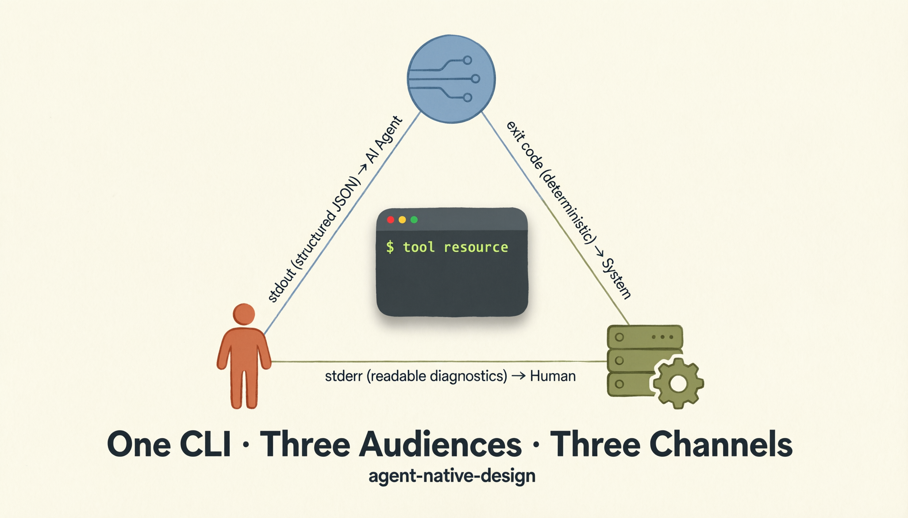

# Design CLIs that AI agents can actually use

[中文文档](README_CN.md) · [Docs site](https://agents365-ai.github.io/agent-native-design/)

A skill that evaluates whether a CLI is reliably usable by AI agents and helps you design CLIs that serve humans, agents, and orchestration systems at the same time. Built around seven principles, a 14-criterion rubric, and a structured refactor playbook.

## What it does

- Evaluates whether an existing CLI is reliably usable by AI agents
- Designs CLI interfaces that serve humans, agents, and orchestration systems simultaneously
- Converts REST APIs and SDKs into agent-native CLI command trees
- Reviews stdout contracts, exit code semantics, and error envelope design
- Designs schema-driven self-description, dry-run previews, and schema introspection
- Defines safety tiers (open / warned / hidden) for graduated command visibility
- Designs delegated authentication so agents never own the auth lifecycle
- Produces prioritized refactor plans with concrete interface examples

## Documentation

| Doc | What's inside |
| --- | --- |
| [docs/install.md](docs/install.md) | Per-platform install (Claude Code / OpenClaw / Hermes / pi-mono / Codex / SkillsMP) and path summary |
| [docs/changelog.md](docs/changelog.md) | Version history from v1.1.0 through v1.4.0 |
| [SKILL.md](skills/agent-native-design/SKILL.md) | Workflow guide loaded by the agent |
| [references/](skills/agent-native-design/references/) | On-demand reference material — design patterns, rubric, checklists, examples, testing recipes, citations |

## When to use

- Evaluating whether an existing CLI is usable by an AI agent
- Designing a new CLI interface for an API or SDK
- Refactoring a human-first CLI to be machine-readable
- Reviewing stdout, stderr, and exit code contract design
- Defining dry-run, schema introspection, and self-description layers
- Designing auth delegation and trust boundaries for agent safety
- Producing a SKILL.md or skill docs from a CLI schema

## Installation

See [docs/install.md](docs/install.md) for per-platform install commands (Claude Code, OpenClaw / ClawHub, Hermes, pi-mono, OpenAI Codex, SkillsMP) and the installation paths summary.

## Support

If this skill helps your work, consider supporting the author:

<table>
  <tr>
    <td align="center">
      
       
      <b>WeChat Pay</b>
    </td>
    <td align="center">
      
       
      <b>Alipay</b>
    </td>
    <td align="center">
      
       
      <b>Buy Me a Coffee</b>
    </td>
    <td align="center">
      
       
      <b>Give a Reward</b>
    </td>
  </tr>
</table>

## Author

**Agents365-ai**

- Bilibili: <https://space.bilibili.com/441831884>
- GitHub: <https://github.com/Agents365-ai>

## License

MIT
