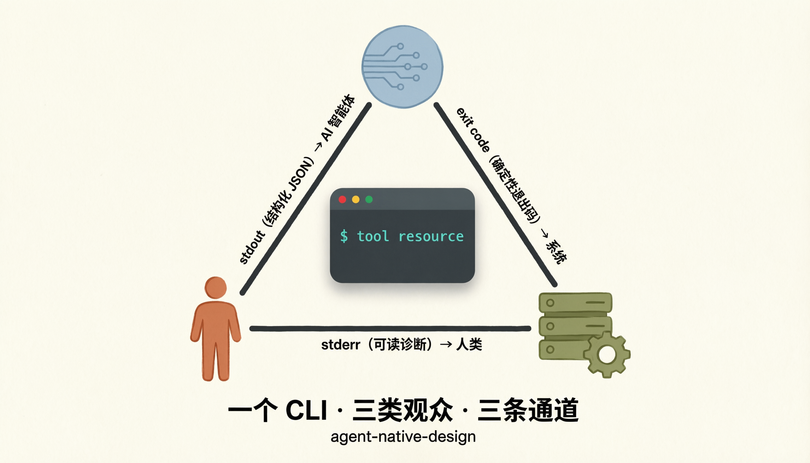

# 为 AI 智能体设计真正可用的 CLI

[English](README.md) · [文档站点](https://agents365-ai.github.io/agent-native-design/zh.html)

一个评估 CLI 是否能被 AI 智能体可靠使用,并帮你设计同时服务人类、智能体、编排系统的 CLI 的技能。围绕 7 项原则、14 项评分标准、结构化重构剧本展开。

## 功能说明

- 评估现有 CLI 是否能被 AI 智能体可靠使用
- 设计同时服务人类、智能体和编排系统的 CLI 接口
- 将 REST API 和 SDK 转换为智能体原生的 CLI 命令树
- 审查 stdout 契约、退出码语义和错误信封设计
- 设计基于 Schema 的自描述能力、dry-run 预览和 Schema 自省
- 定义安全分级(开放 / 警示 / 隐藏),实现命令可见性的渐进式控制
- 设计委托式认证,使智能体永远不拥有认证生命周期
- 生成带有具体接口示例的优先级重构计划

## 文档导航

| 文档 | 内容 |
| --- | --- |
| [docs/install_CN.md](docs/install_CN.md) | 各平台安装命令(Claude Code / OpenClaw / Hermes / pi-mono / Codex / SkillsMP)与路径汇总 |
| [docs/changelog.md](docs/changelog.md) | 从 v1.1.0 到 v1.4.0 的版本历史(英文) |
| [SKILL.md](skills/agent-native-design/SKILL.md) | agent 加载的工作流指南 |
| [references/](skills/agent-native-design/references/) | 按需加载的参考资料 —— 设计模式、评分标准、清单、示例、测试配方、引用文献 |

## 适用场景

- 评估现有 CLI 是否可被 AI 智能体使用
- 为 API 或 SDK 设计新的 CLI 接口
- 将以人为本的 CLI 重构为机器可读的接口
- 审查 stdout、stderr 和退出码契约设计
- 定义 dry-run、Schema 自省和自描述层
- 为智能体安全设计委托式认证和信任边界
- 从 CLI Schema 生成 SKILL.md 或 skill 文档

## 安装

各平台安装命令(Claude Code、OpenClaw / ClawHub、Hermes、pi-mono、OpenAI Codex、SkillsMP)与安装路径汇总,见 [docs/install_CN.md](docs/install_CN.md)。

## 支持作者

如果这个 skill 对你的工作有帮助,欢迎支持作者:

<table>
  <tr>
    <td align="center">
      
       
      <b>微信支付</b>
    </td>
    <td align="center">
      
       
      <b>支付宝</b>
    </td>
    <td align="center">
      
       
      <b>Buy Me a Coffee</b>
    </td>
    <td align="center">
      
       
      <b>打赏</b>
    </td>
  </tr>
</table>

## 作者

**Agents365-ai**

- Bilibili: <https://space.bilibili.com/441831884>
- GitHub: <https://github.com/Agents365-ai>

## License

MIT
