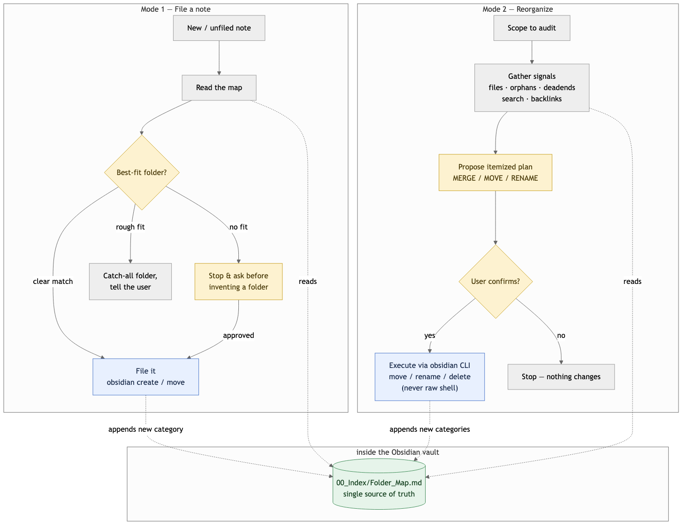

# obsidian-organizer — Keep a Large Obsidian Vault Tidy

[](LICENSE)
[](https://github.com/Agents365-ai/obsidian-organizer/stargazers)
[](https://github.com/Agents365-ai/obsidian-organizer/network/members)
[](https://github.com/Agents365-ai/obsidian-organizer/commits/main)

**English** · [中文](README_CN.md)

A Claude Code skill that keeps a large Obsidian vault tidy: files new notes into
the best-fit folder, and audits/reorganizes existing structure on request. Both
modes share one source of truth — a plain-markdown folder map that lives inside
the vault itself, so it never drifts out of sync with reality.

<p align="center">
  
</p>

The skill itself lives at [`skills/obsidian-organizer/SKILL.md`](skills/obsidian-organizer/SKILL.md).

## ✨ Highlights

- **Two modes, one map** — *file a note* (match its topic against the map, place
  it, ask before inventing a new category) and *audit / reorganize* (find
  orphans, dead-ends, and near-duplicates, then propose an itemized plan)
- **Source of truth inside the vault** — `00_Index/Folder_Map.md` is a plain
  markdown note in the vault (not a copy in the repo or in Claude's memory), so
  filing decisions never rely on a stale snapshot
- **Link-safe by design** — every move/rename/delete goes through the `obsidian`
  CLI so Obsidian's internal-link auto-repair rewrites wikilinks and backlinks;
  raw `mv` / `rm` on vault paths is forbidden
- **Propose, then confirm** — bulk reorganizations are presented as a concrete
  MERGE / MOVE / RENAME plan and nothing changes until you say yes
- **Self-maintaining** — approved new folders are appended back to the map, so
  the next filing decision remembers them

## 🚀 Installation

```bash
# Manual install
git clone https://github.com/Agents365-ai/obsidian-organizer.git \
  ~/.claude/skills/obsidian-organizer
```

Requires the `obsidian-cli` skill (from the
[kepano/obsidian-skills](https://github.com/kepano/obsidian-skills) marketplace
plugin) and the **Obsidian desktop app running** — the CLI talks to the live app.

## 🔄 How it works

Both modes start by reading `00_Index/Folder_Map.md` with one cheap CLI call —
no re-traversal of hundreds of folders per decision.

- **Mode 1 — File a note**: match the note's topic against the map's filing
  rules. Clear match → file it (`obsidian create` / `move`). Rough fit → use the
  map's catch-all convention and say so. No fit → stop and ask before creating
  new taxonomy.
- **Mode 2 — Audit / reorganize**: gather signals for the scope (`files`,
  `orphans`, `deadends`, `search:context`, `backlinks`), propose an itemized
  MERGE / MOVE / RENAME plan, wait for explicit confirmation, then execute
  through the CLI's own commands — never raw shell — so links stay intact.

Whenever a new folder or category is approved, a line describing it is appended
to the map, keeping the source of truth current. If the map is missing, it is
rebuilt from the live vault structure, never from a bundled copy.

## ❤️ Support

If this skill helps you, consider supporting the author:

<table>
  <tr>
    <td align="center">
      
      <br>
      <b>WeChat Pay</b>
    </td>
    <td align="center">
      
      <br>
      <b>Alipay</b>
    </td>
    <td align="center">
      
      <br>
      <b>Buy Me a Coffee</b>
    </td>
    <td align="center">
      
      <br>
      <b>Give a Reward</b>
    </td>
  </tr>
</table>

## 👤 Author

**Agents365-ai**

- GitHub: <https://github.com/Agents365-ai>
- Bilibili: <https://space.bilibili.com/441831884>

## 📄 License

[CC BY-NC 4.0](LICENSE) — free for non-commercial use. Commercial use requires permission.
