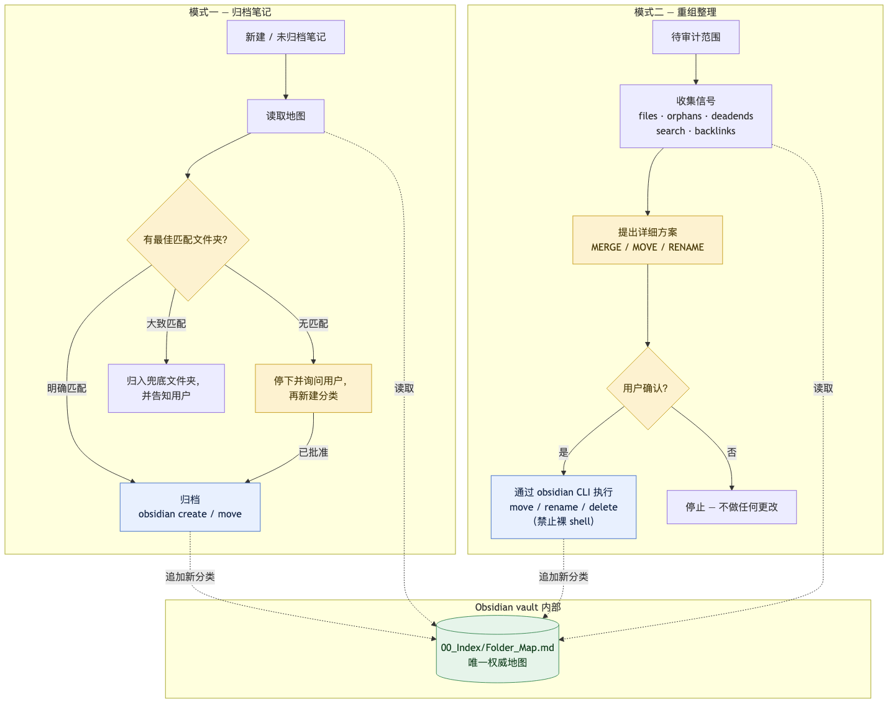

# obsidian-organizer — 让大型 Obsidian 仓库保持整洁

[](LICENSE)
[](https://github.com/Agents365-ai/obsidian-organizer/stargazers)
[](https://github.com/Agents365-ai/obsidian-organizer/network/members)
[](https://github.com/Agents365-ai/obsidian-organizer/commits/main)

[English](README.md) · **中文**

一个让大型 Obsidian 仓库长期保持整洁的 Claude Code 技能：把新笔记归档到最合适的
文件夹，并按需审计/重组现有目录结构。两种模式共享同一个事实来源 —— 一份存放在
仓库内部的纯 Markdown 文件夹地图，因此它永远不会与真实结构脱节。

<p align="center">
  
</p>

技能本体位于 [`skills/obsidian-organizer/SKILL.md`](skills/obsidian-organizer/SKILL.md)。

## ✨ 亮点

- **两种模式，一张地图** —— *归档笔记*（将主题与地图匹配、放入最合适的文件夹、
  新建分类前先询问）与*审计 / 重组*（找出孤立笔记、死端笔记和近似重复项，
  给出逐条计划）
- **事实来源就在仓库里** —— `00_Index/Folder_Map.md` 是仓库内的一篇普通
  Markdown 笔记（不是仓库外的副本，也不是 Claude 的记忆），归档决策永远不依赖
  过期快照
- **链接安全** —— 所有移动/重命名/删除都通过 `obsidian` CLI 执行，Obsidian 的
  内部链接自动修复会同步改写全仓库的 wikilink 和反向链接；禁止对仓库路径使用
  原生 `mv` / `rm`
- **先提案，后执行** —— 批量重组以具体的 MERGE / MOVE / RENAME 计划呈现，
  你确认之前不做任何改动
- **自我维护** —— 新批准的文件夹会追加回地图，下一次归档决策自动知晓

## 🚀 安装

```bash
# 手动安装
git clone https://github.com/Agents365-ai/obsidian-organizer.git \
  ~/.claude/skills/obsidian-organizer
```

依赖 `obsidian-cli` 技能（来自
[kepano/obsidian-skills](https://github.com/kepano/obsidian-skills)
插件市场）且需要 **Obsidian 桌面应用处于运行状态** —— CLI 与运行中的应用通信。

## 🔄 工作原理

两种模式都以一次低成本的 CLI 调用读取 `00_Index/Folder_Map.md` 开始 ——
无需每次决策都遍历数百个文件夹。

- **模式一 —— 归档笔记**：将笔记主题与地图中的归档规则匹配。明确匹配 → 直接归档
  （`obsidian create` / `move`）；大致匹配 → 使用地图约定的兜底文件夹并告知用户；
  无匹配 → 停下来先询问，不擅自新建分类。
- **模式二 —— 审计 / 重组**：针对指定范围收集信号（`files`、`orphans`、
  `deadends`、`search:context`、`backlinks`），提出逐条的 MERGE / MOVE / RENAME
  计划，等待明确确认后，再通过 CLI 自带命令执行 —— 绝不使用原生 shell ——
  以保证链接完整。

每当新文件夹或新分类获批，都会向地图追加一行描述，让事实来源保持最新。若地图
丢失，则从真实仓库结构重建，绝不使用打包副本。

## ❤️ 支持

如果这个技能对你有帮助，欢迎支持作者：

<table>
  <tr>
    <td align="center">
      
      <br>
      <b>微信支付</b>
    </td>
    <td align="center">
      
      <br>
      <b>支付宝</b>
    </td>
    <td align="center">
      
      <br>
      <b>Buy Me a Coffee</b>
    </td>
    <td align="center">
      
      <br>
      <b>打赏</b>
    </td>
  </tr>
</table>

## 👤 作者

**Agents365-ai**

- GitHub: <https://github.com/Agents365-ai>
- Bilibili: <https://space.bilibili.com/441831884>

## 📄 许可证

[CC BY-NC 4.0](LICENSE) — 免费用于非商业用途，商业使用需获得许可。
