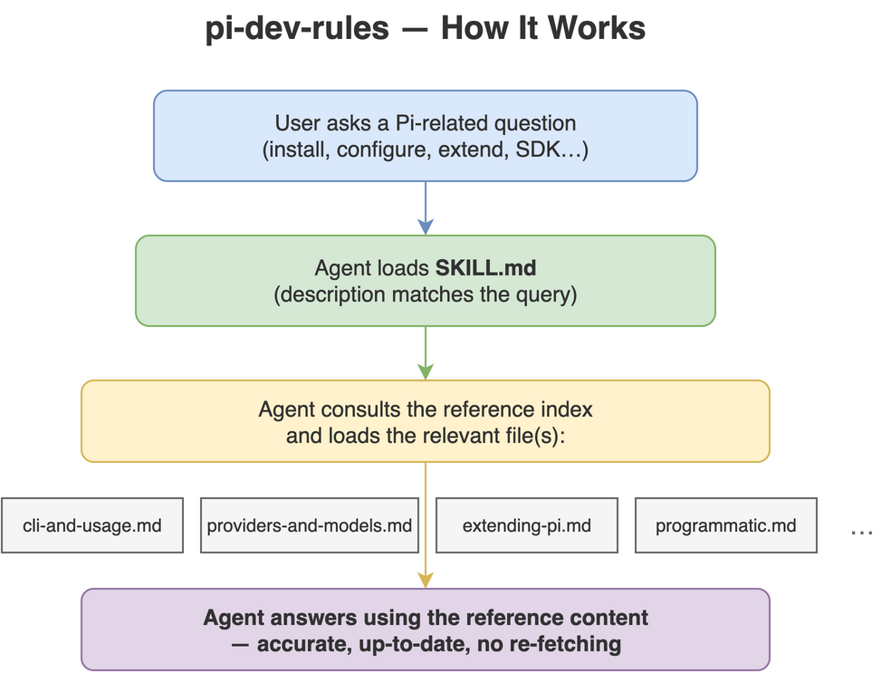

# pi-dev-rules

[](LICENSE)
[](https://github.com/Agents365-ai/365-skills/stargazers)
[](https://github.com/Agents365-ai/365-skills/network/members)
[](https://github.com/Agents365-ai/365-skills/commits/main)

[](https://agentskills.io)

**English** · [中文](README_CN.md)

A coding-agent skill that packages the **latest [Pi](https://pi.dev) documentation**
(`@earendil-works/pi-coding-agent`) as an on-demand reference, so an agent can install, configure,
run, and **extend Pi** without re-fetching the docs.

Mirrors <https://pi.dev/docs/latest> (fetched 2026-09-22, doc restructure included). Three extra
bundles (`development.md`, `chord.md`, `agent-harness.md`) cover material with no page on the
website: the repository's build/development/contribution rules and Pi's **internal monorepo
architecture**. They are built from a pi checkout at `pi@2c2cd63`.

Works with Claude Code, Cursor, Codex, Copilot, Windsurf, Cline / Roo Code, Gemini CLI,
Aider, Zed, OpenCode, OpenClaw / ClawHub, Hermes, pi-mono, plus major Chinese agents
(Trae, Qwen Code / Tongyi Lingma, Baidu Comate, CodeGeeX), and any agent that reads
`AGENTS.md` or the [Agent Skills](https://agentskills.io) format.

<p align="center">
  
</p>

## What's inside

- `SKILL.md`: overview, when-to-use, cheat sheet, hard rules, reference index.
- `references/cli-and-usage.md`: install, auth, launching, how Pi works (agent loop, context,
  sessions), the CLI reference (commands, flags, modes), slash commands, message queue, context
  files, env vars, sessions, keybindings.
- `references/providers-and-models.md`: providers (30+), `auth.json` (+ scoped `env`), cloud
  providers, custom `models.json`, `compat`, custom-provider extensions.
- `references/settings-and-compaction.md`: configuration layout (agent directory vs project
  `.pi/`, context files), `settings.json` (trust/analytics/retry/transport),
  auto/manual compaction, branch summaries.
- `references/extending-pi.md`: extensions API, skills (SKILL.md), prompt templates, themes, packages.
- `references/tui-components.md`: TUI component system for custom extension/tool UIs.
- `references/security-and-containerization.md`: project-trust model, no built-in sandbox, Gondolin
  micro-VM, Docker, OpenShell.
- `references/session-format.md`: session JSONL schema, entry/types, SessionManager API, and the
  model-facing message types.
- `references/programmatic.md`: SDK, CLI integration (mode choice, `RpcClient`, fork-and-rebrand),
  JSON event-stream mode, RPC protocol, RPC command reference, RPC extension UI.
- `references/platform-setup.md`: Windows, Termux, tmux, per-terminal setup, shell aliases.
- `references/development.md`: monorepo package list, build-from-source and standalone-binary
  builds, supply-chain rules, `AGENTS.md` development rules, the `CONTRIBUTING.md` gate.
- `references/philosophy-and-design.md` (the creator's design manifesto, Mario Zechner's blog post,
  2025-11-30): why minimal, the 4-tool philosophy, YOLO by default, the explicit non-features (no
  MCP / plan mode / to-dos / sub-agents / background bash) with their intended alternatives.
- `references/chord.md`: `@earendil-works/chord`, the application-neutral composition runtime:
  plugin loading/composition/bundling, the service catalogue, RPC transport, facet bundle loaders,
  and `chord/delta` replicated latest-value state. Includes `PLANNING.md`, which is a plan rather
  than a frozen API.
- `references/agent-harness.md`: internal agent architecture, from `packages/agent/docs/`:
  `AgentHarness` spec, application hosts and facets, typed values and lists, facet-service RPC,
  telemetry schema and invocation context.

## Install

| Platform | Path |
| ---------- | ------ |
| Claude Code (global) | `~/.claude/skills/pi-dev-rules/` |
| Claude Code (project) | `.claude/skills/pi-dev-rules/` |
| OpenClaw (global) | `~/.openclaw/skills/pi-dev-rules/` |
| Pi (global) | `~/.pi/agent/skills/pi-dev-rules/` |
| Pi (project) | `.pi/skills/pi-dev-rules/` |

```bash
cp -r pi-dev-rules ~/.claude/skills/      # example: Claude Code, global
```

## Updating

`references/*.md` are generated, not hand-written: the 12 auto-built bundles and `changelog.md`
come from a pi checkout, and `philosophy-and-design.md` is curated by hand. Users only need the
files as shipped and never have to run anything. Rebuilding is maintainer tooling, documented in
[`scripts/README.md`](skills/pi-dev-rules/scripts/README.md). Upstream restructured the docs on
2026-09-22 (pages split into `cli.md`, `slash-commands.md`, `configuration.md`,
`message-types.md`, `rpc-commands.md`, `rpc-extension-ui.md`, `cli-integration.md`,
`how-pi-works.md`; `docs/development.md` folded into `docs/index.md`).

## Support

If this project helps you, consider supporting the author:

<table>
  <tr>
    <td align="center">
      
      <br>
      <b>WeChat Pay</b>
    </td>
    <td align="center">
      
      <br>
      <b>Alipay</b>
    </td>
    <td align="center">
      
      <br>
      <b>Buy Me a Coffee</b>
    </td>
    <td align="center">
      
      <br>
      <b>Give a Reward</b>
    </td>
  </tr>
</table>

## Author

**Agents365-ai**

- Bilibili: <https://space.bilibili.com/441831884>
- GitHub: <https://github.com/Agents365-ai>

## License

[MIT](LICENSE)
