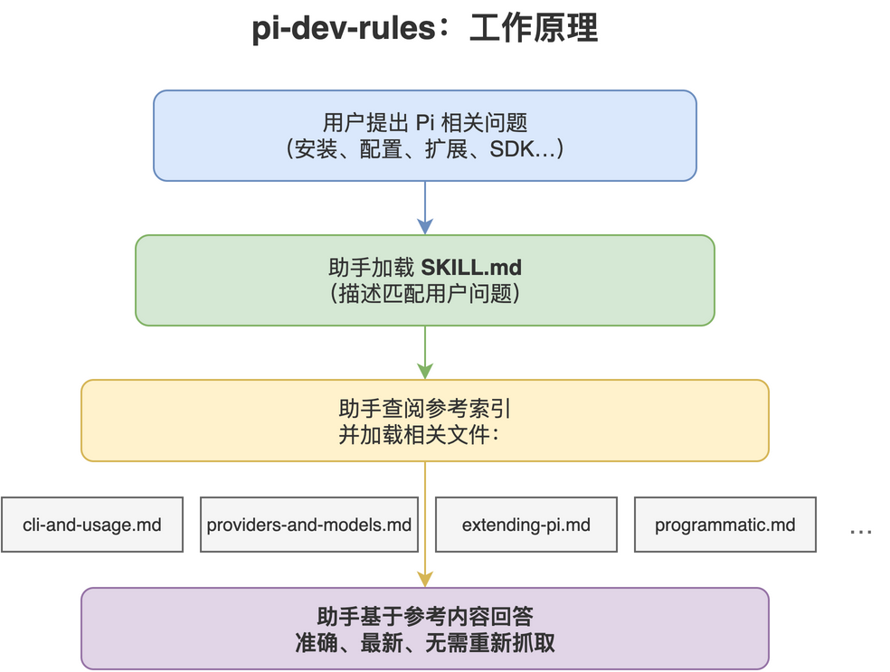

# pi-dev-rules

[](LICENSE)
[](https://github.com/Agents365-ai/365-skills/stargazers)
[](https://github.com/Agents365-ai/365-skills/network/members)
[](https://github.com/Agents365-ai/365-skills/commits/main)

[](https://agentskills.io)

中文 · [English](README.md)

一个编程助手技能，将最新的 [Pi](https://pi.dev) 文档（`@earendil-works/pi-coding-agent`）
打包为按需参考库，让助手无需重新抓取文档即可安装、配置、运行和**扩展 Pi**。

镜像 <https://pi.dev/docs/latest>（抓取日期：2026-10-03，对应 Pi 1.0.1）。另外四个参考文件
（`development.md`、`chord.md`、`agent-harness.md`、`durable-spec.md`）覆盖官网没有页面的内容：
仓库的构建/开发/贡献规则，以及 Pi 的**内部 monorepo 架构**，从 `pi@a7229ddc2` 的源码树构建。

适用于 Claude Code、Cursor、Codex、Copilot、Windsurf、Cline / Roo Code、Gemini CLI、
Aider、Zed、OpenCode、OpenClaw / ClawHub、Hermes、pi-mono，以及主流国产编程助手
（Trae、Qwen Code / 通义灵码、百度 Comate、CodeGeeX），和任何支持 `AGENTS.md`
或 [Agent Skills](https://agentskills.io) 格式的工具。

<p align="center">
  
</p>

## 包含内容

- `SKILL.md`：概述、使用时机、速查表、硬性规则、参考索引。
- `references/cli-and-usage.md`：安装、认证、启动、Pi 的工作原理（agent 循环、上下文、
  会话）、CLI 参考（命令、参数、模式）、斜杠命令、消息队列、上下文文件、环境变量、会话、快捷键。
- `references/providers-and-models.md`：提供商（30+）、`auth.json`（+ scoped `env`）、云
  提供商、自定义 `models.json`、`compat`、自定义提供商扩展。
- `references/settings-and-compaction.md`：配置布局（agent 目录与项目 `.pi/`、上下文文件）、
  `settings.json`（trust/analytics/retry/transport）、自动/手动压缩、分支摘要。
- `references/extending-pi.md`：扩展 API、技能（SKILL.md）、提示模板、主题、包、虚拟模型
  （`pi.registerVirtualModel`）。
- `references/mcp.md`：内置 MCP 服务器（2026-09-29），`mcp.json` 全局与项目配置、stdio 与
  streamable HTTP、`pi mcp add/remove/list`、OAuth 登录、暴露模式与 `toolExposure`、
  `codemode` / `tool_search`、resource、权限、来自扩展的服务器。
- `references/tui-components.md`：自定义扩展/工具 UI 的 TUI 组件系统。
- `references/security-and-containerization.md`：项目信任模型、无内置沙箱、Gondolin
  微型虚拟机、Docker、OpenShell。
- `references/session-format.md`：会话 JSONL 架构、条目类型、SessionManager API，以及面向模型的
  消息类型。
- `references/programmatic.md`：SDK、CLI 集成（模式选择、`RpcClient`、fork 与重命名）、
  JSON 事件流模式、RPC 协议、RPC 命令参考、RPC 扩展 UI。
- `references/platform-setup.md`：Windows、Termux、tmux、终端设置、shell 别名。
- `references/development.md`：monorepo 包列表、从源码构建与独立二进制构建、供应链规则、
  `AGENTS.md` 开发规则、`CONTRIBUTING.md` 准入门槛。
- `references/philosophy-and-design.md`（作者的设计宣言，Mario Zechner 的博客文章，2025-11-30）：
  为何极简、4 工具哲学、默认 YOLO、文中列出的非功能特性（MCP、计划模式、待办、子代理、后台 bash）
  及其预期替代方案。其中 MCP 一条已标注为“已被取代”：MCP 自 2026-09-29 起内置。
- `references/chord.md`：`@earendil-works/chord`，与应用无关的组合运行时：插件加载/组合/打包、
  服务目录、RPC 传输、facet bundle loader，以及 `chord/delta` 的“最新值”状态复制。其中
  `PLANNING.md` 是实施计划，不是冻结的 API。
- `references/agent-harness.md`：内部运行时包，取自各自的 README：`@earendil-works/pi-durable`
  （持久化的会话/任务/文档 harness，先落盘再展示，API 属实验性）、`@earendil-works/pi-agent-core`
  （工具调用与状态）、`@earendil-works/pi-telemetry`（遥测契约、适配器、类型化 schema）。
- `references/durable-spec.md`：`pi-durable` 背后的规范性 **Pico5 规范**（4610 行）：记录与生命周期、
  文档与变更所有权、任务与 effect sandwich、submission 与 inbox、扩展/hook/工具、遥测。属实验性
  包的设计文档，不是冻结的 API。

## 安装

| 平台 | 路径 |
| ------ | ------ |
| Claude Code（全局） | `~/.claude/skills/pi-dev-rules/` |
| Claude Code（项目） | `.claude/skills/pi-dev-rules/` |
| OpenClaw（全局） | `~/.openclaw/skills/pi-dev-rules/` |
| Pi（全局） | `~/.pi/agent/skills/pi-dev-rules/` |
| Pi（项目） | `.pi/skills/pi-dev-rules/` |

```bash
cp -r pi-dev-rules ~/.claude/skills/      # 示例：Claude Code，全局
```

## 更新

`references/*.md` 是生成物，不是手写文档：14 个自动生成的参考包与 `changelog.md` 来自 pi 源码
检出，`philosophy-and-design.md` 为手工整理。用户直接使用随包文件即可，无需执行任何命令；重建属于
维护者工具，说明见 [`scripts/README.md`](skills/pi-dev-rules/scripts/README.md)。上游于
2026-09-22 改版了文档（拆分为 `cli.md`、`slash-commands.md`、`configuration.md`、
`message-types.md`、`rpc-commands.md`、`rpc-extension-ui.md`、`cli-integration.md`、
`how-pi-works.md`；`docs/development.md` 并入 `docs/index.md`），并于 2026-09-28 新增
`virtual-models.md`、于 2026-09-29 新增 `mcp.md`，两者均已收录。2026-10-01 harness 文档迁出
`packages/agent/docs/`：持久化 harness 现位于 `packages/durable`（README 加 Pico5 规范），
遥测位于 `packages/telemetry`，即这两个内部参考包现在镜像的内容。

## 支持

如果这个项目对你有帮助，欢迎支持作者：

<table>
  <tr>
    <td align="center">
      
      <br>
      <b>微信支付</b>
    </td>
    <td align="center">
      
      <br>
      <b>支付宝</b>
    </td>
    <td align="center">
      
      <br>
      <b>Buy Me a Coffee</b>
    </td>
    <td align="center">
      
      <br>
      <b>打赏作者</b>
    </td>
  </tr>
</table>

## 作者

**Agents365-ai**

- Bilibili: <https://space.bilibili.com/441831884>
- GitHub: <https://github.com/Agents365-ai>

## 许可证

[MIT](LICENSE)
