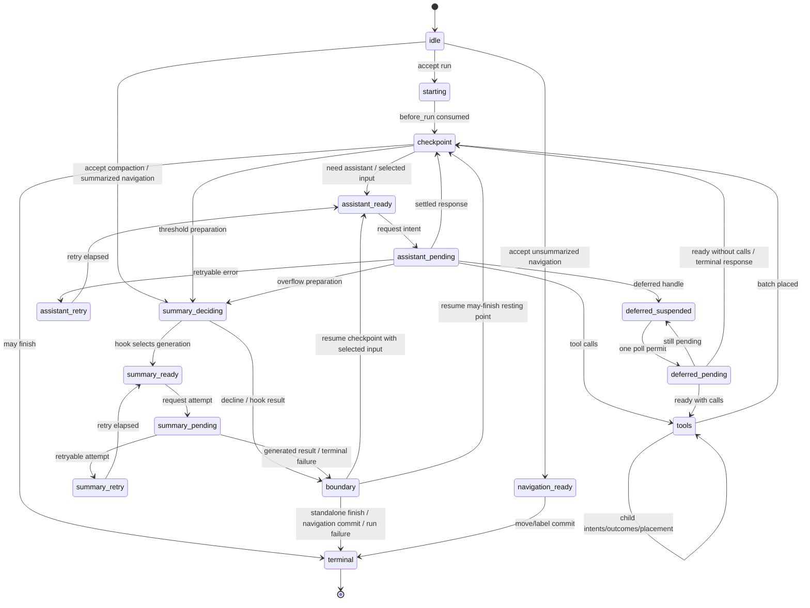

# Pi Agent Harness, Facets, and Services

Source: `packages/agent/docs/harness.md`, `plugins.md`, `values.md`, `rpc.md`, `telemetry-schema.md`, `telemetry.md`
Internal architecture of the agent harness, not user documentation. `harness.md`, `plugins.md`, and `rpc.md` are implementation specifications; `telemetry.md` is design input and `telemetry-schema.md` is generated. See the shipped CLI docs in the other reference files for user-facing behavior.

---

> **Auto-built from individual doc pages.**
> Sources: <https://raw.githubusercontent.com/earendil-works/pi/main/packages/agent/docs/harness.md>, <https://raw.githubusercontent.com/earendil-works/pi/main/packages/agent/docs/plugins.md>, <https://raw.githubusercontent.com/earendil-works/pi/main/packages/agent/docs/values.md>, <https://raw.githubusercontent.com/earendil-works/pi/main/packages/agent/docs/rpc.md>, <https://raw.githubusercontent.com/earendil-works/pi/main/packages/agent/docs/telemetry-schema.md>, <https://raw.githubusercontent.com/earendil-works/pi/main/packages/agent/docs/telemetry.md>

## AgentHarness Implementation Specification

Sections are numbered (§N.M) for cross-reference; part-level contents:

- [Part 0 — Orientation](#part-0--orientation): system model · three stores · worked examples · non-goals · notation/source types · validation boundary · implementation status
- [Part 1 — Storage](#part-1--storage): model · identity · bound values/lists · transactions · queries · usage ledger · backends · rationale
- [Part 2 — The conversation tree](#part-2--the-conversation-tree): entries · placement · Branches/AgentLanes · metadata · branch queries/context · branch index · forks · Session/repository (incl. C1, search) · precise rewrite
- [Part 3 — The operation state machine](#part-3--the-operation-state-machine): operations · state · lane state · transition rule · graph · acceptance · assistant · tools · summaries · navigation · inbox · boundary · terminal results
- [Part 4 — Execution, recovery, abort, close](#part-4--execution-recovery-abort-close): Drive · effect gate · mutation line · attachment · recovery · abort · close · faults
- [Part 5 — Public surface](#part-5--public-surface): lane · harness · Session/Branch · snapshots · events · hooks · execution blocks · telemetry
- [Part 6 — Future: partitioned retention (Postgres)](#part-6--future-partitioned-retention-postgres)
- [Part 7 — Schema evolution](#part-7--schema-evolution)
- [Part 8 — Work packages](#part-8--work-packages)
- [Part 9 — Invariants and tests](#part-9--invariants-and-tests): 38 invariants · race catalog · test tiers
- [Appendix A — Glossary](#appendix-a--glossary) · [Appendix B — Coding-agent v3-format compatibility](#appendix-b--coding-agent-v3-format-compatibility) · [Appendix C — Open questions](#appendix-c--open-questions)

# Part 0 — Orientation

## 0.1 What this is

A durable runtime for agent conversations: it persists conversation and operation state so interrupted work resumes without repeating settled effects. This document is the normative specification; §0.9 marks the parts that are specified but not implemented. Public type declarations live in the source files named in §0.7 — this document repeats a declaration only where its shape itself is a rule.

## 0.2 System model

A **session** has four parts: an immutable **entry tree** (message, compaction, branch summary, or application-defined custom entries; branches share the tree, enabling branching, compaction, forking, and parallel work while preserving history); mutable **values and lists** at bound typed addresses (built-ins: session name, entry labels; applications define their own collision-resistant addresses); **Branches and AgentLanes** (a Branch is one named data path with a movable tip; an AgentLane adds total model configuration, queues, and at most one operation; sessions may start with zero of either, and `main` is an ordinary explicit name); and an append-only **usage ledger**.

The Session layer owns global durable data and Branch capabilities. The **harness** drives lanes through four primitives — `accept` durably creates an operation, `drive` advances an expected operation, `requestAbort` durably requests cancellation, `inspectExecution` atomically reports current and latest-terminal execution — plus conveniences (`prompt`, `resume`, `abort`, …) composing them with process-local waiting policy. A serving layer may instead schedule `drive` calls through alarms, jobs, or another host runtime. The harness also owns harness-wide tool and prompt-resource registries, hooks, passive events, and runtime configuration.

An **operation** is one accepted unit of lane work: run, compaction, or navigation. Immutable metadata records identity, intent, and starting point; a total current state records phase, control, and recovery data; queued input belongs to the lane. Acceptance and execution ownership are separate: an accepted operation may have no process-local driver. Completion deletes operation-owned state and writes one immutable result record.

**Context.** Every asynchronous public harness/lane/Session/Branch/repository/storage method takes an explicit trailing `Context`; synchronous registration (`events.on()`, `hooks.on()`) is contextless, and handlers receive a Context when invoked. Context exists because concurrent calls need independent telemetry parentage and an RPC adapter must carry one request's cancellation as `context.abortSignal`. Shared receivers never retain a caller Context or discover one through `AsyncLocalStorage`. Request-ID RPC cancellation is implemented: the client maps its signal to `cancel(requestId)`, and the server derives a request Context with an `AbortController` that aborts on matching cancellation or disconnect. Trace injection/extraction and remote telemetry-parent reconstruction are specified but not implemented (T1, §5.8). Context is process-local invocation authority, never durable data: aborting it does not call `requestAbort()` or write `cancel_requested`.

**Storage** (Part 1) exposes atomic transactions and queries over three durable forms. `pi.op.meta` is written once per operation; `pi.op.state` is replaced after each transition with the complete current state; tool checkpoints of bounded progress are auxiliary and never prove effect completion. The terminal transaction deletes operation-owned values/lists and writes immutable `pi.result/{operationId}`. No partial transaction is ever visible.

## 0.3 The three stores

Everything in Parts 1–5 follows from four rules.

**1. Three stores, one invariant.**

```text
entries        conversation tree — write-once, append-only
values/lists   current mutable state — replaceable values; append-only lists
               (append or whole-list delete)
usage ledger   cost history — append-only rows
```

*Every payload is in an entry, a bound value/list, or the ledger; there is no third place.* An entry is the complete conversation record: placement and payload in one row. A `Value<T>` holds only its current value; a `ValueList<T>` holds immutable elements ordered by write sequence, deletable only whole. Complete content that durably exists before tree placement — queued input, deferred writes, finalized out-of-order tool results — waits in `pi.pending.entry` and becomes an entry in the transaction that places it; tool progress may occupy `pi.pending.tool_output` only while its effect is uncertain; streamed assistant frames occupy `pi.pending.assistant_frame` only while their response is effect-pending (§3.7). Per-backend projections (branch index, search, stats) are rebuildable and carry no authority.

**2. Atomic transactions** (§1.4): entry/usage inserts and value/list writes committed all-or-none with strictly increasing sequence numbers; no crash state exists inside a transaction; the only write primitive.

**3. The durable restart point** (§3.2): after every durable transition, the harness replaces `operationState(operationId)` with the *complete, total* current state — never depending on a previous state. After task loss, recovery reads it and starts at the responsible procedure, never replaying a journal or inferring position from what is missing. Small captured values are inline; large stable payloads live at sibling operation-owned addresses or are named by id; the terminal transaction deletes them, leaving exactly the conversation, ledger, and a handful of lane/session values.

**4. Intent and settlement** (§0.4 trace, §3.7–§3.8): provider requests and real tool calls are wrapped in two commits — intent ("about to do X; output will use ids R and U"), the uncertain effect, then settlement (complete output + next state, plus source-ordered materialization for tools). Hooks follow a replay contract instead: a hook result becomes durable in the transaction that consumes it, and a crash before that transaction may rerun the hook. Every external effect can therefore happen without durable settlement; intents make that explicit where replay policy depends on it, and idempotent hooks accept it as a non-goal.

## 0.4 Worked example — a Slack thread

A user posts in a channel with 400 entries of history; the application creates a lane anchored at the channel's tip and calls `lane.prompt(...)`. The normative write order (each `TX[...]` is one atomic commit): acceptance is hook-free and starts no task or effect; the intent mints response/usage ids before anything is sent; streamed events append compact frames without blocking the stream (§3.7); settlement commits response, usage, next state, and frame-list deletion together; tool calls follow intent → effect → outcome settlement, materializing in assistant source order; the terminal transaction deletes operation values/lists and writes `pi.result/O`:

```text
TX[ insert entry n1 (user msg), upsert pi.branch.tip = n1,
    upsert pi.op.meta/O, upsert pi.op.state/O = starting,
    upsert pi.lane.state = { currentOperationId: O } ]
… first drive owns real work; before_drive then before_run …
TX[ insert injected messages if any, upsert pi.branch.tip when needed,
    upsert pi.op.state/O = checkpoint need_assistant ]
TX[ upsert pi.op.state/O = assistant ready (config snapshot) ]
TX[ upsert pi.op.state/O = effect_pending (reserves response n2, usage u1) ]
… provider streams …                                  ← the uncertain window
TX[ append pi.pending.assistant_frame/O:n2 += frame ]    ← zero or one per non-terminal
                                                        event, enqueued without awaiting
TX[ insert entry n2, insert usage u1, upsert pi.branch.tip = n2,
    delete list pi.pending.assistant_frame/O:n2,
    upsert pi.op.state/O = tools (result id n3 reserved) ]
TX[ upsert pi.op.tool_args/O:s1:0, upsert pi.op.state/O = call 0 effect_pending ]
… tool runs; selected bounded updates may replace pi.pending.tool_output/O:n3 …
TX[ upsert pi.pending.entry/n3 = finalized tool result,
    delete pi.pending.tool_output/O:n3, upsert pi.op.state/O = call 0 outcome_ready ]
TX[ insert entry n3, delete pi.pending.entry/n3, upsert pi.branch.tip = n3,
    upsert pi.op.state/O = checkpoint ]
… second turn: ready · intent · stream · settle (n4, u2) …
TX[ delete pi.op.meta/O, pi.op.state/O, pi.op.tool_args/O:*,
    set pi.result/O = { operationId: O, kind: "run", status: "completed",
                        fromTipId, tipId: n4, startedAt, endedAt },
    upsert pi.lane.state = { currentOperationId: null,
                             lastOperationId: O, inbox: [] } ]
```

Kill the process between any two transactions and restart: the harness reads the lane's required values, sees which committed last, and continues. A death during the provider stream leaves a request that may have been billed and may or may not have produced output — the one genuinely uncertain window; §4.5 states the policy, and the committed frame prefix preserves the latest durable partial for synthetic settlement and reconnect display without proving how the request ended. A second thread in the same channel runs its own lane over the same shared history with no coordination.

## 0.5 Worked example — a crash mid-tool

The model returns two tool calls for `lane.prompt("delete the stale migrations and run the test suite")`. The harness commits the batch plan, then the intent for call 0 with its exact arguments and `replay: "never"`. The tool deletes files, emits bounded progress every 100 ms, and requests a durable checkpoint every two seconds. The process dies after one checkpoint commits:

```text
TX[ insert entry n2 (assistant, 2 calls), insert usage u1, upsert pi.branch.tip = n2,
    upsert pi.op.state/O = tools (result ids n3, n4 reserved) ]
TX[ upsert pi.op.tool_args/O:s1:0, upsert pi.op.state/O = call 0 effect_pending,
                                                    replay: "never" ]
… tool deletes files; live updates u1 … u19 …
TX[ upsert pi.pending.tool_output/O:n3 = bounded update u1 ]
… live updates u2 … u19 …  ← CRASH
```

On restart, `pi.op.state` says `calls[0].status = "effect_pending", replay = "never"`, so the deletion is not re-run. A later drive reconciles the orphan per §4.5: latest durable checkpoint content plus an explicit interruption warning, staged as a synthetic error under the reserved id, then materialized normally:

```text
TX[ upsert pi.pending.entry/n3 = synthetic interrupted result containing u1,
    delete pi.pending.tool_output/O:n3, upsert pi.op.state/O = call 0 outcome_ready ]
TX[ insert entry n3, delete pi.pending.entry/n3, upsert pi.branch.tip = n3,
    upsert pi.op.state/O = call 0 completed ]
```

Every tool call has a result and nothing ran twice; without a committed checkpoint the result contains only the warning. Had the tool declared `replay: "safe"` (a read, a query), the harness would instead have re-executed it with the persisted arguments.

## 0.6 Non-goals

- **Exactly-once external effects** — hooks with side effects must be idempotent, keyed by operation id.
- **Provider stream resumption** — the harness never reattaches to a provider stream; committed frames (§3.7) preserve the latest durable partial for recovery and reconnect display, and a settled response is persisted *completely* before anything classifies it.
- **Multiple writable owners** — exactly one host-assigned owner may hold a writable Session at a time; normally that owner is its Session worker, while the server may temporarily own a newly created or forked destination before handing it off. Storage backends do not enforce this host-lifecycle rule. Read-only repository work such as a SQLite source snapshot may overlap the worker (§1.7, §2.7). Lanes cover the workload that looks like multi-writer.
- **Work scheduling** — the harness never creates platform alarms, scans repositories for abandoned sessions, leases hosted submissions, or promises an HTTP receipt; it reports durable waits through `drive` and the serving layer decides when to call again.
- **Replication** — a session lives in one place.
- **Durable write history** — values retain only current state, lists only until whole-list deletion; no API or table exposes replaced values or deleted elements. Test write-order assertions use an instrumented decorator around `commit()` (Part 9); production auditing belongs to telemetry (§5.8).
- **Deletion as a runtime feature** — entries and usage rows are never deleted: compaction changes provider context, not storage; terminal cleanup deletes only values/lists; `retainedTail` copies old messages forward and summaries derive from old content, so compaction is not erasure. Compliance-grade erasure is the administrative precise rewrite (§2.9), the sole sanctioned exception.

## 0.7 Notation and source types

- `TX[ a, b, c ]` — one atomic commit with writes in that order. Write vocabulary: `insert entry`, `insert usage`, `setValue`, `deleteValue`, `appendList`, `deleteList`. Traces may abbreviate a bound address as its persisted `namespace/key`; that is never an API signature or second key argument (§1.3).
- Ids are UUIDv7s (§1.2), abbreviated `e_*`/`u_*`/`op_*`; where the time prefix matters, examples show it.
- `S(next)` overwrites `operationState(operationId)` with the next total state; `L(next)` the same for `laneState(lane)`.
- Declarative rules, transition/race tables, invariants, and traces explicitly called normative are normative; examples and sections marked informative are not. **must / must not** emphasize obligations but are not the only normative wording. This clarifies the old shorthand: tables that tests consume are part of the contract.

Path convention: `src/...` is relative to `packages/agent/`; bare harness paths such as `session/types.ts` or `agent-harness.ts` are relative to `packages/agent/src/harness/`; `docs/...` is relative to `packages/agent/`; paths beginning `packages/` are repository-root relative. Source type provenance: `AgentMessage`, `AgentTool`, `AgentToolResult`, `QueueMode`, `ThinkingLevel` — `packages/agent/src/types.ts`. `Skill`, `PromptTemplate`, `AgentHarnessResources` (`Resources` below), the `AgentHarnessTool*` family, `AgentHarnessStreamOptions`/`Patch` — `packages/agent/src/harness/types.ts`. `Model`, `Models`, `Tool`, `Usage`, `RetryPolicy`, `StopReason`, `AssistantMessage`, `ImageContent`, provider messages, stream options, deferred handles — `packages/ai`; `AiContext` aliases pi-ai's provider request `Context` to distinguish it from the harness invocation `Context`. `AssistantMessageFrame`, `AssistantMessageFrameEncoder`, `reduceAssistantMessageFrames` — `packages/ai` `src/utils/assistant-message-frame.ts`; the harness defines no second frame codec or reducer. `CompactionSettings`, `CompactionPreparation`, `CompactResult`, `BranchPreparation`, `BranchSummaryResult` — `packages/agent/src/harness/compaction/`; existing preparation and split-turn algorithms remain the implementation unless this document changes them. `TelemetryContext` and schema helpers — `packages/telemetry`; agent-owned schemas — `src/harness/telemetry.ts`. `Context`, `ContextKey`, `BACKGROUND_CONTEXT`, derivation helpers — `src/harness/context.ts`. Harness/lane public declarations — `src/harness/agent-harness.ts`; Session/storage declarations — `src/harness/session/types.ts` and `session/values.ts`.

Public `QueueMode` is `"all" | "one-at-a-time"`. Public `RetryPolicy` is `{ enabled, maxRetries, baseDelayMs, maxAgentDelayMs? }`; operation state stores the normalized `{ maxAttempts, baseDelayMs, maxAgentDelayMs }`. `maxRetries`, `baseDelayMs`, and optional `maxAgentDelayMs` must be finite non-negative safe integers and `maxRetries + 1` must remain safe; disabled retry normalizes to one attempt; omitted `maxAgentDelayMs` defaults to 60 seconds; delay and `notBefore` arithmetic saturate at `Number.MAX_SAFE_INTEGER`. Public `CompactionSettings` is `{ enabled, reserveTokens, keepRecentTokens }`; both token counts must be finite non-negative safe integers. Constructors and setters reject invalid settings before publication. `AgentHarnessStreamOptions` and its patch include `deferred?: boolean | { window?: "15m" | "1h" | "24h" }`; structural requests always force it to false. `SettledAssistantMessage` is `AssistantMessage & { stopReason: Exclude<StopReason, "pending"> }`. Provider dispatch resolves the durable `{ provider, modelId }` identity through `Models` at request time (which also applies auth); a missing or swapped registry entry fails the request in-band, like an unknown tool.

## 0.8 Validation boundary

Internal pi objects are trusted typed values: Session, storage, operation procedures, and in-process extensions neither runtime-validate shapes nor defensively clone. Storage still enforces its operational invariants (atomicity, sequence allocation, unique ids, parent existence); backends serialize/parse as needed; externally edited or shape-corrupt storage is unsupported. Runtime schema validation belongs at untrusted wire boundaries — a future protocol-schema slice defines shared TypeBox schemas for serializable pi-ai/harness data and derives TypeScript types from them, without adding validation to internal paths. Attachment validates only the relationships needed to publish the small lane/operation projection (§3.3, §4.4); detailed state-directed references are consumption-time checks (`watch` verifies the pending/entry discriminants and message-role relationships its snapshot needs; drive verifies transition inputs), and optional assistant-frame lists and tool checkpoints may be absent.

## 0.9 Implementation status

WP00–WP07 are complete (Part 8): the operation graph, public lane runtime, and SQLite host-ownership alignment are implemented. Part 9 states the required conformance matrix; it is not a claim that every listed row already has one dedicated test. Known missing behavior and current contract debt, each labeled again at its section:

- **J1 — JSONL snapshot compaction (§1.7):** specified, not implemented; dead bytes are never reclaimed today.
- **C1 — raw RemoteSession (§2.8):** the specified remote mutation transport contradicts the shipped process-local product; a decision is required before implementing either direction.
- **R12 — `watchSession` (§5.2):** public method throws `SliceNotImplemented`; the sole stubbed Harness method.
- **T1 — telemetry (§5.8):** span vocabulary declared; production starts only the tool-hook span. RPC ingress has request-ID cancellation but no trace propagation.
- **S3 — search (§2.8):** design only; the current `src/search/index.ts` skeleton conflicts with it and has no implementation.
- **R11 — schema migrations (Part 7):** mechanism specified; activation-gated; no migration exists or is required.
- **WP08 — named-branch and streaming forks (§2.7):** in progress on Slice A. Explicit scope and named-branch selection, ancestry validation, configured-lane enforcement, and the closed scalar fork policy are implemented. Lists, sequence/high-water preservation, direct Memory construction, and bounded JSONL/SQLite transfer remain.
- **SQLite branch divergence (§2.6):** the current compaction-bounded algorithm can copy O(history) on an uncompacted branch, contrary to its bounded-prefix goal.
- **H1 — contract/test closure:** public `OperationStatus` includes `"running"` but current observations produce only `"open"`/`"aborting"` (§5.4); the pre-rewrite abort contract bound `operation_abort` before resolving/signalling but current code signals first and binds recipients before releasing the line (§4.6); Part 9 remains the required conformance matrix, not a claim that every row has a dedicated test.
- **Source declaration corrections:** `CommitResult.stats` and `SessionReader.getStats()` are implemented; the old inline declarations omitted them even though other old sections depended on post-commit totals (§1.4, §2.8). The old execution-block declarations also predate the current source shapes: standalone `streamHarnessAssistant` permits an absent `afterResponse`, while the durable Harness caller always supplies it; tool phases directly carry `AgentHarnessTool`, `toolContext`, and invocation capabilities and create the canonical result message after an immediate raw result (§5.7). These are source-shape corrections, not changes to the durable boundaries.
- **Gate close typing (§4.2):** the production contract permits only `HarnessClosed | HarnessFault`; source currently widens the private primitive to `Error`, which isolated tests use. Production calls obey the narrower rule; narrowing the source type remains H1 cleanup.
- **Precise rewrite (§2.9)** and **partitioned Postgres (Part 6):** administrative/future; no implementation.

Storage format 4 is still WIP (pre-stabilization): shapes may change in place without migrations; do not invent migration obligations for them. The detailed future-work inventory is [`post-wp05-roadmap.md`](post-wp05-roadmap.md).

---

# Part 1 — Storage

Storage knows nothing about agents, lanes, or conversations. It stores entries and usage rows, updates bound values/lists, and answers a small fixed query set. Parts 2–4 are built entirely on this.

## 1.1 The model

Declarations: `session/types.ts`, `session/values.ts`. Semantics:

```ts
type JsonValue = null | boolean | number | string | JsonValue[] | { [k: string]: JsonValue };

/** Write-once complete conversation record: placement and payload in one row.
    Created in exactly one transaction, never modified or deleted. Concrete
    entry types: §2.1. */
interface EntryBase {
  id: string;                // UUIDv7 (§1.2)
  parentId: string | null;
  seq: number;               // storage-assigned at commit
  timestamp: number;         // Unix ms, storage-assigned at commit
  type: "message" | "compaction" | "branch_summary" | "custom";
  customType?: string;       // when type === "custom"
}

/** The only mutable store, addressed by bound typed addresses. */
function value<T>(namespace: string, key = ""): Value<T>;      // kind: "value"
function list<T>(namespace: string, key = ""): ValueList<T>;   // kind: "list"
interface StoredValue<T> { address: Value<T>; value: T; seq: number }  // seq of last set
interface ListElement<T> { seq: number; value: T }             // global write seq of the append

/** Append-only cost ledger row. Never modified, never deleted (§1.6). */
interface UsageRow {
  id: string;                // UUIDv7 (§1.2)
  seq: number;
  usage: Usage;
  entryId?: string;          // the entry this cost belongs to, when there is one
  adjustment: boolean;       // true = caller-supplied reconciliation, not a provider report
  details?: JsonValue;
}
```

## 1.2 Identity

Every id — operation, entry, usage, every reserved id — is a **UUIDv7** from the session's id generator (§2.8); legacy imports re-mint to conform (Appendix B). `accept` may receive a caller-supplied operation id so a durable host submission and harness operation share one identity; the caller must mint it by the same contract and never reuse it. Omission mints internally. The first 48 bits are the mint time, so every reference is self-describing and time-sortable; the accepted cost is that ids leak creation time. (Part 6's informative Postgres sketch builds on this prefix.)

Minting rules: (1) ids are minted with `now()` when their committing operation begins — direct appends place in the same transaction; assistant/tool ids trail placement by at most the request duration; (2) **tool-result ids inherit their assistant id's timestamp** (`idGenerator.next(timestampMs?)`, fresh random tail), so a call-and-results group is time-cohesive under id order even across midnight; (3) synthetic settlements write under already-reserved ids (§4.5) — no special case.

**Opaque payloads** — custom entry `data`, application values, `details`, message text — may embed entry ids; the harness never tracks those references and they may go stale. Copy content, don't reference it.

**Absolutes.** Within a session, entries and usage rows are never deleted — the precise rewrite (§2.9) is the sole exception. A missing parent is always corruption.

## 1.3 Bound values and lists

The public storage abstraction is a **bound typed address**: `value<T>(namespace, key?)` names one replaceable durable value, `list<T>(namespace, key?)` one append-only durable list of `T`. Namespace and key are bound once; every later read or write receives only the address. There is no global value-type map, token catalog, declaration merging, or separate application-state storage mechanism. Built-in constructors live in `session/values.ts` and are imported directly — no runtime catalog or dependency-injection bundle; core and applications use the same universal constructors.

Rules:

- `namespace` must be non-empty; neither component may contain `\u0000`.
- Namespace `pi` and every `pi.*` namespace are reserved for built-ins by contract; every built-in namespace starts with `pi.`. Application use of `pi.*` is a trusted-programming defect; constructors perform no ownership check — exact constructor tests, not runtime privilege checks, enforce the convention.
- An empty key is legal and addresses one session-wide value or list.
- Object identity has no durable meaning; equal `(kind, namespace, key)` triples name the same location.
- Constructing one location with incompatible TypeScript types is a trusted-programming defect. Value and list addresses may not share one `(namespace, key)` in a storage version; storage performs no cross-kind collision check.
- Changing namespace, key grammar, kind, or incompatible value shape requires migration (Part 7). Later operations never accept another key after address construction.

Complete built-in inventory:

| Address constructor                             | Kind  | Persisted namespace, key                                 | Value                            | Meaning                              |
| ----------------------------------------------- | ----- | -------------------------------------------------------- | -------------------------------- | ------------------------------------ |
| `branchTip(lane)`                               | value | `pi.branch.tip`, lane                                    | entry id or `null`               | where this lane appends next         |
| `laneConfig(lane)`                              | value | `pi.lane.config`, lane                                   | `LaneConfiguration`              | total lane configuration             |
| `laneState(lane)`                               | value | `pi.lane.state`, lane                                    | `LaneState` (§3.3)               | current/last operation ids and inbox |
| `operationResult(opId)`                         | value | `pi.result`, operation id                                | `OperationResultRecord` (§3.13)  | immutable terminal observation      |
| `operationMeta(opId)`                           | value | `pi.op.meta`, operation id                               | `OperationMeta` (§3.1)           | acceptance data; written once        |
| `operationState(opId)`                          | value | `pi.op.state`, operation id                              | `OperationState` (§3.2)          | total durable restart point          |
| `operationToolArgs(opId, stepId, sourceIndex)`  | value | `pi.op.tool_args`, `{opId}:{stepId}:{sourceIndex}`       | effective arguments              | written once at clearance            |
| `operationToolMemo(opId, invocationId, name)`   | value | `pi.op.tool_memo`, `{opId}:{invocationId}:{name}`        | `JsonValue`                      | invocation-scoped durable memo       |
| `operationPreparation(opId, taskId)`            | value | `pi.op.preparation`, `{opId}:{taskId}`                   | `DurableStructuralPreparation`   | structural preparation               |
| `pendingEntry(entryId)`                         | value | `pi.pending.entry`, reserved entry id                    | `PendingEntry`                   | complete content awaiting placement  |
| `pendingToolOutput(opId, invocationId)`         | value | `pi.pending.tool_output`, `{opId}:{invocationId}`        | `AgentToolResult<unknown>`       | latest bounded progress checkpoint   |
| `pendingAssistantFrames(opId, responseEntryId)` | list  | `pi.pending.assistant_frame`, `{opId}:{responseEntryId}` | `AssistantMessageFrame` elements | committed stream-frame prefix        |
| `sessionName`                                   | value | `pi.session.name`, empty key                             | string                           | session name                         |
| `entryLabel(entryId)`                           | value | `pi.entry.label`, entry id                               | string                           | entry label                          |

Exactly five exported scan-prefix constructors encapsulate lane inventory and operation-cleanup grammar. Their results are valid only as namespace-scoped `scanValues()` inputs, never exact get/set/delete addresses:

| Prefix constructor | Namespace | Prefix key |
| --- | --- | --- |
| `branchTipInventoryPrefix()` | `pi.branch.tip` | `""` (all lanes) |
| `operationToolArgsPrefix(opId, stepId?)` | `pi.op.tool_args` | `{opId}:` or `{opId}:{stepId}:` |
| `operationToolMemoPrefix(opId, invocationId?)` | `pi.op.tool_memo` | `{opId}:` or `{opId}:{invocationId}:` |
| `operationPreparationPrefix(opId)` | `pi.op.preparation` | `{opId}:` |
| `pendingToolOutputPrefix(opId)` | `pi.pending.tool_output` | `{opId}:` |

```ts
/** Unplaced content: current mutable state until the placement transaction
    writes the complete entry and deletes this value (§2.2). */
type PendingEntry =
  | { type: "message"; payload: AgentMessage }
  | { type: "custom"; customType: string; payload?: JsonValue };
    // absent custom payload = a custom entry with no data
```

`DurableStructuralPreparation` (`session/types.ts`) is a two-variant union: `kind: "compaction"` with `messagesToSummarize`, `turnPrefixMessages`, `retainedTail`, `isSplitTurn`, `tokensBefore`, optional `previousSummary`, `fileOps`, `settings`; and `kind: "branch_summary"` with `messages`, `fileOps`, `totalTokens`. `fileOps` is `{ read, written, edited: string[] }`.

Lifetimes:

```text
pi.lane.*  pi.session.*  pi.entry.*   session-lived semantic values
pi.result                             immutable lane-lived records, one per terminal operation
pi.op.*                               operation-lived; deleted no later than the terminal transaction (§3.13)
pi.pending.entry                      until placement, cancellation, or owning-operation cleanup
pi.pending.tool_output                only while its invocation is effect-pending
pi.pending.assistant_frame            only while its response is effect-pending
```

- `pi.op.meta` and `pi.op.preparation` are written exactly once; `pi.op.tool_args` once per call. Invocation memos die when the invocation reaches `outcome_ready`. Every `pi.op.*` value is deleted no later than the terminal transaction.
- The lane inbox and its pending payloads outlive operations and die only when consumed or cancelled; operation-owned staged tool outcomes die at placement or terminal cleanup (§3.11).
- Tool output is optional auxiliary state: outcome staging deletes it atomically; safe replay deletes it before re-execution; unsafe recovery may consume it into an interrupted result.
- Assistant frames are auxiliary list elements ordered by global write `seq`. A missing list is valid. Frames never prove request admission, completion, or failure and never select a restart point; settlement deletes the exact bound list atomically (§3.7).
- `pi.result` records are written once by terminal transactions, never updated or deleted by the runtime, and never read by recovery.
- Deleting a bound value removes it; JSON `null` stays distinct from absence where the address type permits it.

## 1.4 Transactions

A `Write` is an erased storage record for one of six operations — entry insert, usage insert, value set/delete, list append/delete — carrying `(namespace, key)` plus the value where applicable. Raw write shapes are storage internals: all code constructs them through `insertEntry(entry)`, `insertUsage(row)`, `setValue(address, next)`, `deleteValue(address)`, `appendList(address, element)`, and `deleteList(address)`, which check the bound address/value relationship before erasure. Value helpers cannot target list addresses and vice versa; `NoInfer<T>` makes the address authoritative instead of widening `T`.

```ts
interface CommitResult {
  firstSeq: number; seqs: number[]; timestamp: number;
  stats: SessionStats;   // session totals immediately after this commit
}
```

Rules:

1. A transaction commits **all-or-none**; no observable state has some writes and not others.
2. Writes receive **strictly increasing** `seq` in the order given; gaps are legal within and between transactions; `seq` is monotonic session-wide across all lanes and write kinds. A value `set` stamps the stored value with its assigned `seq`.
3. Writes apply in order within a transaction: an entry may name a parent created earlier in the same transaction; a stored value may reference entry/usage ids created earlier in it. A placement transaction inserts the complete entry and deletes its `pendingEntry(id)` together (§2.2) — both never exist at once.
4. Entry and usage ids share one session-wide id namespace; writing either kind under any existing id is **corruption**, not an update.
5. A value `set` replaces the current value; `delete` removes it; a later `set` recreates it; no history is retained. A `delete` naming an absent key is a no-op, so public deletions such as clearing an unset label stay legal.
6. One list `append` carries one element and never reads existing elements. Elements are immutable after commit and ordered by assigned write `seq`; gaps from unrelated writes are irrelevant. No per-element update, delete, insertion, or truncation exists.
7. A list `delete` removes every element under `(namespace, key)`; deleting an absent list is a no-op; `delete` then `append` in one transaction atomically creates a fresh list. "Append-only" describes elements while the key exists — whole-key deletion is lifecycle cleanup, not element mutation.
8. Transactions on one session are **serialized**: one writer, one queue.

Session passes typed transactions to storage without a codec, runtime shape validation, or cloning. A failed admitted commit **faults the harness** (§4.8): all effects stop, all calls reject, the process must restart. A partially applied transaction is not tolerated.

## 1.5 Queries

One `Storage` instance serves one session; repository discovery and lifecycle are outside it (§2.8).

```ts
interface Storage {
  commit(writes: Write[], context: Context): Promise<CommitResult>;
  getEntries(ids: string[], context: Context): Promise<Map<string, Entry>>;
  getValue<T>(address: Value<T>, context: Context): Promise<StoredValue<T> | undefined>;
  /** Internal namespace-scoped prefix scan; the bound address key is the prefix. */
  scanValues<T>(prefix: Value<T>, context: Context): Promise<StoredValue<T>[]>;
  readList<T>(address: ValueList<T>, options: ListReadOptions | undefined,
              context: Context): Promise<ListElement<T>[]>;
  scanBranch(q: StorageBranchScan, context: Context): Promise<Entry[]>;           // §2.5
  scanBranchStructure(q: StorageBranchScan, context: Context): Promise<EntryStructure[]>;
  scanEntries(q: EntryScan, context: Context): Promise<Entry[]>;   // session-wide inventory
  scanUsage(q: UsageScan, context: Context): Promise<UsageRow[]>;  // ledger read (§1.6)
  getStats(context: Context): Promise<SessionStats>;               // maintained projection
  close(context: Context): Promise<void>;
}
```

`EntryStructure` is the entry minus payload fields (`id`, `parentId`, `seq`, `timestamp`, `type`, `customType`). `EntryScan`/`UsageScan` filter by `type`/`customType` (entries only), `fromSeq`/`toSeq`, `order: "asc" | "desc"`, `limit`. `ListReadOptions` is `{ cursor?: { seq }, order?: "asc" | "desc" (default "asc"), limit? }`; the limit must be a positive safe integer, defaults to 1,000, and clamps above 10,000.

List read semantics: ascending returns `seq > cursor.seq`, descending `seq < cursor.seq`; results are ordered before `limit`; absent and empty keys both return `[]`; callers continue with the last element's `seq`, and an empty page ends iteration. A cursor is a sequence filter, not a snapshot or key-incarnation token: concurrent later appends may appear on later ascending pages, and after a whole-key delete a read simply applies the comparison to surviving elements. There is deliberately no unbounded "read the whole list" helper.

`scanValues(prefix)` is namespace-scoped, interprets the bound key as a prefix, and returns values in key-ascending order. Core inventory/cleanup uses only the five §1.3 prefix constructors; core call sites do not repeat raw reserved grammar. Ordinary reads use exact addresses. There is no cross-namespace value dump or durable write log. Entry inventory uses `scanEntries`, ledger reads `scanUsage`, totals the stats projection (§1.6), and test-order assertions the instrumented decorator (Part 9).

Recovery and execution reads must be index-driven and bounded: never infer state from an absent value (no history exists to fold). Exact dereference is allowed — current typed state may name a bounded set of entries and values, and an exact list address derived from current state may be read in bounded pages and reduced by its consumer (assistant frames use `reduceAssistantMessageFrames`, §3.7). Base restore never reads lists (§4.4). Public inventory/debugging APIs expose explicit limits/pagination through Session and Branch.

`close()` is idempotent: seal admission, reject later reads/commits on that instance, drain commits admitted before the seal, then release backend resources. Durable data reopens through the repository; writable-owner handoff belongs to the host lifecycle, not Storage.

## 1.6 Usage ledger

Every settled provider attempt writes one `UsageRow` — successful, failed, retried, and synthetic alike, including attempts whose operation later aborts. An orphaned structural/deferred intent that recovery discards or replaces has no settled outcome and may leave its reserved response/usage ids unused; abandonment alone writes no synthetic usage row, while any already committed usage remains. Settlement writes the response entry and its usage row together (§3.7); synthetic settlements write zero usage under the reserved usage id. Rows are append-only: terminal cleanup never deletes ledger rows, so billing survives everything that happens to orchestration state.

- `entryId` names the entry the cost belongs to, when one exists; structural attempts that fail before producing an entry, and standalone adjustments, have none.
- `adjustment: true` marks a caller-supplied reconciliation (`recordUsage`, §5.1), not a provider report; the format-3 import writes one aggregate adjustment row (Appendix B).
- Provider-attempt usage ids are reserved in the intent commit, so settlement writes under exactly the promised id. Adjustment rows, tool-reported usage, hook-supplied compaction/navigation usage (§3.9, §3.10), and import aggregates mint ids at commit; nothing reserves them.
- `getStats()` is a maintained projection over the ledger plus the message-entry count — `messageCount` counts `message` entries only. After every commit it equals the ledger sum (asserted by conformance, Part 9). Rows reach the application through the `usage` event at commit (§5.5); `scanUsage` reads them back by seq range, so a consumer persisting the greatest applied event `seq` catches up with `scanUsage({ fromSeq })`. Recovery never reads the ledger.

## 1.7 Backends

Three encodings of one model ship — Memory, JSONL, SQLite — and all pass the same conformance suite (Part 9). Each records the session's `storageVersion` (Part 7): a JSONL header field, a SQLite catalog column; Memory sessions are always current. Partitioned Postgres is informative only (Part 6).

### Memory

Maps for entries, scalar values, list arrays, and usage rows, physically keyed by `namespace + separator + key`. One queue serializes commits. A commit checks storage invariants, assigns sequences and the transaction timestamp, then applies writes synchronously; all validation and serialization needed to admit a transaction completes before any map mutates. Value delete = map delete; list append pushes the sequenced element; whole-key list delete removes the array; list reads filter by the exclusive cursor and slice to the validated limit. Reads are map lookups; `scanBranch` walks `parentId` in RAM. Memory returns typed values without cloning and holds exactly the live state — there is no log.

### JSONL

The file is the **replay recipe** for the Memory maps, not the state. One physical line per `commit()`: storage assigns sequence/timestamp fields, then encodes one committed write as a JSON object line or several as one **array line**. The header line is `{"v":4,"kind":"header","id":…,"storageVersion":1,"createdAt":…,"cwd":…}` plus optional `parentSessionId`, `legacyParentSessionPath`, and the `nextSeq` high-water mark written by fork destinations and v3 normalization (and required for future J1 rewrites).

- This is format 4. The pre-WP01 unfinished format-4 spelling was replaced in place; no migration for it exists or is required. Coding-agent format 3 remains supported (Appendix B).
- Open replays lines in order into the maps — entries/usage accumulate; a later value `set` overwrites, `delete` removes; list `append` adds `{ seq, value }`, list `delete` removes the key. That is *decoding*, not recovery logic. Open verifies persisted sequence monotonicity (strictly increasing, gaps legal) and timestamps, and never regenerates committed timestamps. All queries then run in RAM.
- **A torn final line is discarded whole**, including every element of an array line, and truncated before new writes are admitted — this makes "no crash prefix inside a transaction" true here. A malformed *interior* line or invalid framing is corruption. A future older storage version is decoded only when an explicit R11 migration defines that total mapping; post-migration compaction retires its bytes.
- Durability is process-crash level: a resolved `commit()` survives process death; no fsync promise. Optionally retain `(offset, length)` per entry and load payloads lazily — only if profiling demands it.

**Snapshot compaction (J1 — specified, not implemented).** In SQLite a value `set` is an in-place upsert; in JSONL every `set` appends, so a 30-turn run leaves ~10 dead `pi.op.state` lines after the terminal `delete`: the file grows with write history even though logical state does not. The specified fix rewrites the file as `header + current entries + current values + surviving list elements + usage rows` via temp file + atomic rename. Surviving lines keep their original `seq` values (dropped-line gaps are legal; no renumbering). Each surviving list element is rewritten as an append record carrying its original `seq`, merged in sequence order — never collapsed into one synthetic append — so list cursors survive. Deleted lists produce no snapshot records; the `nextSeq` high-water mark is preserved so dropping a trailing delete line cannot permit sequence reuse. Compact on open when the dead-bytes ratio crosses a threshold, after a terminal or outcome-staging deletion pushes the file across it, and always after a schema migration (Part 7); between compactions, operation is append-only and O(1) per commit.

Until J1 lands, deleted pending payloads, superseded state revisions, superseded tool checkpoints, and deleted frame lists linger as bytes indefinitely — logical deletion is immediate; physical deletion currently never happens. Tool authors therefore own bounded checkpoint values, cadence, and duplicate suppression (bash: live updates at 100 ms, checkpoints at most every two seconds, only when changed; at 50 KiB per checkpoint, continuously changing output adds ~15 MiB per ten minutes). Assistant frame lists grow linearly with model output; the [mobile assistant-output handoff](mobile-handoff/01-harness/05-assistant-output/message-update.md) replaces per-frame durable and replication writes with tracked output in scoped storage. One small immutable `pi.result` record per terminal operation is retained forever and copied into every later snapshot — result growth is linear in operation count by design. Deployments needing prompt physical removal of sensitive cancelled content compact eagerly at terminal boundaries, once J1 exists.

### SQLite

Backend: `packages/session-backends/sqlite-node`. **One database file per session is the default; a shared container is supported.** Without `databasePath`, safe alphanumeric/underscore/hyphen ids retain `{id}.sqlite`; every other explicit id uses a `~`-prefixed base64url encoding of its UTF-16 code units, so separators, dots, percent signs, and Unicode cannot escape `directory`. With `databasePath`, any number of Sessions share one container. Metadata reports the canonical physical container path. Every authoritative and projection row is scoped by `session_id`; shared containers are a supported deployment mode, not an implementation detail to remove. SQLite supplies atomic transactions and coherent WAL snapshots, not Session ownership.

`001_initial.sql` (storage version 1), all scoped by `session_id`:

```sql
entries(id, parent_id, seq, type, custom_type, timestamp, payload) WITHOUT ROWID;
  -- ix_entry_parent(parent_id), ix_entry_seq(seq, type)
scalar_values(namespace, key, seq, value, PRIMARY KEY (namespace, key)) WITHOUT ROWID;
list_values(namespace, key, seq, value, PRIMARY KEY (namespace, key, seq)) WITHOUT ROWID;
usage_ledger(id, seq, entry_id, adjustment, usage, details) WITHOUT ROWID;
  -- ix_usage_seq(seq)

-- Private branch index (§2.6). Not values/lists; no equivalent in other backends.
branch_entries(branch_id, entry_id, entry_seq, entry_type,
               PRIMARY KEY (branch_id, entry_id)) WITHOUT ROWID;
  -- ix_be_seq(branch_id, entry_seq, entry_id, entry_type): entry_seq must directly
  --   follow branch_id or ORDER BY needs a temp b-tree; trailing columns cover
  --   id-only reads. ix_be_type(branch_id, entry_type, entry_seq, entry_id),
  --   ix_be_entry(entry_id)
branch_meta(branch_id PRIMARY KEY, tip_entry_id, tip_seq, base_branch_id, base_seq);
  -- unique ix_bm_tip(tip_entry_id)

sessions(id, created_at, parent_session_id, storage_version, metadata,
         message_count, usage_payload, next_seq);        -- one row per Session
```

Triggers enforce the shared entry/usage id namespace and ordered parent insertion at the storage level. No pre-WP01 format-4 SQLite file is supported; migration machinery belongs to R11.

One `commit()` is one SQL transaction: insert entries and ledger rows, replace/delete scalar values, insert/whole-list-delete list elements, maintain the branch index, bump session stats (`message_count`, aggregate `usage_payload`). Never update or delete an entry or ledger row; mutability is confined to values/lists, the branch index, stats, sequences, and the catalog row. List paging is `SELECT seq, value FROM list_values WHERE namespace = ? AND key = ? AND seq > ? ORDER BY seq ASC LIMIT ?` (descending symmetric; omit the predicate without a cursor); assert via `EXPLAIN QUERY PLAN` that it uses the primary key with no temporary sort.

**Every transaction that may write must open with `BEGIN IMMEDIATE`.** A deferred `BEGIN` that reads before writing takes a read snapshot and must later upgrade to the write lock; if another writer committed in between, SQLite fails the upgrade — and `busy_timeout` cannot rescue it, because waiting cannot refresh a stale snapshot; the only recovery is rollback and full retry. Every commit reads the session row's `next_seq` before writing, so a read precedes a write in every writing transaction; branch creation (§2.6) also reads the newest compaction before inserting. Coherent read-only snapshot transactions — fork capture (§2.7) — may use a deferred `BEGIN` read transaction; they never upgrade to a write. The old blanket wording covered every transaction and conflicted with its own read-only fork rule; this narrows the rule to the source behavior without weakening any write path.

**Session ownership is host-authoritative.** Exactly one worker normally owns a writable Session; create/fork administration may own a destination only until it closes that Session and hands metadata to the worker. Memory, JSONL, and SQLite do not detect a second process opening the same Session for writes; bypassing the server/worker lifecycle is a trusted-host defect. SQLite has no lease, fence, heartbeat, or replacement ownership primitive. A repository still rejects duplicate writable handles and reserves create/open/fork/delete destinations it owns in one process. The host closes a worker before deletion; shared-container deletion removes only that Session's rows in one `BEGIN IMMEDIATE` transaction, while per-file deletion removes its database and WAL/SHM sidecars.

Database access has three explicit modes: intentional create-or-open, no-create read-write, and no-create read-only. Metadata `open` and deletion use no-create read-write access; listing and external fork sources use no-create read-only access, so missing paths never become empty databases. Writable `open`/`delete` metadata must resolve to the repository-affine physical path. A foreign fork source is instead read from its exact physical path and can never alias an active local source with the same Session ID.

Read-only fork access may overlap the worker: WAL permits the server's repository to capture a live worker-owned source while the worker continues committing. Every source uses an independent read-only connection and one deferred read transaction that never upgrades or claims writable authority; it validates the Session row and storage version inside that transaction and sees every source transaction wholly before or wholly after its snapshot boundary. For a same-repository open source, the reader opens first and a short callback on the source commit queue begins the transaction and establishes its snapshot before releasing the queue. WAL frames become visible only when the commit record lands, so no fork sees part of a commit. Selected rows stream into a temporary on-disk staging database while the source reader remains open; after that reader closes, the stage streams into one destination `BEGIN IMMEDIATE` transaction and is removed in `finally`. Later source commits may complete while staging. Repository close seals admission, starts every open Session close, waits for all to settle, and reports one error directly or several in an `AggregateError`.

Each physical segment of `scanBranch` uses one JOIN (§2.6 combines segment ranges):

```sql
SELECT e.id, e.parent_id, e.seq, e.type, e.custom_type, e.timestamp, e.payload
FROM branch_entries b
CROSS JOIN entries e ON e.id = b.entry_id
WHERE b.branch_id = ? AND b.entry_seq > ? AND b.entry_seq <= ?
ORDER BY b.entry_seq;
```

`CROSS JOIN` is required: it forces `branch_entries` as the outer loop; left alone the planner may drive from `entries`, scan it, and sort through a temp b-tree. Assert the plan in a test (`SEARCH b USING COVERING INDEX ix_be_seq …`, then `SEARCH e USING PRIMARY KEY`); any plan with `USE TEMP B-TREE FOR ORDER BY` or an `entries` scan is a regression. `scanBranchStructure` is the same query without the payload column; `getEntries` is a primary-key `IN (...)` lookup.

In per-session-file mode a precise rewrite (§2.9) may build a fresh database (`VACUUM INTO` or row copy over one read snapshot) and atomically swap it over the old path, like JSONL. A shared-container rewrite/fork copies only the selected Session's rows and must not rewrite unrelated Sessions. Fork staging writes to a separate temporary file in both layouts; precise-rewrite tooling remains administrative future work.

## 1.8 Why write-once plus values and lists

Consequences relied on throughout: attachment is bounded (fixed projection point reads per lane, §4.4; one compaction-bounded watch scan plus exact state-directed reads, §5.4; the only reducer on a durable path is pi-ai's frame reducer over one exact bounded list, §3.7); crash states are enumerable — between transactions, never inside one; cleanup is deletion, not collection — a 30-turn run replaces `operationState` ~30 times then deletes it, leaving exactly the conversation, ledger, and a few lane/session values (JSONL defers physical reclamation to J1; logical state is identical); recovery never repairs by rewrite — it appends entries and replaces only values it owns with the same transitions normal execution would commit, so interrupting and rerunning gives the same result; readers never see partial state. Staging writes are deliberate: queued content serializes into `pi.pending.entry` at enqueue and again into its entry at placement; finalized tool outcomes stage before source-ordered materialization, preventing a completed parallel effect from replaying after a crash; assistant settlements are born placed, their frames dying atomically with settlement. Staging always has one owner and dies atomically with placement or cleanup.

---

# Part 2 — The conversation tree

## 2.1 Entries

An **entry** is the complete stored row (§1.1): placement fields and payload together. `getEntries` and the scans return exactly what was committed — no materialization step, no join.

```ts
interface MessageEntry extends EntryBase {
  type: "message"; message: AgentMessage; terminate?: true;
}
interface CompactionEntry extends EntryBase {
  type: "compaction"; summary: string; retainedTail: AgentMessage[];
  tokensBefore: number; details?: JsonValue; usage?: Usage; fromHook: boolean;
}
/** fromId: the summarized branch's pre-navigation tip — the producing
    operation's sourceTipId (§3.10) — or null when that source is the root. */
interface BranchSummaryEntry extends EntryBase {
  type: "branch_summary"; fromId: string | null; summary: string;
  details?: JsonValue; usage?: Usage; fromHook: boolean;
}
interface CustomEntry extends EntryBase {
  type: "custom"; customType: string; data?: JsonValue;
}
type Entry = MessageEntry | CompactionEntry | BranchSummaryEntry | CustomEntry;
```

Rules: `type`/`customType` are structural fields — branch queries filter on them and the branch index denormalizes them (§2.6); `customType` is set exactly on custom entries; payload fields never drive structure. Assistant entries always contain a `SettledAssistantMessage` — reject `pending` before writing. Tool-result entries carry `terminate?: true`, orchestration state `ToolResultMessage` has no field for. Every compaction and branch summary carries `fromHook` (`true` = hook output, `false` = generated). Every compaction stores a complete `retainedTail` (`[]` when empty); **context never reads past a compaction** — a compaction is a self-contained checkpoint, not a pointer into history. Only a custom entry may lack `data`. Payloads are inline; two entries never share stored content and there is no deduplication layer.

## 2.2 Placement

> An **entry** is created, complete, when placement happens. Content durable *before* placement is current mutable state waiting in a `pendingEntry(id)` value; the placement transaction writes the entry and deletes the pending value. Neither is modified after that.

**Born placed** — assistant responses and direct appends to an idle lane; content and placement arrive in one transaction (`TX[ insert entry, upsert pi.branch.tip ]`).

**Content first — queued input.** `steer`, `followUp`, `nextRun`, and deferred tree writes mint the entry id at enqueue and construct `pendingEntry(id)`; queue state references content by that id, and the two transactions may be far apart:

```text
t0  TX[ upsert pi.pending.entry/e_q1 = { type: "message", payload: <200KB message> },
        S(next){ ...inbox.steer += "e_q1" } ]
t1  TX[ insert e_q1 (parent e_a3), delete pi.pending.entry/e_q1,
        upsert pi.branch.tip/main = "e_q1", S(next){ ...inbox.steer -= "e_q1" } ]
```

Crash before `t1`: still queued; after: placed, pending value gone. Until placement or cancellation exactly one of pending value and entry exists; cancellation deletes the value and the content never enters the tree (§3.11).

**Content first — finalized parallel tool outcomes.** A tool result id begins as a plain reserved string in `pi.op.state`. When execution and `after_tool` finish, the complete final `ToolResultMessage` is staged in `pendingEntry(resultEntryId)` and the call becomes `outcome_ready`; it enters the tree only when every earlier source position is ready (`t0`: stage + `outcome_ready`; `t1`: insert after the earlier result + delete pending + `completed`). Effects settle in completion order while entries materialize in assistant source order. Crash before `t0`: uncertain effect; after `t0`: never re-executed; after `t1`: immutable entry.

**Id reserved before content exists.** Assistant response, tool-result, and usage ids are minted as strings in operation state. Assistant settlement places its result directly; during the effect window the reserved response id also keys the auxiliary frame list, which settlement deletes (§3.7).

Consequences: a queued or outcome-ready item is invisible to tree queries but visible through its owning state and `pendingEntry(id)`; queue placement/cancellation and outcome-ready materialization delete `pi.pending.entry` atomically with their state change; a reserved tool-result id moves through `string only → pi.pending.entry → immutable entry` with no two representations coexisting at a commit boundary; queued input pays the deliberate double-write (§1.8), and finalized tool outcomes stage once before placement when source ordering requires it — the extra write that prevents completed parallel effects from replaying after a crash.

## 2.3 Branches and AgentLanes

A `Branch` is data for one named path through the tree; it exists exactly when its tip value `pi.branch.tip/{name}` exists (entry id or `null`). A Branch owns only its tip, branch-relative queries, and direct append — a raw append always inserts at the current tip and moves the tip in one Session mutation. It has no model, queues, operation state, hooks, or execution policy.

A configured `AgentLane` is a Branch plus total agent state: `pi.lane.config/{name}` (`LaneConfiguration = { model: { provider, modelId }, thinkingLevel, activeToolNames }`), `pi.lane.state/{name}` (`LaneState`, §3.3), and one `pi.result/{operationId}` per terminal operation.

`AgentHarness.lane(name, options?, context)` is atomic get-or-create: a missing Branch writes its tip, the immutable Harness seed configuration, and idle lane state together; a data-only Branch receives configuration and idle state without moving its existing tip; a complete AgentLane returns unchanged; partial combinations fault as corruption. Concurrent acquisitions publish and return one process-local AgentLane. A fresh Session/Harness may have no Branches or AgentLanes; `main` is created only when explicitly acquired. During an active run, AgentLane append methods preserve operation-aware deferred-write semantics; a raw Branch append remains direct, and mutating that raw Branch while a Harness owns its lane is a trusted-programming defect.

## 2.4 Session metadata and application values

Session name and entry labels are latest-wins values outside the tree (`sessionName`, `entryLabel(entryId)`, §1.3). `getName`/`setName` and `getLabel`/`setLabel` wrap them; passing `undefined` deletes, deleting an absent value is a no-op (§1.4); these writes commit immediately and never move a tip. Applications define their own stable collision-resistant addresses (`value<T>("my-app.state")`, `list<T>("my-app.events")`); there is no built-in application namespace or separate application-state API. Fork behavior is defined in §2.7; applications own their migration policy.

## 2.5 Branch queries and context

```ts
interface BranchScan {
  start?: string;           // required at Storage; Branch/AgentLane default to the receiver's tip
  stopAtType?: EntryType;   // scan ends after the first match, inclusive
  stopAtId?: string;
  type?: EntryType; customType?: string;
  order?: "newestFirst" | "oldestFirst";   // default newestFirst
  limit?: number;
  cursor?: { seq: number };                // EntryCursor
}
type StorageBranchScan = BranchScan & { start: string };
```

Semantics: take the path from `start` toward the root, order it (default `newestFirst`), stop **inclusively** at the first `stopAt` match, filter by `type`/`customType`, apply the exclusive cursor (`newestFirst` retains `seq < cursor.seq`, `oldestFirst` `seq > cursor.seq`), then `limit`. A `stopAt` entry is returned only if it also passes the filter. `stopAtType` applies after ordering — `oldestFirst` with `stopAtType: "compaction"` stops at the oldest compaction segment — so canonical context reads use `newestFirst` through the newest compaction and reverse the bounded result.

**Context projection** — how a provider request is built:

1. `scanBranch({ start: tip, order: "newestFirst", stopAtType: "compaction" })`.
2. Reverse to oldest-first. If a compaction terminated the scan, the context is its `summary`, then its `retainedTail`, then every entry after it. **Nothing earlier is read.**
3. Drop assistant responses whose stop reason is `error`, `aborted`, or `deferred`; retain genuine output-limit `length`.
4. Run custom entries through `entryProjectors`; an unprojected custom entry never enters context.
5. Run `transform_context`, then `toProviderMessages`.

An overflow response needs no dedicated omission rule: it is committed with stop reason `error` (§3.7) and dropped by rule 3.

**Append-only context invariant.** Across one lane's requests, provider context must only grow at the tail: an insertion before the previous request's tail invalidates the provider's KV cache and multiplies cost. This is why mid-run writes defer to checkpoints, where they append at the tail. Compaction is the one deliberate cache invalidation, traded for a smaller context.

## 2.6 The branch index

Memory and JSONL walk parent pointers in RAM. SQLite maintains a private segmented branch cache so a diverging append does not copy the full root prefix. `branch_entries` stores the entries physically present in one segment; `branch_meta` stores its tip and optional `{ baseBranchId, baseSeq }`. A segment logically contains its own rows above `baseSeq` plus the referenced base prefix through `baseSeq`.

Append: (1) if a branch tip equals the lane tip, append one row and move that tip; (2) otherwise resolve a branch that actually covers the tip, find the newest compaction at or below the tip through the complete segment chain, copy only rows after that compaction through the tip, and set the older prefix as the new segment's base; (3) append the new entry and make it the new segment tip.

**Known contradiction (open):** the copy bound is the newest compaction, so a first divergence from a long *uncompacted* transcript copies O(history) rows — the "no unbounded copy" goal is not met in that case. The implementation follows the compaction-bounded algorithm as written. Resolving this needs a segment representation that can reference a covering segment at the parent boundary (inventoried in `post-wp05-roadmap.md`); specification and representation must change together.

Read newest segment first; if the requested range crosses `baseSeq`, continue through the base chain with the upper bound capped at that boundary; merge segment results into the requested order before filtering/limiting. Two correctness rules are mandatory: the base branch must itself cover the tip within its logical range (containing the tip in an ancestor is insufficient), and the newest-compaction search must traverse the base chain (checking only the newest physical segment can miss it). The cache must preserve: a segment chain followed to its end yields the exact root path with no gaps or duplicates; all chains containing an entry agree below it; runtime reads never fall back to a table scan or parent walk; stale branches remain valid cache history; only an explicit repair operation rebuilds the cache from entries. Tests assert these invariants and the required query plans; no wall-clock threshold is normative.

## 2.7 Forks

A fork is a repository operation over one coherent source-storage boundary. Destination metadata records the source id as `parentSessionId`.

```ts
type ForkOptions =
  | { scope: "branch"; branch: string; entryId?: string;
      position?: "before" | "at"; id?: string }
  | { scope: "tree"; id?: string };
```

**Branch scope** requires the named source Branch to be a complete configured AgentLane: tip, configuration, and lane state must all exist. A missing tip is an unknown Branch; a data-only Branch rejects; a partial configuration/state pair, or lane values without a tip, is corruption. `entryId`, when supplied, must be on the named Branch's current-tip ancestry, inclusive; omission selects the current tip. `position` defaults to `"at"`; `"before"` selects the target's parent and may produce a `null` destination tip before a root entry. A `null` source tip is legal only with no `entryId`. The destination contains exactly that one Branch under the same name, its selected path and tip, copied configuration, and fresh idle lane state.

**Tree scope** copies every immutable entry, including entries unreachable from all current tips; every Branch tip; every configured lane's configuration plus fresh idle lane state under the same name; and every data-only Branch as data-only. A partial configuration/state pair or lane values without a tip is corruption and rejects instead of being dropped. A branchless source produces a branchless destination.

**Both scopes** copy the session name and labels only for copied entries. They exclude the usage ledger, `pi.result`, every `pi.op.*`, and every `pi.pending.*` value/list, including pending entries, tool checkpoints, and assistant frames. Destination usage starts at zero and `messageCount` counts copied message entries. Copied entries retain ids.

Application state follows scope rather than a historical sequence cutoff: tree scope copies every current application scalar and every surviving application list element; branch scope copies none. Current state has no replaced values or deleted list elements from which to reconstruct an earlier point, so filtering surviving rows by `seq <= selectedTipSeq` is forbidden. Applications re-derive branch-scoped state.

One closed core policy classifies every namespace. Session name copies; labels depend on copied-entry membership; branch/lane values are reconstructed coherently; operation, pending, and result namespaces exclude; application namespaces follow scope. Exact namespace `pi` and every otherwise-undeclared `pi.*` namespace reject only when current surviving scalar or list state exists. Replaced or deleted history is absent and cannot by itself reject a fork.

Copied entries, values, and list elements retain their source `seq`. Rewritten tips and fresh idle lane states reuse the source rows' current sequences, and destination `nextSeq` equals the source high-water mark so no sequence can be reused. Memory constructs destination state directly at its commit-queue boundary. JSONL captures a fixed read-only file prefix and uses bounded disk-backed passes without mutating the source. SQLite establishes an independent read snapshot, streams into a temporary staging database, closes the source reader, then publishes the stage in one destination transaction. Later source commits are wholly outside that fork.

## 2.8 Session and repository boundary

`Storage` is one-session only. `Session` owns global metadata, values/lists, entry and usage queries, Branch discovery/creation, one mutation line, and one backend lifecycle; it does not implement Branch and has no implicit main. Full declarations: `session/types.ts`. The surface, by group (every asynchronous method takes a trailing `Context`):

- **`SessionReader`** (implemented by Session and mutation capabilities): `getEntries(ids)`, `getStats()`, `getValue(address)`, `scanValues(prefix)`, `readList(address, options?)`, `scanBranch(query: StorageBranchScan)`.
- **`SessionMutation extends SessionReader`**: `commit(writes)` — zero or one attempt, does not release — and `end()` — waits for any admitted commit, invalidates, releases. `SessionMutator = Omit<SessionMutation, "end">`.
- **`Branch`**: `name`, `getTipId()`, `findEntries(query?: BranchScan)`, `findEntry(query?: BranchScan)`, `appendMessage(message)` and `appendCustomEntry(customType, data?)` (both return the new entry id).
- **`Session<M extends SessionMetadata>` extends SessionReader**: `metadata`, `idGenerator: { next(timestampMs?) }`, `getEntry(id)`, `findEntries`/`findEntry` (session-wide `EntryQuery`: `type?`, `customType?`, `order?: "asc"|"desc"`, `limit?`, `cursor?`), `getName`/`setName(name | undefined)`, `getLabel`/`setLabel(targetId, label | undefined)`, `branch(name)`, `createBranch(name, at)`, `beginMutation()`, `mutate(callback)`, `setValue`/`deleteValue`/`appendList`/`deleteList`, `close()`.

All supported mutations serialize on one keyless Session line (§4.3). `beginMutation()` is the explicit scope; **every direct `beginMutation()` caller must call `end()` in `finally`**. `Session.mutate()` is the callback convenience and always ends in `finally`; normal harness/plugin code uses `mutate`. Ordinary Session and Branch reads bypass the line: each read observes the latest fully applied commit, but several reads are not a snapshot — use `mutate()` for coherent read-decide-write.

**C1 — raw RemoteSession (contradiction, decision required).** The begin/read/commit/end lifecycle was specified as the RemoteSession transport contract: a worker runs its local callback and publication while the server holds the sole concrete Session line, then sends end; disconnect or timeout terminates that scope; no caller-selected lane key exists. No implementation, protocol schema, client facade, server-held scope, worker adapter, or conformance test exists — the shipped product deliberately deleted raw `RemoteSession` in favor of process-local Session plus routed semantic services. C1 (Part 8, roadmap) must decide whether to implement or retire this contract; if C1 commissions a remote Session, it must preserve the same read → decide → commit → process-local publication → end order (invariant 38). Until decided, treat the remote lifecycle as specification under dispute, not current behavior.

A repository creates only metadata/header/catalog state: no Branch, configuration, or lane state. `createBranch` validates name, absence, and a non-null target atomically and writes only the tip. `SessionRepo` exposes `create`, `open`, `list`, `delete`, and `fork` with implementation-specific metadata/list-option generics.

### Search

**S3 — design only, not implemented.** The current `src/search/index.ts` exports a draft `SessionSearchService` skeleton (`sync()`, `notify()`, array-returning `searchEntries()`) that conflicts with this design and has no implementation; S3 must reconcile the public API before implementing. The design:

Search is a **standalone service with its own store**; the repository knows nothing about it and exposes no search methods. A sync utility consumes `repo.list()` and read-only session opens to feed the index store; applications construct the service, run sync at startup or on a schedule, wire the notify utility to their event stream for freshness, query the service directly, and call `search.remove()` alongside `repo.delete()` (or leave stale rows to the next reconciliation). Callers join metadata and fetch entries through the repository they already hold. Draft interfaces: `SessionSearchHit { sessionId, entryId }`; `SessionSearchOptions { entryTypes?, limit?, signal? }`; `SessionSearch<T>.search(text, options?): AsyncIterable<T>`; `SessionSearchService { searchSessions({ text, limit? }): Promise<SessionSearchResult[]>; searchEntries?: SessionSearch; remove(sessionId); close() }` (`limit` counts sessions; `SessionSearchResult { sessionId }`; display services may extend hits/results with `timestamp`, `snippet`, `score`, `top`); catch-up targets implement `SessionSearchSyncTarget { getCursor(sessionId, storeGeneration), indexBatch(batch), remove(sessionId) }` with `SearchIndexBatch { sessionId, storeGeneration, fromSeq, toSeq, entries: { entryId, seq, text, timestamp }[] }`.

**Indexing is pull-based; events are only hints.** The store keeps a durable cursor per session — the highest entry `seq` indexed. Sync enumerates sessions via the repository (old, new, copied files alike), reads `scanEntries({ fromSeq: cursor + 1 })`, indexes message-entry text idempotently per `(sessionId, entryId)`, and advances the cursor in the same store transaction; a crash mid-batch re-indexes into the same state, and years of existing sessions catch up with the same loop. Notify carries no content — a poke triggering a debounced pull; a lost poke is caught by the next sweep. The index is a rebuildable projection with zero authority; indexing failures never affect the harness or commits. Reading a Session its worker writes is legal through the backend's read-only path: host lifecycle prevents a second writable owner, and WAL gives cross-process snapshot reads. The precise rewrite (§2.9) may renumber seqs, so cursors key on `(sessionId, storeGeneration)`; the rewrite bumps a generation counter and a mismatch triggers full re-index. Reference implementation: one standalone SQLite database — an FTS5 table over `(session_id, entry_id, text)` plus the cursor table — working unchanged over JSONL session files; several processes may share it (WAL, `busy_timeout`, `BEGIN IMMEDIATE`, idempotent rows, monotonic cursor updates; writers serialize).

**Open question — metadata filtering.** Coding-agent's resume flow filters by `cwd`; other repositories have no cwd concept, and search options are deliberately generic. Candidates: (a) typed filter passthrough (service generic over each repo's filter vocabulary); (b) pre-restrict via the repo's own listing, passing a possibly huge candidate id set; (c) post-filter in the app — **unsound**, filtering after ranked `limit` drops results; (d) index chosen metadata fields at sync time and filter natively, coupling the service to those fields and requiring re-sync when they change. Settled with S3.

## 2.9 The precise rewrite

Entries and usage rows are never deleted (§1.2); the sole sanctioned exception is the **precise rewrite**: an administrative repository operation that copies the retained set — entries, usage rows, semantic values, lane values, immutable result records — into a fresh session store over a coherent snapshot, exactly as a fork does, then atomically swaps it for the old store. Its keep-predicate can express what no runtime mechanism may: compliance-grade erasure (including content copied into `retainedTail`s and summaries), pruning abandoned branches, re-minting legacy-format ids (Appendix B). It is tooling above the harness — no harness surface exposes it, no core rule depends on it, and **no implementation exists**.

Result records are retained even when the rewrite removes an entry named by `fromTipId`/`tipId`; those pointers then deliberately dangle — the record's identity, kind, terminal status, error, and times remain valid while transcript dereference reflects the erasure. Rewrites do not silently delete or mutate immutable operation dispositions.

# Part 3 — The operation state machine

## 3.1 Operations

```ts
interface OperationMeta {
  operationId: string;
  lane: string;
  sourceTipId: string | null;    // lane tip before acceptance
  startedAt: number;
  intent:
    | { kind: "run"; promptEntryIds: string[] }
    | { kind: "compaction"; customInstructions?: string }
    | { kind: "navigation"; targetId: string | null; summarize: boolean;
        label?: string; customInstructions?: string };
}
```

`OperationMeta` is immutable acceptance data: written once, paired with one complete `operationState(operationId)`, deleted by the terminal transaction (§3.13). For runs, `promptEntryIds` names only normalized request messages; queued items captured by acceptance and later hook messages are not prompt intent. An operation id may be supplied or minted before acceptance; it correlates a host submission with `inspectExecution`, `drive`, and the result record but is not an unbounded acceptance-idempotency index. The process-local operation `{ meta, state }` is never stored as one object.

## 3.2 Operation state — the durable restart point

`operationState(operationId)` holds one member of a flat 13-leaf union; every transition replaces the complete value; there is no finished state — terminal completion deletes it. Full fields: `session/types.ts`. The shared shapes:

```ts
type Control = { status: "running" } | { status: "cancel_requested"; requestedAt: number };

interface OperationScope {           // carried by every leaf
  control: Control;
  settings: { compaction: CompactionSettings; steeringMode: QueueMode;
              followUpMode: QueueMode; toolExecution: "sequential" | "parallel" };
  latestAssistantEntryId: string | null;
}

type Continuation =
  | { kind: "need_assistant"; overflowRecoveryUsed: boolean }
  | { kind: "may_finish"; includeFinalAssistant: boolean };
interface CheckpointData { continuation: Continuation; triggerEntryId: string }

type ResultBoundary =
  | { kind: "resume_checkpoint"; resumeAfter: CheckpointData }
  | { kind: "finish" }
  | { kind: "commit_navigation"; targetId: string; label?: string };
interface SummaryTask {
  taskId: string; reason?: "manual" | "threshold" | "overflow";
  customInstructions?: string; boundary: ResultBoundary;
}

type OperationState =            // at:
  | StartingOperation                    // "starting"
  | CheckpointOperation                  // "checkpoint"
  | AssistantReadyOperation              // "assistant.ready"
  | AssistantEffectPendingOperation      // "assistant.effect_pending"
  | AssistantRetryWaitOperation          // "assistant.retry_wait"
  | ToolsOperation                       // "tools"
  | DeferredSuspendedOperation           // "deferred.suspended"
  | DeferredEffectPendingOperation       // "deferred.effect_pending"
  | SummaryDecidingOperation             // "summary.deciding"
  | SummaryReadyOperation                // "summary.ready"
  | SummaryEffectPendingOperation        // "summary.effect_pending"
  | SummaryRetryWaitOperation            // "summary.retry_wait"
  | NavigationReadyToCommitOperation;    // "navigation.ready_to_commit"
```

The four `summary.*` leaves carry one `SummaryTask`; summary kind is derived from the closed boundary union, never duplicated. `ToolBatch`/`ToolCall` remain a nested child state machine because parallel children genuinely settle concurrently — a `ToolCall` is `{ sourceIndex, resultEntryId }` plus `planned | effect_pending{replay} | outcome_ready{terminate} | completed{terminate}`. Large content stays at referenced sibling addresses; state contains only bounded policy and the ids required to dispatch and recover. A live procedure's JavaScript continuation is finer-grained than the durable leaf: after `assistant.effect_pending` commits, a live process awaits the provider; after process loss, the same leaf means unknown-outcome recovery.

## 3.3 Lane state and the restore projection

```ts
interface LaneState {
  currentOperationId: string | null;
  lastOperationId: string | null;
  inbox: Array<{ entryId: string; kind: "steer" | "followUp" | "nextRun" | "write" }>;
}
```

Attachment reads `branchTip`, `laneConfig`, and `laneState` per configured lane; if `currentOperationId` names O, also `operationMeta(O)` and `operationState(O)`. It validates required existence, lane/id agreement, and intent-to-leaf reachability. It never reads `operationResult`: `lastOperationId` is only an observation pointer.

The restored process-local projection is authoritative while the Harness owns the Session; every supported mutation commits on the Session mutation line and publishes the matching projection before releasing it. Attachment does not dereference transcript, inbox payloads, deferred sources, frames, tool arguments/checkpoints/memos, preparations, or staged outcomes — `watch` and drive procedures validate those references when they consume them (§4.4). Missing optional frame lists and tool checkpoints are legal; contradictory required content faults its consumer.

## 3.4 The atomic transition rule

> Compute one complete next state in memory, then atomically commit every entry, usage row, value/list write, and projection change that makes it true.

`Lane.state` supplied by the Session mutation line is the control authority. Drive procedures never reread `laneState`, `operationMeta`, `operationState`, `branchTip`, `laneConfig`, or `operationResult` to choose work; storage reads dereference ids named by current state or enumerate operation-owned cleanup addresses. §4.1's single-writer rule follows: concurrent inbox calls change only `LaneState.inbox` and `requestAbort` only `control` (draining selected inbox tags), so settlement preserves current inbox/control fields; parallel tool children retain child-status fencing. Providers, tools, hooks, timers, and event delivery run outside mutation callbacks.

## 3.5 The graph



`terminal` and `boundary` are explanatory nodes, not durable leaves. Every summary result switches once on `ResultBoundary`: resume an enclosing run, finish standalone compaction, or atomically commit navigation. Cancellation is orthogonal; before ordinary dispatch it routes every one of the 13 leaves to reconciliation (§4.6).

## 3.6 Acceptance

`accept(request, context)` normalizes immutable input off the mutation line, then performs one acceptance command: check the lane is idle, validate durable inputs, commit metadata plus the initial leaf, publish events, return `OperationAdmission`. It installs no Drive and invokes no hook, provider, tool, timer, or process owner. Run acceptance selects eligible items from the lane's one ordered inbox:

| Tag | Idle acceptance |
| --- | --- |
| `write` | all |
| `nextRun` | all |
| `steer` | all or oldest according to `steeringMode` |
| `followUp` | all or oldest according to `followUpMode` |

Selected items place in global admission order regardless of tag; request prompt entries are newer and follow them. Selection deletes each `pendingEntry(id)` and removes only selected inbox ids in the same transaction; mode remainders and late admissions stay queued. An empty public prompt is valid only when captured queued content places at least one conversational message — the ordinary continuation-run acceptance used after structural convenience operations.

| Request | Initial durable leaf and acceptance writes |
| --- | --- |
| prompt, skill, template | selected queued entries + normalized prompt entries; `OperationMeta`; payload-free `starting`; lane current id |
| compaction | durable preparation + `OperationMeta`; `summary.deciding` with boundary `finish`; lane current id |
| summarized navigation | preparation + `OperationMeta`; `summary.deciding` with boundary `commit_navigation`; lane current id |
| unsummarized navigation | `OperationMeta`; `navigation.ready_to_commit`; lane current id |

Structural preparation may run outside the mutation line, but the acceptance command revalidates the observed source tip and idle state before committing. Pre-acceptance failures write nothing: busy lane, empty/invalid message, missing skill/template, nothing to compact, invalid navigation, unknown target; model/tool registry availability is checked only at the later effect boundary. `starting` is consumed by the Drive after the cancellation check and `before_drive`; `before_run` runs off-line, and one commit places its injected messages and enters `checkpoint` — a crash before that commit may repeat the hook, a crash after it cannot. Concurrent accepts serialize on the Session line (loser: `LaneBusy`); a crash after acceptance leaves an open initial leaf that only a later `drive` advances.

## 3.7 Assistant generation

Four phases: read compaction-bounded context and resolve captured model/tools → run `before_request` and commit `assistant.effect_pending` with response/usage ids → admit and consume the provider stream → commit response entry + usage + frame cleanup + one classified successor.

The request identity is the stable lane identity `Session metadata id + ":" + lane name` (§5.7). The intent snapshots the lane configuration, stream options, retry policy, trigger, and overflow-recovery flag. An unavailable captured model or configured tool fails terminally before intent with a machine-readable configuration error and no fabricated response or usage.

Settlement commits the complete response entry, usage row, branch tip, deletion of `pendingAssistantFrames(O, R)`, and exactly one successor:

| Settled response | Successor |
| --- | --- |
| accepted tool calls | `tools` with reserved result ids |
| retryable error with attempts remaining | `assistant.retry_wait` |
| first overflow with preparation | `summary.deciding` with `resume_checkpoint` |
| valid deferred handle | `deferred.suspended` |
| stop or genuine output-limit length | `checkpoint{may_finish}` |
| terminal error, exhausted retry, invalid deferred handle, second overflow, or empty overflow preparation | terminal failed result |

A retry timer runs off the mutation line and enters `assistant.ready` only after `notBefore`; cancellation or close wins without starting another request. Every response/usage/decision lands together or none does.

### Streamed frame persistence

During an admitted assistant or deferred effect, one `AssistantMessageFrameEncoder` converts provider events to compact recovery frames. A convertible event synchronously enqueues one invocation-fenced append to `pendingAssistantFrames(operationId, responseEntryId)` and emits the corresponding live message event. The provider loop never awaits storage per frame; Session FIFO preserves order, every promise carries fault observation, and settlement awaits the latest queued frame write before `after_response` and the final commit.

Each append checks the same response id is still effect-pending: an append admitted before settlement may commit first; one reaching the line after settlement declines and cannot recreate the list. Frames are auxiliary — absence is legal, they do not prove request completion, and a complete-looking prefix still restores as unknown outcome until settlement commits. Recovery reduces the exact list with `reduceAssistantMessageFrames`, synthesizes the documented partial result, and deletes the list with its next durable decision. Structural summary streams intentionally persist no frames. JSONL records the appends physically until snapshot compaction (J1) even after logical deletion. The [mobile assistant-output handoff](mobile-handoff/01-harness/05-assistant-output/message-update.md) replaces this path with tracked pending output in ephemeral scoped storage while preserving unknown-outcome recovery.

### Classification order

First match wins:

1. current durable control is `cancel_requested` → normalize to `aborted`; reconciliation terminalizes it as aborted;
2. adapter-reported or recognized context overflow → normalize to `error`; enter one overflow summary, or terminal-fail if recovery was already used;
3. valid deferred handle → suspend; invalid handle → terminal failure;
4. retryable error with attempts remaining → retry wait; otherwise terminal failure;
5. accepted tool calls → tools;
6. stop or genuine output-limit length → `checkpoint{may_finish}`.

Overflow is checked before retryability. Error, aborted, and deferred assistant entries remain durable history but are omitted from future provider context by §2.5. A genuinely truncated response carrying calls produces synthetic error tool results rather than executing potentially corrupted arguments.

## 3.8 Tools

Tool execution separates effect completion from source-ordered tree placement:

| From | Trigger | Transaction | To |
| --- | --- | --- | --- |
| call *i* `planned` | clearance passed (`before_tool`, lookup, arg validation) | `TX[ upsert pi.op.tool_args/O:{stepId}:{i} = effective args, S(call i = effect_pending, replay) ]` | dispatch |
| call *i* `effect_pending` | tool calls `onUpdate(partial, { checkpoint:true })` | `TX[ upsert pi.pending.tool_output/O:{resultEntryId} = partial ]` after invocation fencing; state unchanged | `effect_pending` |
| call *i* `effect_pending` | effect settled; latest update delivery and latest checkpoint write awaited; `after_tool` applied | `TX[ upsert pi.pending.entry/{resultEntryId} = finalized result, delete pi.pending.tool_output/O:{resultEntryId}, delete pi.op.tool_memo/O:{resultEntryId}:*, S(call i = outcome_ready, terminate) ]`, with post-commit `tool_end` | `outcome_ready` |
| call *i* `planned` | unknown tool / invalid args / `before_tool` blocks or throws / control cancelled | `TX[ upsert pi.pending.entry/{resultEntryId} = complete synthetic result, S(call i = outcome_ready, terminate) ]`, with post-commit `tool_start` followed by `tool_end`; no effect intent | `outcome_ready` |
| source-ready prefix | first non-completed calls are `outcome_ready` | `TX[ insert result entries in source order, delete their pi.pending.entry values, insert reported usage, upsert pi.branch.tip, S(calls = completed / next checkpoint) ]` | `completed` or checkpoint |

**Updates and checkpoints.** Every `onUpdate` is a process-local `tool_update` observation: the synchronous callback emits the event and retains the latest delivery promise internally; tools neither receive nor await it. `checkpoint:true` additionally requests replacement of the invocation's bounded durable progress snapshot: each such call synchronously enqueues one invocation-fenced value replacement on the mutation line, attaches the ordinary harness-fault observer, and replaces only the process-local latest checkpoint-write promise reference. No checkpoint write is dropped or coalesced; Session FIFO preserves request order, and each mutation verifies the same call is still `effect_pending` when it executes. The tool alone controls cadence, duplicate suppression, and bounding — requesting checkpoints faster than storage commits queues memory under the trusted-tool contract, and the API imposes no generic byte cap or truncation. When the tool promise settles, the harness stops accepting updates and closes checkpoint admission; a late request returns without committing. Before `after_tool`, the procedure awaits the latest update-delivery promise **and** the latest checkpoint-write promise — each implies completion of everything earlier in its queue. Checkpoint writes order before outcome staging, and staging deletes the value; a failed checkpoint commit follows the ordinary storage-fault path and prevents staging.

**Staging.** Outcome staging is the point after which the tool can never replay. After `after_tool`, the procedure constructs the complete canonical final result — bounded independently of progress snapshots — and stages its `ToolResultMessage`; the state carries only `terminate` and the reserved id. The staging commit publishes `tool_end` after committed state is installed, so that event is durable evidence that the call is `outcome_ready`. For a fresh synthetic call, the same staging commit publishes `tool_start` followed by `tool_end`; it never crosses the external tool-effect boundary or runs `after_tool`. Tool-reported usage stays inside the staged message until materialization, where its ledger row commits atomically with the entry; added tool names likewise become active from the materialized transcript point, never from invisible staging.

`tool_start`/`tool_end` bracket public processing of a fresh call and finalized-result availability, not necessarily an external effect. Historical events are not replayed: an unsafe restored `effect_pending` call is represented as running by the initial snapshot and may emit only a recovery-tagged `tool_end` when its interruption result stages. A safe replay's checkpoint-clear commit publishes its recovery-tagged `tool_start`; its staging commit later publishes `tool_end`.

After any outcome stages, the procedure materializes the contiguous `outcome_ready` prefix from the first non-completed source position; several results may enter the tree in one transaction, each parented to the previous inserted result. When the final call materializes, the same transaction deletes the addresses from `scanValues(operationToolArgsPrefix(O, stepId))` and chooses: **every** completed call set `terminate: true` → `checkpoint{may_finish, includeFinalAssistant: false}`; otherwise `checkpoint{need_assistant(overflowRecoveryUsed: false)}`. `terminate` lets a tool end the run without another provider turn (a "submit final result" tool in place of structured output); the result record still embeds no message payload.

Modes: **sequential** — clear → intent → execute → finalize → stage → materialize, one call at a time; **parallel** — clearance and intent in source order, effects and post-effect hooks settle independently, each complete outcome stages immediately in completion order, tree materialization stays source ordered.

Blocked and invalid calls skip intent/execution but still stage a synthetic outcome. A missing tool implementation is the ordinary unknown-tool case: stage an `isError:true` `ToolResultMessage` saying the named tool is unavailable, then continue the batch and later assistant turn; the harness constructs that message directly, omits `details`, and must not invent a value for the tool's typed details contract. A crash before staging reruns ordinary clearance, including `before_tool` under its replay contract; a crash after staging never reruns the hook or tool.

Calls are tracked internally by `sourceIndex` (position in the assistant message's complete content array); hooks and events see provider `toolCallId` and tool name. A provider `toolCallId` is unique only within its tool-call batch and may be reused by a later assistant message. `AgentHarnessToolInvocation.invocationId` equals the reserved session-unique `resultEntryId`, is stable across safe replay, and scopes durable memos under `operationToolMemo(O, invocationId, name)`. Memo names must be non-empty with no `:`; `setMemo(name, undefined)` deletes. Memo operations synchronously enqueue on the mutation line before returning their promises, and tools must await writes; each job verifies the same effect-pending invocation when it executes, so a queued memo write cannot outlive staging. A pre-return write is FIFO-ordered before staging and then deleted by it; a post-return call rejects after capability expiry; no separate write drain exists. Flue-style named effect memoization (`step.do(name, effect)`) awaits these operations: a committed value returns on replay, while a crash before its memo commit may rerun the effect. There is no nested per-step replay state and no exactly-once external-effect promise.

## 3.9 Summary generation — compaction and navigation summaries

Compaction and navigation summaries share one durable quadruple, `summary.deciding → summary.ready → summary.effect_pending ↔ summary.retry_wait`. `SummaryTask.boundary` determines semantics:

| Boundary | Use | Successful publication |
| --- | --- | --- |
| `resume_checkpoint` | threshold/overflow inside a run | compaction entry, then one atomic boundary plan for queued input and run continuation |
| `finish` | standalone compaction | compaction entry plus terminal compaction result |
| `commit_navigation` | summarized navigation | move, summary entry, optional label, and terminal navigation result in one commit |

Preparation is immutable content stored at `operationPreparation(operationId, taskId)` in the same transaction that enters `summary.deciding`; `before_compaction` runs off-line. A decline, hook-supplied result, generated result, model absence, or terminal generation failure all meet at one boundary switch; cancellation never takes a boundary continuation.

If generation is selected, `summary.ready` captures configuration, stream options, retry policy, and result id. Each nested provider request has its own durable request/usage intent inside `summary.effect_pending`, and its usage commits before another nested request begins. Structural request options force `cacheRetention: "none"` and a fresh request identity; structural streams emit no assistant-message lifecycle and persist no frames. A lost effect-pending attempt is unknown and retries under the captured policy; committed attempt usage remains in the ledger.

Threshold compaction is guarded by transcript recency: it runs only when `shouldCompact` is true and the newest compaction entry is older than the checkpoint trigger, so a successful compaction is its own durable marker; decline never commits back to the threshold-checking checkpoint, so no extra checked flag exists.

Overflow trace: assistant settlement normalizes the response to `error` + usage + overflow preparation → `summary.deciding{boundary: resume_checkpoint{need_assistant(true)}}`; summary attempts run intent → effect → usage/result; publication commits the compaction entry + selected write/steer items + `assistant.ready` in one commit. The overflow response remains durable but is excluded from summarized context. `overflowRecoveryUsed: true` prevents a second compaction loop; a second overflow terminal-fails the run.

## 3.10 Navigation

Unsummarized navigation accepts directly into `navigation.ready_to_commit`; summarized navigation enters the shared quadruple with `commit_navigation`. The successful transaction is atomic: optional hook usage → move tip to target → optional summary entry parented to target (tip moves to it) → optional target label → operation cleanup + immutable navigation result + idle lane state. A summarized decline moves nothing. Abort before commit moves nothing and records `aborted`; after commit the operation is already completed. `navigation_end` tells replicas to rebase because the new tip can be outside their transcript; `WatchHandle.resnapshot()` captures the replacement snapshot (§5.4).

## 3.11 Inbox, queues, deferred writes

Every queued admission mints an entry id and atomically writes `pendingEntry(id)` plus one tagged item into the lane's single ordered inbox. Enqueue is accepted while idle, during any operation family, during deferred suspension, and after durable cancellation. Tags determine eligibility, not ownership:

| Drain point | Eligible tags |
| --- | --- |
| idle acceptance | all `write` and `nextRun`; mode-selected `steer` and `followUp` |
| run boundary | all `write`; mode-selected `steer`; mode-selected `followUp` only at `may_finish` |
| idle direct append | all earlier `write`, then the new direct entry |
| abort | all `steer` and `followUp` removed and returned; `nextRun`/`write` remain |

Within one drain, selected items always place in global inbox order; queue modes select per tag and leave remainders in their original relative positions. `nextRun` is never consumed mid-run and never blocks finish. A steer admitted too late for one boundary stays queued and becomes eligible at the next boundary or idle acceptance — not an error.

`steer`, `followUp`, `nextRun`, and operation-aware append all use the same staging path and emit the authoritative full `queue_update`; there is no separate `write_pending` event. `LaneSnapshot.queues` uses the same ordered `LaneQueuedItem[]`; clients group by `kind` without reordering it.

`cancelQueued(id)` performs one triage on the mutation line: pending item → remove it and delete its payload, `cancelled`; immutable entry exists → `already_consumed`; neither → `not_found` (a lost/retried cancellation treats `not_found` as success). Terminal cleanup never deletes lane-owned inbox payloads. Writes can remain pending for an unbounded structural operation; callers needing immediate placement use `waitForIdle()` then append, and `runWhenIdle()` provides serialized process-local callback ownership — neither creates durable scheduling state.

## 3.12 The checkpoint and boundary procedure

A boundary pass makes one decision and commits at most once. It may perform bounded transcript/payload reads and run `before_run_end` off the mutation line, but never commits back into `checkpoint` merely to remember a drain. For an ordinary checkpoint:

1. select eligible `write` + `steer` in global order;
2. if none project, evaluate the transcript-derived threshold guard;
3. route `need_assistant`, or at `may_finish` select eligible `followUp`;
4. if still finishing, capture a no-write verdict and run `before_run_end` off-line;
5. re-enter the mutation line and replan; discard stale hook output if inbox/control changed;
6. commit one of: selected entries + `assistant.ready`, `summary.deciding`, hook follow-up + `assistant.ready`, or the terminal transaction.

The shared structural `resume_checkpoint` publication uses the same planner with threshold checking disabled; its compaction entry, selected queued entries, inbox deletion, tip movement, and successor leaf commit together. A `may_finish` result with no selected input may rest in `checkpoint` so the same live Drive can run finish mediation; it cannot re-trigger threshold because the new compaction is newer than the trigger. Failures terminalize directly; they do not consume queued lane input to rescue the failed operation — that input stays available to a later ordinary run.

## 3.13 Terminal transactions and result records

```ts
interface OperationResultRecord {
  operationId: string;
  kind: "run" | "compaction" | "navigation";
  status: "completed" | "declined" | "aborted" | "failed";
  error?: OperationError;
  fromTipId: string | null;
  tipId: string | null;
  startedAt: number;
  endedAt: number;
}
```

Every terminal path performs one universal suffix in the same transaction as its final business writes: procedure-specific entries/usage/tip writes → delete all operation-owned `pi.op.*` and pending progress/frame/outcome addresses → set `operationResult(operationId)` exactly once → set `laneState{ currentOperationId: null, lastOperationId: operationId, inbox: preservedCurrentInbox }`. This is the implementation's normative write order. The old §3.13 prose listed result before cleanup, while its worked trace and source used cleanup first; this resolves that contradiction in favor of source and the trace.

The record is the public settled outcome, not a pointer to a hydrated outcome object; it embeds no entries and is never read by recovery. `fromTipId`/`tipId` delimit the operation's transcript segment; a precise rewrite may make either pointer dangle (§2.9) without changing the recorded disposition. Records are immutable, lane-lived, and retained for every operation; J1 snapshot compaction must carry them forward. `getResult(id)` is one value read. `drive(id)` is total: the current id installs/joins the lane Drive, an existing record returns `{ kind: "settled", outcome: record }`, and neither returns `OperationMismatch`; `LaneState.lastOperationId` and `LaneSnapshot.lastResult` expose the newest record without limiting access to older ids. A terminal commit under `cancel_requested` always records `aborted`, so `completed`/`declined`/`failed` imply terminal control was still running. Operation cleanup never deletes the lane inbox; usage rows and immutable transcript entries survive terminal cleanup.

# Part 4 — Execution, recovery, abort, close

## 4.1 The live operation task

An open operation has durable state whether or not this process executes it. A `Drive` is the lane-owned process-local continuation for one pass: it answers whether the lane already has a live continuation, supplies the effect gate, and exposes one shared completion.

```ts
class Drive {
  readonly operationId: string;
  readonly completion: Promise<DriveOutcome>;
  readonly gate: Gate;
  readonly context: Context;       // installing invocation cancellation removed
  readonly waitForRetry: boolean;
  deferredPermits: number;         // 1 when installed with pollDeferred
}
```

The first matching `drive` caller installs the Drive on the Session mutation line; every later matching caller observes the same `Drive.completion`. The first caller is not an owner: all callers are observation peers and the Lane owns execution. Each caller races only its own observation with `context.abortSignal` — a signal winning before installation starts nothing; after installation it rejects only that caller's invocation, never removing, replacing, or cancelling the Drive. Durable cancellation exists only through `requestAbort`.

One Drive is the sole top-level state-advance writer. Inbox methods mutate only inbox fields, `requestAbort` only control, and close seals mutation admission — so a live procedure's operation identity and `at` leaf cannot change concurrently, and procedures do not repeatedly verify operation existence, id, kind, Drive identity, or expected `at`. After awaiting external work they re-enter the mutation line and receive the latest authoritative `Lane.state`, preserving concurrent control/inbox changes. Parallel tool children are the exception: sibling call statuses genuinely race, so call identity/status and source-ready-prefix checks remain.

The task runs direct async procedures — no graph interpreter or action scheduler. The Lane supplies two mutation operations: `continueOperation` returns explicit `cancel_requested` without invoking the planner when control is cancelled, otherwise pairs the next state write with projection publication and returns the planner's result; `settleOperation` performs already-admitted effect settlement and tool-child transitions despite cancellation and owns the universal terminal suffix. Intent publishers use `continueOperation`, outcome publishers `settleOperation`: cancellation prevents a new durable intent but cannot erase already-admitted work.

A pass ends at a terminal result or durable wait; that pass clears `activeDrive`, and no live pass is replaced in-process. A crash or close destroys/detaches the continuation; a later attachment rebuilds `Lane.state` from durable values before another pass starts. Normal procedures are straight-line: prepare immutable inputs → publish durable intent → perform the effect → publish one durable outcome. Recovery dispatches directly from the flat `state.at` leaf; cancellation reconciliation runs before ordinary dispatch and never starts new ordinary effects.

## 4.2 Effect gate

`Session.mutate` orders durable races, but ordinary hook/provider/tool/timer admission occurs outside a transaction. Each installed `Drive` owns a split gate:

```ts
interface Gate {
  readonly signal: AbortSignal;
  /** Synchronously checks admission and invokes the operation with no yield between. */
  admit<T>(invoke: () => T): T;
}
interface GateControl {
  beginAbort(cancellation: Promise<void>): void;
  signalAbort(): void;
  close(error: HarnessClosed | HarnessFault): void;
}
type GateState =
  | { status: "open" }
  | { status: "aborting"; cancellation: Promise<void> }
  | { status: "closed"; error: Error };
```

Procedures receive only `drive.gate`; `Drive` privately retains `GateControl`, and there is no procedure-facing `assertOpen`. The source primitive currently types `close(error: Error)` so isolated tests can close with a generic error, but production `Drive` closure supplies only `HarnessClosed | HarnessFault`; the narrower declaration above is the production contract and the broader source type is H1 cleanup. `Gate.admit(invoke)` performs the only check and immediately returns `invoke()`: aborting → throw `AbortRequested(cancellation)`; closed → throw the closing error. The gate owns the cooperative `AbortController`, exposed as `gate.signal`.

`requestAbort(operationId, context)` is the durable cancellation primitive. With a matching live Drive it creates the abort-mutation promise and calls `drive.beginAbort(promise)` synchronously before the lane mutation; the committed marker resolves the promise and then `drive.signalAbort()`. An id mismatch resolves it and returns `OperationMismatch`; a commit fault rejects it and closes with `HarnessFault`. With no Drive, requestAbort commits or observes the marker but starts no pass.

**The admission boundary must be synchronous.** Preparation finishes first; then the gate check and operation invocation are one synchronous expression — wrapping preparation itself in `admit` is wrong, because abort could win while preparation awaits after admission:

```ts
await prepareRequest();   // all preparation first
const admittedContext = withAbortSignal(drive.gate.signal, drive.context);
const stream = drive.gate.admit(() =>
  models.streamSimple(model, aiContext, {
    ...options,
    signal: admittedContext.abortSignal,
    telemetryContext: admittedContext.telemetryContext,
  }),
);
```

The admitted boundary is the public Models/tool/hook operation, not an eventual SDK syscall: a Models call synchronously returns a lazy stream, and later auth resolution, provider loading, and delegation remain part of the admitted operation and own the same signal.

The complete admission catalog:

- **Hook aggregates** (one `admit` wraps the complete registered pipeline, not each handler): `before_drive`, `before_run`, `before_run_end`, `transform_context`, `before_request`, `before_payload`, `after_response`, `before_tool`, `after_tool`, `before_compaction`, `before_navigation`.
- **Provider operations:** one assistant `Models.streamSimple`, each individual structural-summary request, one explicit `Models.streamDeferred` poll. Best-effort `cancelDeferred` is cancellation cleanup and uses its separate close-only signal.
- **Other:** one real `tool.execute` and creation of each assistant/structural retry timer. Unknown, invalid, blocked, and synthetic tool outcomes start no tool and use no gate.

No other code calls `Gate.admit`. It does not wrap commits, public queue/configuration/value/tree mutations, pure classification, transaction construction, synthetic settlement, argument/system/context preparation, an already-admitted promise, cancellation reconciliation, or passive listeners.

The two possible orders: **admission first** — `Gate.admit` checks and invokes synchronously; `requestAbort` begins durable cancellation; the marker commits; `signalAbort` pulls the already-admitted operation's signal. **Abort first** — `beginAbort` closes ordinary admission synchronously; a later `Gate.admit` throws `AbortRequested` and `invoke` never runs; the task waits for the marker and reconciles.

The gate is not durable state, a mutex, scheduler, or mutation line. If the process dies before the cancellation commit, the closed gate disappears and no cancellation exists; recovery trusts only durable control. Every catalog item has abort-first/admission-first tests; preparation must precede `admit`, and the admitted signal must reach asynchronous Models auth/loading/provider work.

## 4.3 The Session mutation line

Every supported mutation uses the one keyless Session line of §2.8: reads and at most one commit happen through the capability, successful commits publish their exact process-local projection and synchronously bind event recipients, and `end()` releases. Lane commands, lane acquisition, progress writes, Branch creation/appends, metadata/value writes, and coherent restore/watch capture all use this line — deliberately sacrificing preparation overlap between lanes for a simpler ownership model. Storage retains its independent commit serializer for atomic application and session-global sequence assignment.

`Session.mutate()` is trusted and easy to misuse: the callback must use the supplied mutator for bounded reads and its sole commit. Calling a public Session writer inside the callback queues the nested write behind the active callback; awaiting it deadlocks. Plugins must not perform nested public writes or unbounded work while holding the line.

A Drive procedure uses the current owned Lane projection for control flow; the Lane pairs every operation-state write with publication of the matching projection, so settlement preserves newer inbox/control fields. Providers, tools, hooks, timers, event delivery, idle waits, and Drive completion stay outside the line. Raw Branch mutation while a Harness owns the corresponding AgentLane can stale the projection and is a trusted-programming defect; AgentLane methods are the operation-aware surface during ownership.

## 4.4 Attachment and open-operation inventory

`AgentHarness.create(options, context)` performs one bounded keyless Session mutation to inventory and restore complete AgentLanes before publishing the Harness. It starts no hook, provider, tool, timer, Drive, or application callback.

Attachment inventories the union of Branch tips and lane configuration/state. A Branch with only a tip is data-only and not published as an AgentLane; a complete lane has tip + configuration + lane state and optional compatible current operation metadata/state; partial or orphan lane values fault attachment; zero Branches and no main are legal. Per-lane restore performs exactly the §3.3 reads and validation — nothing more.

The returned `open` array contains one item per restored lane with a current operation and omits data-only Branches and idle lanes. It is inventory, not scheduling or ownership. Configured model identities remain unresolved strings until their actual effect boundary.

## 4.5 Driving and crash recovery

Recovery begins only when an open operation has no `Drive` and a matching `drive({ operationId }, context)` installs a real pass owner. `AgentHarness.create` never drives; `resume(context)` inspects and drives the current operation without exposing its id and grants the pass one deferred-poll permit; `requestAbort` with no task commits cancellation but installs nothing, and the next drive enters reconciliation directly.

The pass first inspects the owned control projection: cancellation requested → invoke neither `before_drive` nor `before_run`, enter §4.6. Otherwise gate and invoke `before_drive`; failure rejects the pass without faulting the harness or writing durable progress. Model/tool implementations resolve only at the boundary that needs them: an unavailable provider/model or configured request tool is a non-retryable configuration failure before request intent, an unavailable requested tool a synthetic error result; neither suspends the operation. Durable phase then decides the work: `starting` runs and settles `before_run` per §3.6; a pending effect with no owner is an orphan and follows the table; all other phases continue ordinarily.

| Orphaned restart point | Activation recovery |
| --- | --- |
| assistant generation `effect_pending` | Read bounded pages from `pendingAssistantFrames(O, R)`, reduce with `reduceAssistantMessageFrames`, and commit under the reserved ids a synthetic zero-usage `error` response carrying the reconstructed partial (no committed start frame → `api:"unknown"`, captured provider/model strings, empty content). Include an explicit warning: request interrupted, preceding content is the latest committed partial, newer live output may be missing, external outcome unknown. The same transaction deletes the frame list. The committed error then follows ordinary classification: attempts remaining → retry wait and a later numbered attempt under fresh ids; cap reached → terminal failure. Partial tool calls inside it never execute, and `after_response` never runs — there is no trustworthy complete provider result to transform. |
| structural generation `effect_pending` | Treat the entire attempt as uncertain, including any completed first split-turn request whose intermediate text was process-local. Advance to a later `ready` attempt under the captured policy or fail at the cap. Committed request-usage rows remain in the ledger. |
| tool call `effect_pending` | Stored and current declarations both `safe`: delete any old progress checkpoint and re-execute persisted arguments with the same invocation memos/id. Implementation absent, current declaration no longer safe, or stored declaration `never`: synthesize interruption instead of suspending — preserve checkpoint content/details/usage when present, ignore its added-tool/termination hints, append the explicit latest-durable/newer-live-may-be-missing/unknown-outcome warning, and stage a non-terminating error without `after_tool` (no checkpoint → omit `details`). |
| deferred poll `effect_pending` | No poll permit → stays suspended; may expose its durable partial in snapshots. Permit plus resolvable captured model → replace the unknown poll with fresh response/usage ids at the same poll number and fetch once; the replacement intent deletes the abandoned old frame list. Captured model unavailable → delete that old frame list and enter configuration-provenance failure without fabricating settlement. There is no cap. |

After orphan recovery removes or takes live ownership of every pending effect, the ordinary procedures continue. Calls already `outcome_ready` need no identity or effect recovery; ordinary source-order materialization places their staged results. Recovery is not a second end-to-end driver.

Atomic transactions have no internal prefix, so every repeat-sensitive effect has the same four durable crash positions:

| Crash point | Durable restart point | Activation behavior |
| --- | --- | --- |
| before intent commit | previous ordinary state | run the ordinary procedure as if nothing happened |
| after intent, before effect admission | `effect_pending` | outcome indistinguishable from a crash during the effect; apply the table above |
| during/after effect, before settlement | `effect_pending` | same unknown-outcome policy |
| after settlement commit | output + usage + next state | continue; never re-settle |

Queue application and final structural commits remain atomic (Part 3): a crash before one sees the prior complete state, after one the next. A crash after durable abort activates reconciliation; a crash after terminal cleanup sees an idle lane and its immutable `pi.result`.

Retry waits are ordinary restartable states with two caller policies: `waitForRetry: false` returns waiting/`notBefore` with no timer and the caller schedules a wake, later driving the same id; `waitForRetry: true` admits and starts the retry timer through `drive.gate` — the timer reaching `notBefore` verifies the same current wait and commits `ready`, `requestAbort` wakes it after durable cancellation so reconciliation runs, and close rejects the local task with no durable write. At or after `notBefore`, either policy verifies the same current durable wait in the owned projection and commits `ready` without an unnecessary timer.

## 4.6 Abort and cancellation reconciliation

Invocation cancellation and durable cancellation are different: aborting one caller's `Context` stops only that caller's observation and never mutates operation state. Durable cancellation exists only through `requestAbort(operationId, context)` or the `abort(context)` convenience.

For a matching current operation, the first request, in order: (1) synchronously call `Drive.beginAbort()` when a live Drive exists, preventing new effect admission while the marker is pending; (2) on the mutation line, set `control = { status: "cancel_requested", requestedAt }`; (3) in the same commit, remove every `steer` and `followUp` item from the inbox and delete its pending payload, preserving `nextRun` and `write`; (4) after commit, publish the Lane projection, resolve the abort mutation, and signal the live gate; (5) still before releasing the mutation line, bind `operation_abort` and any `queue_update` recipients; (6) deliver those events, then return `{ operationId, newlyRequested: true, steer, followUp }`. Signal callbacks run before event recipients are bound, but no later Lane mutation can publish first because the current mutation still owns the Session line.

The drained messages exist only in that return value and event — no durable drained-control fields. A process crash, transport loss, or lost response after the commit permanently loses those payloads: an explicit product tradeoff. A repeat request against the same still-open cancelled operation returns `newlyRequested: false` with empty drains and no duplicate event. A stale id returns `OperationMismatch` and cannot cancel another operation. `requestAbort` never installs a Drive; with none it only commits or observes the marker, and a later `drive` reconciles. `abort()` inspects the current id, requests cancellation, then ensures a same-id reconciliation pass is observed; an idle lane returns `NoActiveOperation`.

Before every ordinary dispatch the Drive checks control; `cancel_requested` routes to one total reconciliation switch over all 13 leaves that starts no new ordinary hook/provider/tool work. It settles or reconstructs admitted assistant/deferred outcomes, preserving committed frame prefixes; interrupts unsafe orphaned tools, safely replays only where policy permits, and stages and source-orders outcomes already durable; discards process-local structural results not atomically published; best-effort cancels a deferred provider handle using the Drive's close-only signal; and deletes operation-owned values/lists, recording one terminal `aborted` result. Lane-owned `nextRun`/`write` items remain queued. Close is not abort (§4.7).

## 4.7 Close — a controlled crash

Close writes no cancellation or terminal state. It seals harness and Lane mutation admission, rejects caller observations through the harness-close boundary, keeps detached pass promises observed, drains Session mutations admitted before the seal, then closes storage. A provider/tool result produced after sealing cannot commit — its next Lane mutation rejects with `HarnessClosed`. The Drive is not replaced and durable operation state is unchanged, so reopening sees the same restart point as process loss. Whether a host also signals cooperative provider/tool work is local resource cleanup; it must not write cancellation, synthesize settlement, remove a durable operation, or create an ownership-loss recovery path.

## 4.8 Faults

A failed admitted storage commit faults the whole harness: it closes Drive gates, rejects barriers and pending/future calls with `HarnessFault`, and requires process restart — never an expected `Err` result. `faulted:true` appears in snapshots obtained before observation closes; reopen restores from the last successful transactions.

Close rejects active drive and convenience-operation promises with `HarnessClosed`; already-resolved admissions remain durable, calls not yet accepted return `Err(Closed)`, and surfaces without a `Result` channel reject with `HarnessClosed` on and after close. Provider, tool, and isolated hook failures remain per-lane and in-band. A throw/rejection from trusted deterministic application computation (`systemPrompt`, `toolContext`, `toProviderMessages`, an `entryProjector`) faults the harness; `AgentTool.prepareArguments` is the deliberate exception, normalized to a synthetic tool error.

# Part 5 — Public surface

## 5.1 The lane surface

An `AgentLane` is the execution-capable facade over one named Branch. Full declarations: `agent-harness.ts`. Every asynchronous method takes a trailing `Context`. The complete method inventory:

- **Branch surface** (same five methods as `Branch`, §2.8, plus operation-aware append behavior): `getTipId`, `findEntries`, `findEntry`, `appendMessage`, `appendCustomEntry`.
- **Primitives:** `accept(request: OperationRequest) → OperationAdmissionResult`; `drive(options: { operationId; waitForRetry?; pollDeferred? }) → DriveResult`; `requestAbort(operationId) → AbortRequestResult`; `getResult(operationId) → OperationResultRecord | undefined`; `inspectExecution() → LaneExecutionInfo`.
- **Conveniences:** `prompt(text, images?)` and `prompt(message | message[]) → RunResult`; `skill(name, additionalInstructions?) → RunResult`; `promptFromTemplate(name, args?) → RunResult`; `compact({ customInstructions? }?) → CompactionResult`; `navigateTree(targetId, options?: { summarize?; label?; customInstructions? }) → NavigationResult`; `resume() → ResumeResult`; `abort() → AbortResult`.
- **Queues:** `steer`/`followUp`/`nextRun(message: string | AgentMessage, images?) → QueueResult`; `cancelQueued(entryId) → CancelQueuedResult`.
- **Other:** `recordUsage(usage, { entryId?; details? }?) → RecordUsageResult`; `waitForIdle()`; `runWhenIdle(callback)`; `getModel`/`setModel(identity: { provider, modelId })`; `getThinkingLevel`/`setThinkingLevel`; `getActiveTools`/`setActiveTools(names)`; `watch() → WatchHandle<LaneSnapshot>`.

`OperationRequest` is the union of `prompt` (text+images or message(s)), `skill`, `prompt_template`, `compaction`, and `navigation` requests, each with an optional caller-supplied `operationId` (§1.2, §3.1).

The four primitives are `accept`, `drive`, `requestAbort`, and `getResult`/`inspectExecution` for observation. `accept` commits no process owner; `drive` installs or joins one lane-owned pass, reports durable retry/deferred waits, and returns old result records without disturbing the current operation; each caller races only its own observation with its Context signal; `requestAbort` is expected-id fenced and the sole durable cancellation primitive.

Conveniences add process-local waiting policy only: `prompt`/`skill`/`promptFromTemplate` compose acceptance and drive; `resume` inspects and drives any current operation, granting one deferred poll permit; `abort` requests durable cancellation and observes reconciliation; `compact`/`navigateTree` settle structural operation A, then may accept and drive an ordinary empty-prompt run B when queued conversational input remains — B has a fresh id and ordinary `run_start`, and a competing acceptance may win that idle window, in which case the convenience returns only A. Primitive and convenience histories are equivalent and externally reproducible; no scheduler, auto-start-on-reopen, or hidden continuation exists below this layer.

### Results

```ts
interface SuspendedRun { operationId: string; status: "suspended"; deferred: DeferredHandle }

type RunResult = Result<OperationResultRecord | SuspendedRun,
  LaneBusy | InvalidMessage | UnknownSkill | UnknownTemplate | Closed>;
type CompactionResult = Result<
  { compaction: OperationResultRecord; run?: OperationResultRecord | SuspendedRun },
  LaneBusy | NothingToCompact | Closed>;
type NavigationResult = Result<
  { navigation: OperationResultRecord; run?: OperationResultRecord | SuspendedRun },
  LaneBusy | InvalidNavigation | UnknownTarget | Closed>;
type ResumeResult = Result<OperationResultRecord | SuspendedRun, NothingToResume | Closed>;
type QueueResult = Result<{ entryId: string }, InvalidMessage | Closed>;
type CancelQueuedResult = Result<{ kind: "cancelled" | "already_consumed" | "not_found" }, Closed>;
type AbortResult = Result<
  { operationId: string; steer: AgentMessage[]; followUp: AgentMessage[] },
  NoActiveOperation | Closed>;
type RecordUsageResult = Result<{ usageId: string }, Closed>;

type DriveOutcome =
  | { kind: "settled"; outcome: OperationResultRecord }
  | { kind: "waiting"; operationId: string; reason: "retry"; notBefore: number }
  | { kind: "waiting"; operationId: string; reason: "deferred"; deferred: DeferredHandle };
type DriveResult = Result<DriveOutcome, OperationMismatch | Closed>;
type AbortRequestResult = Result<
  { operationId: string; newlyRequested: boolean;
    steer: AgentMessage[]; followUp: AgentMessage[] },
  OperationMismatch | Closed>;
```

`SuspendedRun` is convenience-only and never stored. Terminal outcomes are exactly the immutable record; callers retrieve entry payloads separately through Branch/Lane queries. Queue admission returns the reserved `entryId`; `AbortResult`/`AbortRequestResult` carry the family-neutral `operationId` plus the drained steer/follow-up messages; `recordUsage` writes an adjustment row and returns its id.

`waitForIdle` resolves after earlier admitted lane jobs settle, there is no current operation, and no idle callback owns the lane; multiple waiters may resolve together and later work may begin immediately afterward. `runWhenIdle` serializes one process-local callback owner, released on return or throw; the callback must not invoke another mutating method on the same lane (it would wait behind itself); close rejects callbacks not started and waits for one already running. `setModel` stores `ModelIdentity`, not a live registry object — an unavailable identity remains valid configuration and later fails in-band when generation resolves it. Tree browsing beyond one branch, fork administration, label inventory, and Session/repository listing are deliberately not AgentLane methods; a serving/RPC facade composes those read services beside the lane rather than widening it.

## 5.2 The harness

Full declarations: `agent-harness.ts`. `AgentHarness<TContext>` methods (all with trailing `Context`):

- `lane(name)` / `lane(name, { createAt?: string | null })` → `AgentLane`; `lanes() → LaneInfo[]`.
- `getName`/`setName(name | undefined)`; `getLabel`/`setLabel(targetId, label | undefined)`.
- Harness-global configuration — tool implementations are code and cannot persist, active names live in each lane's configuration, and `setTools` replaces only the registry: `getTools`/`setTools`, `getResources`/`setResources`, `getStreamOptions`/`setStreamOptions`, `getRetryPolicy`/`setRetryPolicy`, `getCompactionSettings`/`setCompactionSettings`, `getSteeringMode`/`setSteeringMode`, `getFollowUpMode`/`setFollowUpMode`.
- `watchSession() → WatchHandle<SessionSnapshot>`; `hooks`; `events`; `close()` (detach cleanly, §4.7 — durable open operations remain open).

`AgentHarness.create(options, context)` returns `{ harness, open: OpenOperation[] }`, where `OpenOperation = { lane, operationId, kind, startedAt, aborting?: true }` and `LaneInfo = { name, tipId, operation: CurrentOperationInfo | null }`.

**R12:** `watchSession` currently throws `SliceNotImplemented("watchSession")` — the sole stubbed Harness method. The current `SessionSnapshot` is `{ lanes: LaneInfo[]; faulted: boolean }`; R12 decides whether it stays that small.

Passing an open `Session` to `create` transfers orchestration ownership to the attachment attempt and then the returned Harness until `close` resolves; if create rejects, ownership returns to the caller. During ownership, raw Branch mutation for a configured AgentLane and direct writes to reserved `pi.*` control addresses can stale the authoritative Lane projection and are trusted-programming defects; session-global application values remain available. `create` creates nothing and restores the small durable projection for every complete lane before returning (§4.4); `open` contains exactly one item per lane with a durable current operation, omits idle lanes, copies `aborting:true` only from durable cancellation control, and is inventory that may become stale — not a reservation, identity prediction, or drive claim. Detailed snapshot payloads are read only by `watch(context)`.

### Options

`AgentHarnessOptions<TContext>`: `session`, `models`; the immutable lane seed `model`, `thinkingLevel?` (default `"off"`), `activeToolNames?` (default: initial tool names) — captured at `create`, initializing every missing AgentLane, never overriding an existing complete lane configuration; `tools?`, `toolContext?` (a `TContext` value or `(context) => TContext | Promise<TContext>`), `systemPrompt?` (string or sync/async `(toolContext, context) => string`, evaluated per request), `resources?` (skills, prompt templates), `streamOptions?`, `retry?`, `compaction?`, `steeringMode?`, `followUpMode?`, `toolExecution?` (`"sequential" | "parallel"`, default parallel), `toProviderMessages?`, `entryProjectors?: Record<string, EntryProjector>` where `EntryProjector` is a sync/async `(entry: CustomEntry, context) => AgentMessage[] | undefined`. `Resources = AgentHarnessResources<Skill, PromptTemplate>`. `AgentHarnessStreamOptions` is the curated §0.7 type; it excludes signal and provider lifecycle callbacks, which the harness owns.

`AgentHarnessTool` replaces `AgentTool.execute` with `execute(toolCallId, params, onUpdate, toolContext, invocation, context)`; the update callback is `(partialResult, options?: { checkpoint?: true }) => void`; `AgentHarnessToolInvocation` is `{ invocationId, operationId, turnId, getMemo(name), setMemo(name, value | undefined) }` — `invocationId` is an opaque session-unique logical call id equal to the reserved result entry id, and `setMemo(name, undefined)` deletes.

There is no harness-level telemetry default: a shared harness may serve concurrent callers, each method/callback uses only its explicit invocation Context, `context.telemetryContext` is always the telemetry parent, and runtime configuration must not reintroduce a receiver-level fallback.

`create` copies the three seed fields into one immutable `LaneConfiguration`, storing the model as `{ provider, modelId }`; existing complete lanes use only their current config. `lane` atomically gets or creates/attaches on the Session mutation line, using the seed whenever it creates or attaches; missing lanes use `options.createAt ?? null`, existing lanes ignore it. Commit success publishes the one Lane object and synchronously binds `lane_created` recipients before line release, then awaits delivery outside. Invalid names and unknown non-null targets reject with `InvalidLane`/`UnknownTarget`; partial durable combinations fault. Lane configuration and Harness metadata setters likewise bind their events in the committing Session job. Applications opt into deferred generation through `setStreamOptions({ deferred: ... })` or initial `streamOptions`; `before_request` may patch the same curated field per attempt. Initial, replacement, and hook-patched stream options are trusted typed internal values; patch deletion semantics apply before publication, and extensions returning values outside the declared types are defective rather than runtime-validated.

`systemPrompt`, `toolContext`, `toProviderMessages`, and `entryProjectors` are deterministic/idempotent computation callbacks: they receive the current invocation Context and may repeat after a crash; effectful interception belongs in hooks. `systemPrompt` is evaluated per provider request; `transform_context` then receives and may request-locally transform both messages and that prompt — durable run context belongs in `before_run` message injection, not request-local transformation. `toolContext` is resolved once per live batch; each bound call receives its stable invocation and a required synchronous update callback even with no live listener. A `replay:"safe"` tool may implement named durable effect memoization over `getMemo`/`setMemo`; committed values survive replay until the call reaches `outcome_ready`, and tools must await memo writes. These methods are invocation-scoped capabilities, not raw Session access.

## 5.3 Session and Branch

Session-global metadata, values/lists, global entry queries, Branch discovery/creation, mutation, id generation, and close live on `Session` (§2.8); Session has no tip or implicit-main methods. `Branch` is intentionally narrow (§2.8): because the receiver already names one Branch, its query methods are `findEntries`/`findEntry`, and direct appends always extend its current tip atomically. AgentLane exposes the same five methods and adds operation-aware append behavior. There is no nested tree/store/view accessor.

## 5.4 Snapshots and subscription

```ts
interface LaneSnapshot {
  lane: string;
  transcript: Entry[];
  tipId: string | null;
  lastResult?: OperationResultRecord;
  configuration: LaneConfiguration;
  stats: SessionStats;
  operation: null | {
    id: string; kind: "run" | "compaction" | "navigation";
    startedAt: number; fromTipId: string | null;
    status: "running" | "open" | "aborting";
    retry?: { attempt: number; maxAttempts: number; nextAttemptAt: number };
    deferred?: { handle: DeferredHandle; poll: number };
    streamingMessage?: AssistantMessage;
    runningTools: Array<
      | { status: "running"; toolCallId: string; toolName: string; args: unknown;
          result?: AgentToolResult<unknown> }
      | { status: "settled"; toolCallId: string; toolName: string; args: unknown;
          result: AgentToolResult<unknown>; isError: boolean }
    >;
  };
  queues: LaneQueuedItem[];
  faulted: boolean;
}

interface WatchHandle<T> {
  snapshot: T;
  start(listener: EventListener): void;
  resnapshot(context: Context): Promise<T>;
  unsubscribe(): void;
}
```

`OperationStatus` includes `"running" | "open" | "aborting"`, but current snapshot and reducer paths produce only `"open"` and `"aborting"`; `"running"` has no defined producer and is tracked as contract cleanup (§0.9, roadmap).

`watch(context)` captures one coherent presentation snapshot on the Session mutation line, then exposes events serialized after it. Capture performs one compaction-bounded transcript read, the newest result lookup named by `lastOperationId`, current stats, and exact state-directed reads for inbox payloads, frames, deferred source, effect-pending tool progress, and outcome-ready staged results. A running tool's optional `result` is its latest complete progress snapshot; a settled tool's required `result` is final and remains in `runningTools` until its own `entry_added` moves presentation to the transcript. Required missing references fault capture; optional frame/checkpoint absence is legal; results remain unrelated to recovery. `queues` is the one global ordered tagged inbox including pending writes; `configuration`, `stats`, and `faulted` make the initial snapshot self-sufficient before any event arrives. First snapshot, reconnect capture, and `resnapshot()` share one path.

`reduceLaneSnapshot(snapshot, event)` is the normative client fold: for non-navigation histories, folding a snapshot over its own events produces the next snapshot. It returns `{ rebase: true }` for `navigation_end`; the client calls `handle.resnapshot(context)` without tearing down or resubscribing. Resnapshot marks a barrier on the event-bus delivery tail while the mutation line still holds the captured boundary — queued pre-boundary watcher deliveries are invalidated and post-boundary events held until the fresh snapshot installs — so calling it from inside the listener neither deadlocks nor refolds stale queue/usage state. The reducer ignores other lanes' events, applies session-wide usage totals, and clones its input rather than mutating caller state.

Operation-terminal events are `run_end`, `navigation_end`, and `compaction_end` only when the open snapshot operation kind is standalone compaction; in-run `compaction_start`/`compaction_end` are segment brackets inside the open run. `run_suspend` is non-terminal and leaves the operation open with a deferred descriptor; `run_resume` clears it.

## 5.5 Events

Events are passive committed-state/lifecycle observations: they never drive execution and are not replayed from durable history. `HarnessEvent` adds `lane` to lane-scoped payloads and may add `recovery: true` for actual orphan recovery/replay. Full payload unions: `agent-harness.ts`. The authoritative groups:

| Group | Events and required data |
| --- | --- |
| operation | `run_start{runId,startedAt}`, `compaction_start{runId,reason,startedAt}`, `navigation_start{runId,targetId,startedAt}`, `operation_abort{operationId,steer,followUp}` |
| terminal/segment | `run_end{runId,status,fromTipId,tipId,endedAt,error?}`, `compaction_end{runId,reason,status,endedAt,entryId?,error?}`, `navigation_end{runId,status,fromTipId,tipId,endedAt,error?}` |
| suspended/retry | `run_suspend{runId,reason:"deferred",deferred,poll}`, `run_resume{runId}`, `retry_scheduled{step,attempt,maxAttempts,delayMs,notBefore,errorMessage}`, `retry_start`, `retry_end` |
| transcript | `message_start`, `message_update{message,event,frame?}`, `message_end{message,entryId?}`, `entry_added{entry}` |
| tools/turns | `turn_start`, `turn_end`, `tool_start`, `tool_update`, `tool_end` |
| replicated state | `queue_update{queues}`, lane/global `config_update`, `usage{row,totals}`, `lane_created{at}` |
| metadata/faults | `value_update`, `fault`, `handler_error` |

`queue_update` carries the complete ordered `LaneQueuedItem[]` after every inbox change and is the sole authoritative queue event; there is no `write_pending`. Lane configuration updates carry `previous` and `value`; global data-bearing configuration updates do the same, while tools/resources remain notification-only because code registries are not replicated. Usage events carry authoritative committed totals from `CommitResult`/storage stats.

Acceptance publishes after its transaction: the start event, message lifecycle plus `entry_added` for placed queued/request entries, then `queue_update` when capture changed the inbox. Standalone structural starts publish before `accept` resolves. Provider streaming and `tool_update` observations may precede the transaction persisting final content; `tool_start` is emitted from the commit that establishes fresh effect intent or synthetic outcome readiness, `tool_end` is emitted only after its finalized result stages, and `entry_added` always means the immutable entry is queryable. `tool_start` carries effective arguments for an intended effect and source arguments for an immediate synthetic result; `tool_end` carries the finalized result but does not repeat arguments.

Clients depend on the terminal taxonomy: `run_end` closes a run; `navigation_end` closes navigation and requires snapshot rebase; standalone-compaction `compaction_end` closes compaction; in-run `compaction_start`/`compaction_end` are nested segment brackets that do not clear the run; `run_suspend` keeps the operation open. Every structural start has one matching end, including `aborted`. `compaction_end.status` is `completed | declined | failed | aborted` (success carries `entryId`); `run_end` is `completed | failed | aborted`; `navigation_end` additionally permits `declined`.

The event bus binds recipients and Context synchronously after commit, serializes delivery in mutation order, and makes the public operation await its retained delivery promise. Listener failures emit `handler_error` and do not roll back committed state. `watch` recipients install on the mutation line so no event falls between snapshot and subscription. `reduceLaneSnapshot` (§5.4) is the supported fold; clients should not reconstruct operation terminality or queue/config/stat state with a second reducer.

## 5.6 Hooks

Hooks are awaited interception points. Registration is harness-global: `Hooks.on(name, handler, options?: { id? })` returns an unsubscribe function; `HookHandler` receives the event plus `{ lane, runId }` (`HookInvocation`) and the current operation Context as its final argument, and returns the result synchronously or as a promise. Registration is host-local configuration and retains no caller Context; nested handler work must derive from the invocation Context, not a harness default. A registration `id` is optional observability metadata only — not uniqueness, persisted routing, replay identity, or a durability protocol. Extension-private durable state belongs in extension-owned bound values/lists or audited custom entries keyed by lane/operation id; the extension owns replay, cleanup, and idempotency.

The canonical hook contract (event/result field shapes as declared in `agent-harness.ts`):

| Hook | Event | Result | Durability |
| --- | --- | --- | --- |
| `before_run` | `{ prompt: AgentMessage[], resources }` | `{ messages? }` | transition-consumed: injected messages and the checkpoint commit together |
| `before_drive` | `{ operation: "run"\|"compaction"\|"navigation" }` | `void`; failure rejects the pass with no durable progress | pass-local |
| `before_run_end` | `{ runId, messages }` | `{ followUp?: string }` | transition-consumed: a follow-up and continuation commit together, or the terminal transaction consumes the no-follow-up decision |
| `transform_context` | `{ messages, systemPrompt }` | `{ messages?, systemPrompt? }` | request-local |
| `before_request` | `{ model, step: "assistant"\|"deferred"\|"compaction"\|"branch_summary", attempt, streamOptions }` | `{ streamOptions?: AgentHarnessStreamOptionsPatch }` | request-local: the intent stores only its specified derived request metadata |
| `before_payload` | `{ model, payload: unknown }` | `{ payload }` | request-local |
| `after_response` | `{ status?, headers?, message: SettledAssistantMessage }` | `{ message? }` (must keep role) | transition-consumed: the transformed message feeds the settled response entry; cancellation or overflow may normalize it at commit |
| `before_tool` | `{ toolCallId, toolName, args }` | `{ args?, block?: { reason, terminate? } }` | transition-consumed: effective arguments commit with effect intent, or a blocked outcome is staged |
| `after_tool` | `{ toolCallId, toolName, args, content, details?, isError, usage? }` | `{ content?, details?, isError?, usage?, terminate? }` (field-by-field patch) | transition-consumed: the finalized result commits with `outcome_ready` staging |
| `before_compaction` | `{ reason: "manual"\|"threshold"\|"overflow", preparation: CompactionPreparation, customInstructions? }` | `{ decline?, compaction?: CompactResult }` | transition-consumed: decline, supplied result, or selection of generation commits as the next structural transition |
| `before_navigation` | `{ targetId, preparation: BranchPreparation, customInstructions? }` | `{ decline?, summary?: BranchSummaryResult }` | transition-consumed, as above |

Timing and repetition:

| Hook | When it runs / repetition |
| --- | --- |
| `before_drive` | once per newly installed real drive pass, after the cancellation check and before recovery or ordinary work; repeats after every wait/suspension or process loss; joiners do not rerun it |
| `before_run` | while a run is durably `starting`, after `before_drive`; may rerun until its consuming commit succeeds; never after that transition |
| `transform_context`, `before_request`, `before_payload` | once per request attempt, including retry and replay; `transform_context` at `AgentMessage` level before `toProviderMessages`; `before_payload` on the provider-specific wire payload |
| `after_response` | per settled response, after streaming settles and the latest frame write completes (§3.7), before `message_end` and the commit; unless abort wins before it starts |
| `before_tool` | after validation, before execution; per call execution; not when an orphaned unsafe call is synthesized without execution |
| `after_tool` | after execution, before outcome staging; per executed result unless abort wins before it starts; runs on safe replay |
| `before_compaction`, `before_navigation` | in `deciding`; once until a structural source commits; never once generation is durable |
| `before_run_end` | at a normal finish boundary; may repeat after a crash at that boundary; never for abort, terminal failure, or exhausted auto-compaction |

Uniform semantics:

- Handlers run in registration order, each seeing prior aggregate output where the hook transforms a value. A throw emits `handler_error`, skips that handler, and lets the rest continue — except **`before_drive` fails closed and rejects the pass, and `before_tool` fails closed and blocks the tool**. One accepted-operation hook invocation calls `drive.gate.admit(() => runPipeline(...))`; individual handlers are not separate gate checks.
- Aggregation: `before_run` appends messages, each later handler seeing the prompt plus prior injections, all applied once by the consuming `starting → checkpoint` transaction. `transform_context`, request/payload/response, and `after_tool` transformations chain with field-by-field patch merging. `before_tool` argument replacements chain and are revalidated; the first block is terminal and later handlers do not run. `before_compaction`/`before_navigation` stop at the first decline or supplied result; if all return neither, generation is selected; decline plus a result is a handler error, ignored like a throw. `before_run_end` uses the latest defined follow-up.
- Durability classes: **pass-local** results control only the current process-local pass — nothing records that the hook ran. **Request-local** values exist only while constructing/executing that provider request — transformed context, system prompts, stream-option patches, and provider payloads are not durable request snapshots, and a retry or rebuilt request runs fresh middleware. **Transition-consumed** output is reflected in the transaction performing the dependent durable transition: before it commits the output may be lost and the hook may run again per the recovery path; after, recovery observes the resulting state/content rather than rerunning the hook. There is no separate hook-completion record. Events expose post-hook values; passive listeners cannot transform them.
- `before_request` receives `AgentHarnessStreamOptions` and returns `AgentHarnessStreamOptionsPatch`; neither can contain a signal or provider lifecycle callback. `after_response` must preserve the assistant role and may return `aborted` only when the harness signal is already aborted. `before_navigation` runs only for summarized navigation; unsummarized navigation cannot decline.

No external hook is globally exactly-once. Transition-consumed hooks commit their interpreted output with dependent durable progress; pass-local and request-local hooks do not. A crash before a consuming transaction may lose the output and repeat the hook when the procedure retries, while recovery paths that synthesize an unknown outcome may skip it. External side effects require extension-owned idempotency keyed by stable operation or invocation ids.

## 5.7 Harness execution blocks

The harness owns purpose-built execution blocks under `src/harness/execution/`; they implement provider and tool mechanics for the operation procedures and know nothing about durable operation state, lanes, retries, classification, queues, or storage. `src/agent-loop.ts` is an independent compatibility implementation, not modified or rebuilt on these blocks — its exports, injected `StreamFn`, callback shapes, mutable-context behavior, and event ordering are unchanged.

### Assistant streaming

`assistant.ts` owns one already-approved provider request (`streamHarnessAssistant(messages, config, context)`; shapes in source). Before the request intent commits, the assistant procedure verifies the captured durable `{ provider, modelId }` resolves in `Models` and runs `before_request`; after that commit, the request adapter resolves the same pair, derives the admitted Context, and invokes `Models` through `drive.gate.admit(...)` under its composed abort signal and telemetry parent. Block order: `transformContext` → `toProviderMessages` → construct provider `AiContext` → map curated stream options + thinking level to `SimpleStreamOptions` → install `context.abortSignal`, `context.telemetryContext`, `beforePayload`, metadata capture → `request(...)` → either `observer.start` then `observer.update`* or a pre-generation error with no start/update → settle the stream completely → `afterResponse(settled message, captured metadata)` → `observer.end` → return the settled message.

It never mutates `messages`; every callback receives the same invocation Context unless its adapter deliberately derives a child span Context. The observer feeds actual start/update events to one per-stream `AssistantMessageFrameEncoder` and synchronously enqueues each returned invocation-fenced frame append without awaiting storage (§3.7); events already covered by a queued frame return no frame. The standalone block's source config makes `afterResponse` optional for callers that need no durable frame/hook mediation; the old inline declaration made it required. The durable Harness procedure must always install it — even with no hook listeners — because it first stops frame admission and awaits the latest frame-write promise before the optional `after_response` pipeline. A pre-generation `error` emits no synthetic start: the adapter calls only `observer.end` after the response hook. An update or successful `done` before `start`, a duplicate start, or an event after terminal is a provider protocol defect. If abort interrupts the parked `afterResponse` adapter, the block awaits the carried abort-mutation promise, skips that hook, emits `observer.end` with the raw settled message, and returns it so the caller commits it under the now-current cancellation control. `beforePayload` maps to pi-ai's payload callback; metadata capture maps to pi-ai's `onResponse`, which runs before the response body is consumed — distinct from `afterResponse`, which transforms the settled message afterward. The harness exposes neither callback through `AgentHarnessStreamOptions`.

The request function, not the block, owns registry dispatch, auth, and admission: it resolves the captured model, derives the admitted Context, and invokes `models.streamSimple` inside `gate.admit` exactly as §4.2 shows, additionally passing ``sessionId: `${session.metadata.id}:${lane.name}` ``. No yield exists between check and invocation; asynchronous auth/lazy/provider work is part of the admitted request and owns the admitted signal. Ordinary assistant requests derive that one stable cache/affinity identity per lane; lanes in one Session never share it, and identity-prefix changes may miss old cache entries but cannot incorrectly reuse them — no durable lineage or rotation state exists. Structural summary requests use fresh identities with `cacheRetention: "none"`; deferred polling sends no cache identity. A captured identity that disappears after intent becomes an in-band provider error under the reserved ids; one unavailable before intent becomes a non-retryable configuration failure with no fabricated response or usage (§3.7, §4.5). Existing summary helpers keep their separate `Models`-based generation logic but gate their `Models` invocation the same way.

### Tool phases

`tools.ts` exposes phases at the exact durable boundaries of §3.8 — `prepareToolCall`, `applyBeforeToolDecision`, `executeToolCall`, `finalizeToolCall`, `createToolResultMessage` (shapes in source). Hooks remain separate gated invocations and commits remain explicit operation-procedure statements; neither hides behind a callback bag. The batch procedure composes: prepare (lookup, `prepareArguments`, initial validation) → `before_tool` → apply decision (block or validate replacement arguments) → commit `pi.op.tool_args` + effect-pending intent with post-commit `tool_start` → execute (effect + live updates + checkpoint requests) → stop updates, expire memo capability, close checkpoint admission → await latest `tool_update` delivery and latest checkpoint write → `after_tool` → finalize → commit `pi.pending.entry` + `outcome_ready` + invocation cleanup with post-commit `tool_end` → materialize source-ready outcomes as entries + usage.

Unknown tools, `prepareArguments` failures, invalid initial/replacement arguments, and blocked calls produce an immediate raw error `AgentToolResult` with `isError: true` and no invented `details`; `createToolResultMessage` constructs the canonical synthetic message before staging `outcome_ready`. Their outcome-staging commit emits `tool_start` followed by `tool_end`; they still invoke no tool effect or `after_tool`. The old inline declarations instead put a `ToolResultMessage` directly in the immediate outcome. `AgentHarnessTool.prepareArguments` is deterministic/idempotent computation and may repeat before intent; effectful policy belongs in `before_tool`. At `tool.execute` admission, `executeToolCall(call, gate, onUpdate, toolContext, invocation, context)` derives `withAbortSignal(gate.signal, context)` and invokes `AgentHarnessTool.execute` directly through `gate.admit(...)`, with the admitted Context trailing; there is no neutral `AgentTool` adapter. The old four-argument declaration and adapter description predate this source shape. The block converts expected tool throws to an error result and stops accepting updates when the tool promise settles; the declared raw tool-effect span is not emitted until T1 (§5.8); update/checkpoint promise retention and the await-both rule follow §3.8. `finalizeToolCall` applies the field-by-field patch before outcome staging and post-commit `tool_end`.

Before starting any call in a live batch, the procedure resolves `toolContext` once and filters the current `AgentHarnessTool` registry to the complete captured active-name set, retaining that procedure-local snapshot. The `executeToolCall` call site supplies each call's stable invocation (`invocationId: resultEntryId`, `operationId`, `turnId`, memos), update callback, tool context, and current invocation Context. An absent implementation — or a provider call outside the captured active names — becomes the §3.8 synthetic unknown-tool result and does not suspend the batch. Every call observes the same application context and its own stable invocation identity. Safe replay creates a new code/context snapshot but passes the same invocation id and memos after deleting the stale progress checkpoint. `AgentHarnessTool.replay` defaults to `"never"`.

There is deliberately no harness `executeToolBatch`. In parallel mode the direct procedure makes one source-ordered start pass; each position either starts a real promise or retains an immediate outcome until it can be staged. Effects/finalization settle independently: each complete result commits `outcome_ready` in completion order, and a separate Session mutation job materializes the contiguous ready prefix in source order. Durably, completed calls form a prefix while the suffix may mix `planned`, `effect_pending`, and `outcome_ready` — e.g. `[effect_pending, outcome_ready, effect_pending]` after the completed prefix. A crash discards only unstaged process-local outcomes; recovery safely replays or interrupts orphaned effects, materializes already-ready outcomes without resolving tool code, and reruns ordinary clearance for planned positions. The same procedure owns cancellation and durable batch completion. Genuine-`length` calls bypass effects but stage their specified synthetic outcomes (§3.7).

The legacy agent loop remains behavioral evidence for ordinary streaming and tool execution; harness differences are deliberate — `before_tool` returns explicit revalidated replacement arguments, hooks have explicit gate boundaries, parallel outcomes stage in completion order, entries materialize in source order. Remote protocol adapters validate untrusted wire data before returning typed provider values; the harness trusts those typed values and all in-process tool/hook/extension values, and violations are adapter or extension defects, not storage validation cases. Expected provider failures still become assistant `error` settlements, tool preparation/argument failures synthetic tool results, throwing hooks retain their documented handling, and invalid public caller operations return their declared errors before acceptance.

## 5.8 Telemetry

Use the existing callback-based `TelemetryContext`, no-op/reference implementations, typed schema machinery, and agent-owned schemas; do not invent a second contract. Invocation Context is passed explicitly as the trailing argument; no core `AsyncLocalStorage`, global active span, or mutable receiver default is permitted.

Local Context propagation and request-ID RPC cancellation follow §0.2, with these additions: child work derives a new immutable Context when it starts a child span; a pre-aborted request starts no server work; one request or drive joiner cannot cancel another caller. An aborted `context.abortSignal` must not call `requestAbort()`, write `cancel_requested`, or commit a durable aborted result while control remains running — only explicit `requestAbort`/`abort` owns that transition. Context objects, signals, telemetry objects, and backend-native span objects are never stored durably or serialized as business arguments. RPC currently carries cancellation metadata and reconstructs a fresh local cancellation Context. T1 retains the old specified trace recipe: the client injects trace metadata; the server extracts the incoming trace parent into a local `TelemetryContext`; then it derives a fresh invocation Context with both `withAbortSignal` and `withTelemetryContext` before invoking core. T1 must define the trace carrier encoding and implement that reconstruction; it does not reopen the composition rule. Whether selected adapter-managed typed values may also cross remains an RPC design decision. Shared receivers retain no caller Context and expose no receiver-level telemetry default; process-local objects representing one invocation (a drive pass, an event subscription) may retain their derived Context for that invocation only. Buffered events retain `{ event, context }`; `emitBatch` binds recipients synchronously so delayed local handlers and RPC event frames preserve source lineage.

**T1 — declared, largely unimplemented.** `src/harness/telemetry.ts` and the generated `docs/telemetry-schema.md` declare the span vocabulary below, but production starts only `pi.harness.hook`, and only for registered `before_tool`/`after_tool` handlers. AI options propagate `telemetryContext`, but no provider path starts `pi.ai.request`, and no tool-effect span is emitted anywhere. Server request ingress has request-ID cancellation signaling but no trace carrier and no client/server RPC spans. T1 must first reconcile whether every declared span is wanted, then implement or remove; RPC trace propagation and an exporter are separate follow-ups. The declared spans:

```text
pi.harness.run | compaction | navigation
pi.harness.checkpoint | turn | step | tool | hook | sleep | event_handler
pi.session.write
pi.ai.request
```

Specified span semantics for the implementation T1 commissions: operation, step, tool, hook, event, and write parents follow the actual async procedure nesting; sleep spans permit run, compaction, navigation, turn, and checkpoint parents; `stepId`/`taskId` correlate retries and recovery. Every provider request/fetch/cancel uses `pi.ai.request`; each real or safely replayed phase-two tool effect uses one tool span. Every storage transaction uses one `pi.session.write` whose start attributes include `pi.session.item_count` and `pi.session.item_kinds` (`entry`, `usage`, `value`, `list`); list appends/deletes are never reported as value replacements; a calling procedure may supply its lane/operation ids and storage never infers them from payloads; end attributes include first and last committed sequence. Tool-checkpoint, invocation-memo, and assistant-frame commits are ordinary value/list writes under this span and emit no additional tool- or provider-effect span; address namespaces may be attributes, but snapshot and frame content never enters telemetry. No span is emitted when a mutation returns without committing; synthetic settlements and blocked/invalid tools emit no provider/tool-effect span.

Telemetry attributes may contain declared ids, names, counts, durations, statuses, and usage — never prompts, completions, tool arguments/results, file contents, provider payloads, headers, handles, or credentials. Events and hooks may contain such content. The generated schema document and adapter/runtime conformance tests remain authoritative; implementation slices extend instrumentation only through those schemas.

# Part 6 — Future: partitioned retention (Postgres)

**Informative; no normative rule.** Memory, JSONL, and SQLite never partition and never delete entries or usage rows (§1.2); no core rule references this part. It records why §1.2's identity choices suffice for a possible Postgres deployment with TTL retention: UUIDv7 sorts bytewise in time order, so entries, the usage ledger, and `branch_entries` can use `PARTITION BY RANGE` on the id with period-boundary UUIDs as bounds and no partition column, while values, `branch_meta`, stats, and sessions stay in a hot unpartitioned catalog. Dropping a period requires an online pre-pass repairer (reparent edges crossing into the period, null dormant tips via value-seq CAS, force-expire open operations through the §3.13 terminal transaction under exclusive administrative ownership, uuid-range-delete labels), then one transactional lock barrier around delta repair plus plain `DETACH PARTITION`, so every commit sees either the fully attached period or a fully repaired store without it. A `DEFAULT` partition absorbs stray inserts whose ids predate every attached partition and is never dropped. A backend admitting an external repairer must perform value reads and CAS checks inside the commit transaction; shipping single-writer backends need no such rule. Retention policy, period granularity, and partition-count limits stay unspecified until the backend is real.

# Part 7 — Schema evolution

**R11 status: mechanism specified, not implemented; activation-gated.** No format-4 migration exists or is required: Memory is current-only, JSONL and SQLite reject unsupported storage versions, and SQLite runs only idempotent `001_initial.sql`. R11 becomes required immediately before the first incompatible durable change after format 4 stabilizes; format 4 is still WIP and pre-stabilization shape changes happen in place without migrations.

**Problem and why it is small here.** Durability snapshots in-flight state shaped like *today's* state machine; ship a different machine and old durable state still exists mid-run. Migration cost is proportional to what must convert: entries and usage rows (years) cannot be rewritten and must stay read-compatible; lane/semantic values are a few per lane; `pi.op.*` exists only for open operations (usually zero); `pi.pending.entry` holds queued items plus staged tool outcomes; `pi.pending.tool_output` only optional open-call checkpoints; `pi.pending.assistant_frame` only open-response frames (usually zero). With no history retained, the entire mutable surface is a few dozen current values/lists, and the host assigns one writable owner before migration starts — migrate-on-open has no concurrent writer.

**Mechanism: storage version plus migrate-on-open.** One session-level `storageVersion` lives in the catalog or header. A version number beats versioned namespace suffixes (`pi.lane.state.v2`): one number to check, chained `v1→v2→v3` migrations, no probing of historical namespace names, stable address components for point lookups.

```text
open session:
  version == current → proceed
  version  < current → run migrations in order, each one transaction:
                         convert lane/semantic/pending values,
                         handle open operations, bump the version
  version  > current → refuse to open (older binary, newer session)
```

Chained migrations run under exclusive host-assigned writable ownership before `open()` returns. Each step commits its conversions and version bump atomically, so a crash mid-chain resumes at the recorded version; conversions must be idempotent over already-converted values, which plain field mappings naturally are.

JSONL has one wrinkle in each direction: when R11 adds migrations, replay must decode exactly the older-version value/list records the migration names, because pre-migration bytes remain in the file; a migration then triggers snapshot compaction (J1), whose temp-file-and-rename persists the new header version atomically and retires the old bytes. Between crash and compaction, version-specific decoding plus idempotent conversion keep the intermediate state harmless. None of this adds compatibility for the pre-WP01 WIP format-4 spelling. Legacy format 3 predates `storageVersion`; it normalizes through Appendix B on load and receives the current version with its first format-4 write.

**Migrations are total.** Value conversion is a field mapping; a state-machine shape change is more — an old `pi.op.state` mid-phase may have no field-by-field equivalent in the new machine. A vN→vN+1 migration translates every stored value/list: lane/semantic values, `pi.pending.entry`, optional `pi.pending.tool_output`, invocation memos, and open operations' `pi.op.meta`/`pi.op.state` included (a migration adding `outcome_ready`, for example, must distinguish staged finalized tool results from still-uncertain effects). The author of a state-machine change writes the mapping for every reachable old state in the same change; a state with no natural successor maps to an explicit safe choice — no force-settle path or silent partial escape hatch. This is tractable because migration runs at open under exclusive host-assigned ownership over quiescent state: no task running, no effect in flight, every `pi.op.state` exactly what some transaction committed — a pure function over a small, fully enumerable, fully typed set of values.

Address and list rules (§1.3, §1.4) extend the discipline: a bound address's namespace, key grammar, and kind are static for one storage version — changing any component or value↔list kind is an explicit migration, storage never infers or coerces kind, changing the TypeScript value shape requires a total value migration when old values are incompatible, and adding a new address with no stored value rewrites nothing. A list migration pages current elements in sequence order and either maps values preserving each element's `seq` or deletes the whole key — never loading an unbounded list at once. A migration changing `AssistantMessageFrame` shape must map every surviving element or explicitly delete the whole list, leaving `effect_pending` recovery with no partial; it must never infer completion from legacy frames.

**Three strata as policy:** entries + usage carry the stability budget — provider-shaped messages plus three simple structural types, read-compatible forever (the precise rewrite §2.9 is administrative, not an open-time step; custom entry payloads are the application's contract). Lane/session values migrate on open, a few per lane, cheap forever. `pi.op.*`/`pi.pending.*` are ephemeral by design and few; every state-machine change ships the total mapping for its own states, and the cost is bounded by open operations — usually zero. Orchestration is ephemeral while the conversation format changes rarely, so migration cost is bounded by the small mutable surface and long-lived entries stay read-compatible.

# Part 8 — Work packages

A rolling plan, not a history. `harness.md` remains the normative behavior contract; a work-package handoff defines one executable implementation boundary. The evidence-backed inventory and dependency order live in [`post-wp05-roadmap.md`](post-wp05-roadmap.md); this part names packages and status only.

Workflow: keep a future package's row here until actionable; move exact files/tests/ordering/exclusions into one handoff; move newly discovered normative behavior into Parts 0–7 or Part 9; only then reduce the row to a link. Every package implements its named concern end to end and tests its normal path, introduced states, owned crash boundaries, and both orders of owned races. Consumption-time dereference checks, implementation resolution, hooks, events, and deterministic effect controls land with the package that first needs them; earlier packages do not build generic future machinery. If implementation exposes a contradiction or a materially simpler boundary, stop for review.

| ID | Status | Outcome | Handoff |
| --- | --- | --- | --- |
| WP00 | complete | Reconciled acceptance/hooks, harvested runtime1 scenarios, switched the public factory, deleted runtime1. | [Runtime1 removal](work-packages/00-runtime1-removal.md) |
| WP01 | complete | Bound values/lists across Session, Memory, JSONL, SQLite, instrumentation, conformance, public application access. | [Bound values and lists](work-packages/01-bound-values-lists.md) |
| WP02 | complete | Atomic prompt/skill/template acceptance, minimal open-operation attachment, Session mutation inspection, gap-free lane watch capture. | [Atomic acceptance and coherent attachment](work-packages/02-atomic-run-acceptance.md) |
| WP03 | complete | Removed the wall-clock drive deadline and non-durable yielded outcome. | [Remove drive deadlines](work-packages/03-remove-drive-deadlines.md) |
| WP04 | complete | Synchronous `emitBatch` publication; Session owns committed lane publication. | [Mutation publication and event delivery](work-packages/04-mutation-publication.md) |
| WP05 | complete | The total direct durable graph, public/replicated lane surfaces, immutable results, atomic boundaries, cancellation reconciliation, lane-safe provider identity. The [mobile assistant-output handoff](mobile-handoff/01-harness/05-assistant-output/message-update.md) is its only recorded follow-up. | [Direct durable drive](work-packages/05-direct-durable-drive.md) |
| WP06 | complete | Separated Session, Branch, AgentLane, AgentHarness; one keyless Session mutation line. | [Session, Branch, Lane separation](work-packages/06-session-branch-lane-separation.md) |
| WP07 | complete | Removed SQLite storage-layer ownership; added live read-only source forks, no-create opens, deletion reservation, physical/path safety, and all-settled close. | [SQLite host ownership and live forks](work-packages/07-sqlite-host-ownership-live-forks.md) |
| WP08 | in progress — Slice A | Replace implicit-main forks with named-branch/tree semantics and bounded-memory backend copies. | [Named-branch and tree forks with streaming copies](work-packages/08-named-branch-streaming-forks.md) |
| WP09 | complete | Project effect-pending and settled-but-unplaced tool calls continuously through snapshots and lifecycle events until transcript placement. | [LaneSnapshot settled-but-unplaced tools](work-packages/09-lane-snapshot-settled-tools.md) |

WP05 subsumed the former R2–R12 execution rows; their implemented contract is in Parts 0–5 and the completed handoff.

Future candidates (detail and order in the roadmap): **WP08** — complete Slice A and the JSONL/SQLite streaming slices; **H1** — resolve the `OperationStatus.running`, abort signal/event-order, and private gate-close typing contracts and audit Part 9 coverage; **C1** — resolve the §2.8 raw-RemoteSession contradiction before implementing either direction; **L1** — repository ownership of open handles and all-settled close across the three backends; **J1** — implement the §1.7 snapshot rewrite, dead-byte triggers, preserved high-water/list sequences, physical reclamation; the **[mobile assistant-output handoff](mobile-handoff/01-harness/05-assistant-output/message-update.md)** — implement tracked assistant progress, scoped durability, and delta replication without weakening unknown-outcome recovery; **R12** — implement `watchSession`; **T1** — reconcile the declared telemetry schema, then implement retained local spans (RPC trace propagation and an exporter are separate follow-ups); **S3** — reconcile the draft search API, then implement the standalone service, repository catch-up utilities, and the reference SQLite FTS5 projection (§2.8); **R11** — chained migrate-on-open under exclusive host ownership with total mappings (Part 7), activated only before the first incompatible stabilized-format change.

Client watch/subscription incarnation fencing, SQLite branch/query performance, pending-payload measurement, and optional presentation/plugin capabilities are inventoried in the roadmap; they do not alter the Harness state machine. Protocol, client/server resnapshot, and lane reducer surfaces required by WP05 are already implemented; future protocol work extends them rather than redefining the lane contract.

# Part 9 — Invariants and tests

## 9.1 Invariants

Storage:

1. Entries and usage rows are **write-once** and share one session-wide id namespace. Writing either kind under any existing id is corruption.
2. Transactions are all-or-none, with strictly increasing `seq` in write order; gaps are legal. `seq` is monotonic session-wide.
3. Bound values and lists are the only mutable state. `setValue` replaces the current value and `deleteValue` removes it; `appendList` adds one immutable element and `deleteList` removes every element at the exact address. There are no tombstones or per-element mutations, and JSON `null` is legal only where an address's type permits it.
4. **Every payload lives in exactly one place**: an entry, a bound value/list, or the ledger.
5. No read on a hot path may fold history or infer state from an absent value — no value history exists to fold. Execution, recovery, and branch hot paths must be index-driven; inventory and debugging APIs page through indexes. Bounded paged reads of an exact list address derived from current typed state are the one sanctioned ordered read; their contents are auxiliary and never restart authority. Every bound address has one stable namespace, key, kind, and trusted value type per storage version; value helpers cannot target list addresses or vice versa. Namespace `pi` and every `pi.*` namespace are reserved by contract; every built-in namespace starts with `pi.`, and application use is a trusted-programming defect. Core and applications use the same constructors with no privilege split. Exactly five core prefix constructors encapsulate lane inventory and operation-cleanup grammar and are consumed only by `scanValues`.

Tree:

1. An entry's parent chain never changes. Branches share prefixes; nothing is copied.
2. Entries are trusted typed internal values. Only a custom entry may omit payload data; external shape corruption is unsupported rather than revalidated on internal reads.
3. Configuration and orchestration never enter the tree. Deleting every operation-owned value and list must leave a complete, valid conversation and ledger.
4. A lane's tip moves only by append or navigation.
5. A branch segment chain, followed to its end, yields the full root path (§2.6).
6. A missing parent is corruption — always (§1.2).

Operations:

 1. `laneState(lane)` confers lane ownership and `operationState(operationId)` operation-state ownership. An open lane names operation O, `operationMeta(O)` holds that lane's compatible `OperationMeta`, and `operationState(O)` holds an `OperationState` compatible with O's intent kind; state values carry no duplicate owner metadata. While a harness owns the session, exactly one live `Lane` owns each lane's authoritative projection and every supported write to that lane's control addresses commits through it.
 2. Operation-owned values and lists may exist only while their operation is open: the terminal transaction deletes them atomically with clearing `currentOperationId` (§3.13). The lane inbox and its `pendingEntry` payloads are lane-owned and never deleted by terminal cleanup.
 3. Acceptance must observe `currentOperationId === null`, commits no `Drive`, and returns before any hook/provider/tool/timer work begins. Run acceptance commits payload-free `starting`; only its consuming command may apply `before_run` output and replace it with `checkpoint`. A supplied operation id obeys §1.2 and is the exact id written to `pi.op.meta`, events, and its eventual `pi.result` record.
 4. A reserved id may exist only with the content its intent named. Queued-content ids begin in `pi.pending.entry`; settlement-family ids begin as strings in `pi.op.state`. A tool-result id may then move through `string only → outcome-ready pi.pending.entry → immutable entry`; no two representations coexist at a commit boundary (§2.2). An effect-pending response id may additionally key its auxiliary frame list (§3.7); frames are observation, not a content representation, and die with settlement.
 5. Only terminal transitions construct `OperationResultRecord`. Exactly one immutable `pi.result/{operationId}` is retained per terminal operation; older records remain readable after later operations, and recovery never reads any record.
 6. At most one operation is open per lane. Two is corruption.
 7. `overflowRecoveryUsed` is `true` only after overflow compaction. A transition that adds projecting conversational input or tool results and requires an assistant writes `false`; an unprojected custom write preserves it.
 8. A response committed with `stopReason: "aborted"` has `control.status === "cancel_requested"`; every terminal transaction under cancelled control records `status: "aborted"`. Equivalently, a terminal `completed`, `declined`, or `failed` record proves control was still running at its terminal commit. Providers must comply with the harness-owned signal contract; violation is corruption.
 9. Attachment restores and validates only the small lane/operation projection (§3.3, §4.4). That owned projection is authoritative until close, fault, or process loss. Detailed presentation references are validated by `watch(context)` under the Session mutation line; drive payload references are validated by their consuming procedure. Missing or contradictory required data faults that consumer, while optional frame/checkpoint absence is legal. Top-level operation state has one live writer; only parallel tool-call status and queued progress/memo writes require child-state fencing. `pi.result` never determines an open operation's next procedure.
10. At most one terminal transaction and one immutable result-record write commit per operation. The one lane-owned Drive is the sole top-level state-advance writer, and every terminal candidate serializes on the Session mutation line. Administrative mutation of a live Lane's reserved control values is unsupported; offline administration first acquires exclusive Session ownership.
11. At most one `Drive` exists per lane. Acceptance and taskless `requestAbort` never install one. A matching `drive` installs it before releasing the Session mutation line; another matching drive joins that pass, and a stale id starts nothing. Caller cancellation ends only that caller's observation. A live Drive is never replaced in-process. Close/fault seal mutation admission and reject observations without writing operation state. Each newly installed pass invokes `before_drive` once after the cancellation check; joiners do not. `starting` under cancelled control invokes neither `before_drive` nor `before_run`.
12. The §4.2 `Gate.admit()` catalog is complete. Every listed hook/provider/tool/timer integration calls `admit(() => operation())` after preparation; no unlisted code calls it. Admitted asynchronous provider setup/delegation owns `drive.gate.signal`.
13. `drive` and `requestAbort` are fenced by expected operation id. They may affect only that current operation; `drive` may also return any matching immutable terminal result, including records older than the lane's latest. A stale wake for A cannot drive or cancel B.
14. No public drive option encodes a wall-clock budget or partial-progress return. An admitted effect settles normally or is recovered from durable state after task loss; host scheduling and process termination remain outside the harness contract.
15. Convenience operations and their explicit primitive compositions produce the same durable writes, events, results, and recovery behavior. Structural continuation is an ordinary empty-prompt acceptance with a fresh operation id; a competing acceptance may win the idle window. Convenience adds only process-local waiting/scheduling policy.
16. Each logical tool call's public `invocationId` is its reserved `resultEntryId`: unique within the session and unchanged across safe replay. Tools must await invocation-memo writes. Such writes synchronously enqueue, verify effect-pending ownership on the Session mutation line, and are deleted with outcome staging.
17. Completed tool calls form a source-ordered prefix. A sequential suffix permits at most one effect-pending or outcome-ready call before planned calls; a parallel suffix may mix `planned`, `effect_pending`, and `outcome_ready`. Completion-order outcome staging never extends the prefix; source-ordered materialization does.
18. Every outcome-ready call has exactly one matching finalized `pi.pending.entry`, no immutable result entry, no invocation memos, and no tool-output checkpoint. Outcome-ready and completed calls never execute again.
19. A tool progress checkpoint is an optional bounded complete `AgentToolResult` snapshot, selected with `checkpoint:true`. It never proves completion. Every selected checkpoint synchronously enqueues one invocation-fenced value replacement; no write is dropped or coalesced, only the latest write promise reference is retained, and awaiting it implies completion of every earlier write. Staging or terminal cleanup deletes the value and fences late recreation.
20. Assistant/deferred operation state is the sole restart authority for streamed partials. One effect-pending response id constructs exactly one `pendingAssistantFrames(operationId, responseEntryId)` address; every element is an exported pi-ai `AssistantMessageFrame`; frame order is a subsequence of provider event order because already-covered queued events produce no frame; terminal `done`/`error` events are never stored; frames never establish provider completion or suppress unknown-outcome recovery.
21. Every final or synthetic response settlement — normal, recovery, or cancellation — atomically deletes its exact frame list. Idle forks contain no frame lists. A restored partial may appear in `streamingMessage` but never in `transcript` before settlement.
22. The provider loop never awaits storage per frame; frame appends are enqueued synchronously in provider-event order, and awaiting the latest frame-write promise at stream settlement implies every accepted append completed.
23. Successful attachment publishes only complete lane projections and an open-operation inventory. It resolves no model/tool identity and starts no work. A later drive uses the authoritative owned projection; storage reads only dereference payloads named by that projection.
24. Every event-producing committing harness lane job publishes its owned projection and calls `emitBatch` with its complete event batch in the exact continuation that observes commit, as the callback's final action; this includes AgentLane appends, lane and metadata setters, acceptance, and AgentLane acquisition/attachment. The mutation never awaits delivery, but the public operation does. A lane watch registers buffering and clones live presentation synchronously, then performs bounded durable reads while holding the line. Snapshot plus buffered events has no gap or duplicate and replays no pre-registration lifecycle. `emitBatch` binds recipients and the emitting Context immediately; a delayed watcher receives the object-identical source Context, never its start Context. For non-navigation histories, `reduceLaneSnapshot` folding those events equals a later snapshot; navigation explicitly rebases through `resnapshot`.
25. Shared Harness/AgentLane/Session/Branch receivers retain no invocation Context and expose no receiver-level telemetry default. Concurrent calls preserve independent telemetry and cancellation lineage. Context and its values are neither durable operation data nor serialized business arguments. RPC cancel/disconnect reaches only the matching invocation through `context.abortSignal` and never becomes durable cancellation.
26. Process-local model/tool registry absence never becomes durable waiting state or an acceptance error. Pre-intent request-configuration absence fails in-band without fabricating a response/usage; missing requested tools stage `isError` tool-result messages with no invented details; uncertain effects settle under their existing recovery rules first.
27. `beginMutation()` acquires exactly one Session mutation line, `commit()` consumes at most one commit capability without releasing that line, and `end()` alone invalidates and releases it after any admitted commit settles. `Session.mutate()` always ends in `finally`; its callback cannot end early; direct `beginMutation()` callers end in `finally`. Local — and, if C1 commissions one, remote — implementations preserve the same read → decide → commit → process-local publication → end order (§2.8).

## 9.2 Race catalog

Each durable mutation race has exactly two durable histories. Matching callers install or join one lane-owned Drive; stale operation ids are rejected. Test every listed order with test-only commit gating and controlled hooks, providers, tools, and timers.

| Race | Orders |
| --- | --- |
| `prompt` vs `prompt` on one lane | both compose `accept`; one accepts, one gets `LaneBusy` |
| `accept(A)` vs process loss before `drive(A)` | acceptance absent → serving layer retries; acceptance present → restored `starting` drives normally, with no unknown effect |
| `drive(A)` vs `drive(A)` | one installs the pass; the other joins exactly that pass and may drive again after its outcome |
| stale `drive(A)`/`requestAbort(A)` vs current B | expected-id mismatch; B is untouched |
| `requestAbort` vs response settlement | marker first → normalized `aborted`; terminal commit first → completed record and later abort mismatches |
| `abort` vs started tool outcome staging | abort first → real result stages under cancelled control; outcome first → finalized result is preserved and later materializes |
| checkpoint vs tool settlement | every accepted checkpoint was enqueued before settlement closed admission; settlement awaits the latest write, then staging deletes the value; a late update is fenced without committing |
| assistant frame append vs response settlement | settlement awaits the latest frame write, then its transaction deletes the list; a crash between leaves the committed frame prefix under `effect_pending` |
| live update event vs its queued frame/checkpoint commit | either finishes first; events are observation, and reconnect uses only committed frames/checkpoints |
| later tool B settles vs earlier tool A | B stages outcome-ready immediately; tree placement waits for A |
| `abort` vs `before_run_end` follow-up | marker first → stale hook output is dropped and reconciliation aborts; follow-up commit first → the run continues under the later cancellation marker |
| `cancelQueued` vs boundary consumption | cancel first → `cancelled`; consume first → `already_consumed`; abort drain first → `not_found` |
| `setModel` vs generation step start | old snapshot used; or new snapshot used |
| `abort` vs structural commit | `aborted` with no entry; or `completed` |
| `nextRun` vs acceptance | captured by this run; or stays for the next |
| structural A terminal vs convenience continuation B | B accepts queued input as an ordinary run; or a competing acceptance wins and the convenience returns A only |
| structural result boundary vs queued input | input commits first and is selected in the one publication commit; publication commits first and input remains queued for the next boundary/operation |
| abort drain response vs process/transport loss | caller receives drained steer/follow-up; or content is durably gone and the response is lost by the accepted drain-and-return tradeoff |
| manual-compaction preparation vs idle tree write | write before the final command → stale preparation is discarded/recomputed; acceptance first → the write follows active-operation rules; preparation never blocks the lane |
| deferred write vs abort | write survives abort either way |
| `requestAbort` vs `before_drive`/`before_run` admission | admission first → the complete hook pipeline runs and its consuming command observes cancellation; cancellation first → reconciliation runs and neither hook starts |
| `requestAbort` vs ordinary operation admission | admission first → operation is invoked with the signal; cancellation first → gate refuses invocation |
| attachment vs concurrent resume | attachment owns the session before publication; after return, resume uses the authoritative owned projection and stale `open` remains harmless |
| watcher registration vs state publication | watcher first → old snapshot plus the complete buffered event batch; publication/`emitBatch` first → new snapshot without that old batch |
| close vs attachment | create completes and publishes a fully open harness; or close/fault rejects attachment without a partial harness |
| snapshot capture vs resume | capture first yields pre-resume snapshot plus events; resume publication first yields post-transition snapshot |
| concurrent invocation contexts | each call/event/session write retains its own telemetry parent and abort signal; cancellation ends only that caller observation and writes no durable cancellation |
| `close` vs settlement | settlement abandoned, state stays `effect_pending`; or it committed before the flag was set |

## 9.3 Test tiers

**Tier A — state and drive.** For each of the 13 leaves in Part 3: construct it durably, close, reopen, drive its expected operation id, and assert the next durable transition, wait, or terminal result. Coverage includes accepted/restored `starting`; minimal projection restore; required/optional watch references; assistant unknown-outcome recovery with no/partial/authoritative-end frames; every classification and retry/deferred outcome; every tool child status and source-order placement; memo/checkpoint fencing; every summary boundary and overflow crash position; summarized/unsummarized navigation; cancellation reconciliation from every leaf; configuration failures; terminal deletion of operation-owned args, memos, checkpoints, frames, preparations, staged outcomes, and pending payloads; immutable `pi.result`; preservation of the lane inbox; representation exclusivity; and every half-completed recovery prefix.

For each recovery prefix: close, reopen, drive, and compare against uninterrupted recovery — invoking recovery twice from the initial prefix is **not** sufficient. Every operation kind also covers accept → close before first drive → reopen → drive. At every test-controlled committed lane boundary, compare the published `Lane.state` with a fresh `restoreLaneState` result; divergence is an implementation defect, never silently healed by the next transition. One corruption assertion constructs an `aborted` response with running control directly and requires the consuming transition to reject it as an invariant defect; provider conformance separately proves implementations emit `aborted` only for the supplied signal.

**Tier B — writer conformance.** Run the public harness against the instrumented-storage decorator (a spy wrapping `Storage.commit()` recording every transaction's writes in order); assert exact write order and content against the Part 3 transaction tables and §5.5 ordering, with faux provider/tool/hook spies interleaving starts/events with commits. It catches: effects before intent; missing awaits of latest update delivery or checkpoint write before `after_tool`; per-frame storage awaits in the provider loop; frame appends out of provider-event order or persisted for `done`/`error`; settlements missing their frame-list delete; `tool_end` before rather than after staging; missing response/usage settlement; checkpoint or frame writes after their child state settled; outcomes not staged before replay becomes impossible; out-of-order tree placement; late result-id reservation; memos or staged/checkpoint/frame values leaked by outcome/terminal cleanup.

**Tier C — deterministic interleavings.** Every race in §9.2, in both orders, with test-only gated commits and controlled hooks, providers, tools, and timers.

**Cross-cutting:**

- **Backend conformance.** One suite, three backends, identical results — including explicit begin/commit/end lane exclusion, commit-without-release, end-without-commit, close waiting for end, checkpoint value set/replace/delete, list append/page/whole-key-delete with identical sequence cursors and reduced frame sequences, and torn-transaction handling exposing no list element. Memory/SQLite retain one current checkpoint; JSONL may retain superseded bytes physically, but compaction (J1, once implemented) must produce identical logical state including preserved list cursors. Internal values are not cloned or shape-validated. Write-order assertions use the instrumented decorator, never a durable log.
- **Attachment and watch.** Construct every durable phase directly and assert minimal open inventory, configured/captured identity inspection without resolution, projection corruption faulting create, presentation corruption faulting watch, exact required/optional ad-hoc reads, no attachment effects, Session mutation inspection, complete snapshots, live-over-durable partial precedence, no historical lifecycle replay, recipient binding at `emitBatch`, and both registration/publication orders without gaps or duplicates.
- **Drive equivalence.** Convenience calls and explicit `accept`/`drive`/`requestAbort` compositions produce byte-identical durable state and equivalent events/results.
- **Deterministic transition control.** Test-only storage gating parks commits without production annotations; controlled hooks, providers, tools, and timers expose effect windows. Each runtime slice tests every durable edge and both orders of each owned race.
- **Effect-start gate.** Cover every item in §4.2's catalog and assert no other path calls `Gate.admit()`. At each integration, force both orders of abort versus admission: abort-first invokes nothing; admission-first gives the complete operation `drive.gate.signal`. Provider tests assert request preparation precedes the check and the same signal reaches Models auth/lazy/provider work. Hook tests treat each aggregate pipeline as one admitted unit. A cancelled drive must enter reconciliation without invoking `before_drive` or `before_run`.
- **Invocation context.** Public operations receive trailing Context; hooks/listeners/callbacks and Session reads/writes preserve it. Cross concurrent calls on one shared receiver and assert independent telemetry/cancellation lineage. Buffered delivery retains the object-identical emitting Context. Context is never written durably. An RPC cancel/disconnect aborts only its reconstructed request signal, and invocation cancellation never writes `cancel_requested`.
- **Signal ownership.** No public surface accepts a standalone operation signal; invocation cancellation arrives through `Context.abortSignal`, operation-owned effect signals remain harness-controlled, and a `before_request` patch carrying a signal has it stripped. Assert by type and by test.
- **Ledger completeness.** Every settled attempt commits its response and its usage; failed structural attempts retain their cost; `getStats()` equals the ledger sum after every commit; a fork starts at zero.
- **Query-plan guards.** `EXPLAIN QUERY PLAN` for `scanBranch` matches §1.7 exactly — no `entries` scan or temporary ordering b-tree. Segment tests assert copied rows are bounded by the newest compaction interval.
- **Transaction discipline.** Assert every SQLite transaction that may write opens with `BEGIN IMMEDIATE`. Add a regression test that reads, lets a second connection commit, then writes — it must succeed, and would fail with `database is locked` under a deferred `BEGIN`.
- **Segment chain soundness.** Build a chain by alternating branch-and-append across several compactions, then assert a full-to-root scan through the chain returns exactly the entries a flat branch would, with no duplicates and no gaps. Both §2.6 rules — resolve-through-base coverage and the chain-searched newest compaction — fail this test when violated, and fail silently without it.

---

# Appendix A — Glossary

Shorthand vocabulary only; common terms already defined clearly in the body are omitted.

| Term | Meaning / defined in |
| --- | --- |
| **Pending entry** | Complete unplaced content in `pi.pending.entry` until placement/cancellation/cleanup (§2.2). |
| **Inbox** | Lane-owned globally ordered tagged queue (§3.11). |
| **Result record** | Immutable `pi.result/{operationId}` terminal disposition (§3.13). |
| **Continuation run** | Fresh ordinary run accepted by structural convenience code when queued conversational input remains (§5.1). |
| **Operation status** | Process-relative observation: `running`, `open`, or `aborting`; idle is no current operation; never predicts registry availability. |
| **Open operation** | Attachment inventory item for a lane with durable current work; not a reservation or continuation policy (§4.4). |
| **Attachment** | Minimal lane/operation projection restore plus open inventory; starts no execution (§4.4). |
| **Drive / drive pass** | The one installed lane-owned process-local pass (§4.1). |
| **Effect** | Anything not pure computation: commit, provider request, tool, hook, timer. A **repeat-sensitive effect** is one whose repetition is observable outside the harness. |
| **Effect gate** | Process-local synchronous arbitration of effect admission against cancellation (§4.2). |
| **Reserved id** | An id minted before content exists (§2.2). |
| **Follower id** | An id minted with its leader's 48-bit timestamp so a call/result group shares one time prefix (§1.2). |
| **Session mutation line / mutation** | The Session-wide serialization point and its explicit read/one-commit capability (§2.8, §4.3). |
| **Control** | Orthogonal per-leaf cancellation flag: `running` or `cancel_requested` (§3.2). |
| **Checkpoint / boundary pass** | Durable resting leaf between turns, and the one-decision procedure that resolves it (§3.12). |
| **Continuation** | Durable answer to "does this run still owe an assistant turn?" (§3.2). |
| **Tool checkpoint** | Optional bounded complete live-update snapshot in `pi.pending.tool_output`; auxiliary, never completion authority (§3.8). |
| **Assistant frame** | Compact replayable pi-ai stream frame in `pi.pending.assistant_frame`; auxiliary, never completion authority (§3.7). |
| **Outcome ready** | Tool call whose finalized result is durable and will never execute again, awaiting source-ordered placement (§3.8). |
| **Invocation memo** | Tool-invocation-scoped durable value for replay-safe memoization (§3.8). |
| **Terminal transaction** | The commit performing the universal terminal suffix (§3.13). |
| **Segment** | A branch-index range referencing an older branch instead of copying it (§2.6). |
| **Precise rewrite** | The administrative copy-retained-and-swap rebuild of a session store (§2.9). |

# Appendix B — Coding-agent v3-format compatibility

"v3" here names the legacy coding-agent JSONL session format, not this document. Old v3 files must open unchanged and restore idle. Normalization on load:

- `custom_message` becomes a custom agent message.
- `label` and `session_info` become session-name/entry-label values (latest by file position wins) and leave the tree. A label target resolves through discarded nodes to its nearest retained ancestor; if resolution produces `null`, the label is skipped.
- Legacy `model_change`, `thinking_level_change`, and `active_tools_change` nodes disappear from the tree. The importer uses the nearest change of each kind on the selected physical main path to write ordinary total main-lane configuration plus idle state before returning; an unsupported nearest value does not fall back to older history. Missing active-tools history normalizes to `[]`; missing or unsupported required model/thinking history leaves main data-only.
- Each retained child of a discarded node is reparented to its nearest retained ancestor. `main`'s tip is the final physical node resolved the same way.
- An old compaction resolves its legacy `firstKeptEntryId` field against its own branch and materializes that range as `retainedTail`. Format 4 never exposes or persists that field.
- Existing `details`, `usage`, and `fromHook` are preserved; absent `fromHook` normalizes to `false`. v3 ISO timestamps convert to Unix milliseconds.
- A v3 `parentSession` path resolves to an available parent header id; otherwise it is preserved as `legacyParentSessionPath`.
- On first format-4 write, append one aggregate adjustment usage row with `details: { source: "v3-import" }`, summing v3 node usage so ledger-derived totals remain unchanged.
- Legacy v3 ids are re-minted at import: each entry gets a UUIDv7 whose prefix is the legacy entry's own timestamp (random tail), preserving time order and §1.2's every-id-is-time-prefixed property. All references the format knows are remapped — parent chains, `main`'s tip, surviving label keys, non-null `fromId`, usage `entryId`. Ids embedded in opaque payloads are not rewritten; the opaque-payload contract (§1.2) covers them.

Read-only open leaves the file unchanged and computes stats from normalized entry snapshots. The first format-4 write persists normalization through a temporary file and atomic rename over the original path, including the aggregate adjustment so subsequent stats are ledger-derived, and stamps the current `storageVersion` (Part 7). Forking an open legacy-v3 source rejects until a normal non-empty commit persists its normalized format-4 ids. A closed legacy-v3 source is parsed without mutation: tree forks remain available; branch forks require a reconstructable complete configured main lane and use its normalized tip when `entryId` is omitted, while data-only main rejects.

# Appendix C — Open questions

1. **Overflow detection remains heuristic.** The normalization specified in §3.7 is authoritative. Preserve the original reason in `errorMessage` for diagnosis.
2. **Pending-payload write amplification.** The deliberate double write (§1.8) is paid only by queued items; measure it for pathological payloads before optimizing (`INSERT … SELECT` placement exists on SQL backends, eager compaction on JSONL).

---

## Application Hosts and Facets

The application-neutral facet, service, and replicated-state runtime is provided by
`@earendil-works/chord`. This document specifies how Pi composes that runtime with Pi-owned
service contracts, process roles, routing, and lifecycle policy.

> **Status:** Design specification for the experimental facet and service architecture.

This document assumes you already understand `AgentHarness`, `AgentLane`, `Session`, `Branch`, `SessionRepo`, and invocation `Context`. Read `rpc.md` for service transport semantics and `telemetry.md` for the telemetry model.

## Bird's-eye view

The coding agent is assembled independently in several processes. Three layers:

1. The **facet kernel** owns service-aware lifecycle mechanics: synchronous setup, dependency assembly, local and connected service binding, activation, scoped resource ownership, setup-failure cleanup, reload, and reverse-order disposal. It knows about services and remote service sources, but not about Harness, tools, TUI components, or coding-agent policy.
2. An **application host** owns one concrete runtime and contributes runtime facets that provide its concrete services. The **session host** normally runs in a dedicated session worker and owns session authority — the real Harness. A **presentation host** (TUI today, web later) owns a user interface. A **server host** owns server-wide authority: session records (`SessionRepo`), session-worker management, authentication, attachment, and routing between presentations and session workers.
3. An **extension** may distribute independent host-specific bundles containing **facets**. No aggregate extension object is loaded into all processes. Each host loads only facets built for that process and those facets can use only services available in that host graph.

The initial topology has one server and no server-to-server links:

```text
server
├─ TUI A
├─ web B
├─ session worker S0
└─ session worker S1
```

A presentation and a session worker each connect to the server. There is no direct presentation→session-worker connection; the server routes service calls to the selected worker. The server lists and manages only its own sessions. Multi-server routing and server hierarchies are out of scope.

A session worker normally owns one session, and each session facet is instantiated for that session. A server facet is instantiated once per server process and is shared across every session and presentation connected to it. Server facets should therefore be rare and limited to inherently server-wide concerns. Per-session feature state belongs in session facets; dedicated workers provide the preferred lifecycle, crash, and state isolation. Future co-location may preserve the same logical service graph without changing what objects a facet can access.

**Host** and **client** are roles per connection, not fixed process kinds. The server hosts presentation and session-worker connections. A session worker serves its provided session services and may consume server-provided services over the same RPC binding mechanism. "Client" below always names the connection role, never a kind of extension.

## Why this shape

- **Authority stays where it belongs.** Provider credentials, tool execution, and per-session extension data exist only in the session worker; session records and worker control exist only in the server. Nothing reaches a presentation except through a deliberate contract.
- **One feature stays coherent.** The question extension's tool, dialog, and renderer ship in one package around one JSON contract, yet each facet is host-native code.
- **A new surface is presentation-only work.** A web facet for the question dialog or the session picker registers against existing tokens; session and server code do not change.
- **Server state stays server-wide.** A server facet is shared by all sessions and clients, so features use one only when their authority is inherently global to that server.
- **One facet mechanism.** Built-ins, runtime capabilities, and extensions use the same facet environment in every host.
- **Testable in pieces.** A facet tests against service-providing fixtures, a contract against loopback, and a routed TUI → server → session-worker path against a real transport — independently.

## One feature, several independently loaded facets

There is deliberately no `CodingAgentPlugin` runtime interface. A server, Session worker, TUI, and future web host execute different bundles in different processes, so they cannot share one loaded object containing all host facets.

The in-process unit is one facet:

```ts
interface Facet {
 readonly id: string;
 setup(env: FacetEnvironment): void;
}
```

Each process loads an ordered `Facet[]` appropriate to that process. Setup is synchronous declaration; asynchronous initialization belongs in `onActivate()`. A feature may consist of a shared contract bundle plus zero or more separately resolved server, Session, TUI, or web bundles. Their shared service IDs and wire contracts connect them, not an aggregate JavaScript object or a `definePlugin()` wrapper.

A package keeps shared wire contracts separate from host dependencies:

```text
question-extension/
  contract.ts       JSON DTOs and service tokens
  session.ts        dialog-service authority and tool contribution; imports agent/session code
  tui.ts            terminal dialog and renderer; imports TUI code
  web.ts            optional browser dialog and renderer
  package exports   unresolved mapping from host kind to independently loadable bundles
```

The browser build never imports `session.ts`; the session process never imports TUI or DOM code.

The question extension is this document's end-to-end example:

```text
model calls the question tool                                  (session facet)
→ session facet adds one invocation-keyed dialog service        (session authority)
→ every connected TUI/web facet observes the service instance   (keyed service)
→ the first accepted answer settles it for everyone
→ session facet returns the durable tool result
→ closing the instance closes every presentation's dialog
```

With no presentation connected, the question remains pending. A TUI or web facet that connects later obtains the same pending question.

The models service in the next sections illustrates services and replicated state; the [server section](#the-server-directory-management-and-routing) covers server-wide services and session routing; the [question section](#session-owned-deferred-interactions-the-question-extension) makes the full round trip concrete.

## Loading and connecting hosts

The loader abstraction is intentionally smaller than an extension manifest:

```ts
interface LoadedFacets {
 readonly facets: readonly Facet[];
 dispose(): Promise<void>;
}

interface FacetLoader {
 load(): Promise<LoadedFacets>;
}
```

Each host receives one or more static, combined, or extension-backed loaders. A loader owns the resources for one loaded module generation; the facet host owns the active facet environments. Initial startup loads facets, assembles the service graph, activates it, and disposes the loaded generation only after the host retires.

An extension resolver may add identity, ordering, version selection, package isolation, and process-specific source resolution. Its output remains independent `FacetLoader` inputs for each process rather than one cross-process extension object.

After transport setup, a host gives the kernel its loaded facets, runtime facets that provide concrete local services, and any host-selected remote service sources. The kernel runs every `setup()` in loader order, validates the complete service graph, binds dependencies, and then activates providers before consumers. Setup failure and normal shutdown dispose resources in reverse dependency order.

Exactly one process owns a Session's authority at a time. Worker replacement must close the old owner before a new process opens the same durable Session. Each presentation and Session worker uses one multiplexed connection to its server; facets never open private sockets or handle request IDs, cancellation frames, routing namespaces, or reconnect buffering.

Out of scope: arbitrary undeclared object remoting, serialized functions/classes/`Map`/`Set`, remote hook or tool execution, offline presentation writes or automatic mutation replay, a universal remote `AgentHarness`, and a serialized UI tree.

## Services connect host facets

Facets communicate across processes through **services**. One token type gives a service contract its identity:

```ts
function defineService<T>(id: string, options?: { local?: boolean }): Service<T>;
```

The declaration lives in the shared contract module and creates nothing. Services are remotely publishable by default; a process-local token declares `{ local: true }`. `provide(service, implementation)` adds one singleton to the host service graph. `provideMany(service)` registers ownership of a multi-instance service during facet setup and returns a `ServiceSpawner` whose later `spawn(key, implementation)` calls publish instances. The host publishes every non-local provision across its process boundary. Consumers select the same modes with `use(service)` or `observe(service, handler)`. Within one facet generation, a token must stay in one mode: mixing `provide`/`use` with `provideMany`/`observe` is an assembly or protocol error.

```ts
interface ServiceSpawner<T> {
 spawn(key: string, implementation: T): () => void;
}
```

TypeScript types cannot produce runtime member metadata. Facet authors nevertheless declare no parallel member descriptor. When an exposed `provide()` implementation or `ServiceSpawner.spawn()` instance reaches the remote-service boundary, the runtime classifies functions as remote methods and recognizes Chord-created `ReplicatedState` values. It rejects unsupported members and announces the resulting member table over the transport. Process-local services may use arbitrary object contracts.

`use()` on a singleton returns a stable lazy proxy synchronously, even before a remote provider is attached. Member access creates local method or state slots as they are used; attachment validates those slots against the provider-announced kinds. A mismatch is an assembly or protocol error. This runtime mechanism is implemented once by the host rather than repeated in every service declaration.

### Dependency declaration and assembly

Service API calls made during facet setup are the dependency declarations. The kernel does not reflect on erased TypeScript interfaces, and facet authors do not maintain parallel `requires` and `provides` lists. A `Service<T>` retains its stable ID at runtime, and the API call supplies the mode. `use()` and `observe()` initially return source-independent disconnected handles. After all setup completes, the host matches unresolved requirements against provider-generated connection catalogues and binds each token to its local provision or exactly one connection.

The host records a private generation-scoped ledger:

```text
env.provide(Models, implementation)
→ @pi/providers-builtin:session provides pi.models/singleton

env.use(Models)
→ @pi/model-selection:tui requires pi.models/singleton

env.provideMany(QuestionDialogs)
→ @pi/question:session provides pi.question-dialog/keyed

env.observe(QuestionDialogs, handler)
→ @pi/question:tui requires pi.question-dialog/keyed
```

The first `provide()`, `provideMany()`, `use()`, or `observe()` for a token must occur during facet setup. Commands, hooks, event handlers, and activation callbacks use handles acquired during setup; they cannot introduce an undeclared service dependency later. Dynamic instances use the setup-owned `ServiceSpawner`, so spawning and closing instances do not change the graph.

After every facet has registered, the host generates its outgoing catalogue from non-local provisions, obtains catalogues from its remote service sources, resolves requirements to local or connected provisions, rejects missing providers, duplicate offers or singleton owners, singleton/keyed mismatches, invalid dependency cycles, and invalid remote service implementations, then records consumer-to-provider edges for lifecycle ordering. `use()` and `observe()` declare hard requirements; optional dependencies require a future distinct acquisition API rather than inference from call failure. The ledger and resulting graph are private kernel machinery, not a facet-facing plan or second declaration format.

Only dependencies acquired through `env.use()` or `env.observe()` belong to this lifecycle graph. Importing another extension's live implementation bypasses ownership and is unsupported. The module loader separately owns the ordinary source import graph. Reload therefore needs both loaded-source ownership and the generated service graph; see [Reloading facets](#reloading-facets).

The models service — the authority behind the model picker and thinking-level control — exercises methods, replicated state, and multiple consumers.

### Shared contract

```ts
export interface ModelRef {
 provider: string;
 modelId: string;
}

export interface ModelsState {
 catalog: { revision: number; availableModels: Array<ModelRef & { name: string; reasoning: boolean }> };
 configuration: { model: ModelRef | null; thinkingLevel: "off" | "low" | "high" };
 refresh:
  | { status: "idle" | "refreshing" | "done" }
  | { status: "warning"; errors: Record<string, string> };
}

export interface Models {
 readonly state: ReplicatedState<ModelsState>;
 cycleThinking(context: Context): Promise<void>;
 refresh(context: Context): Promise<void>;
 select(model: ModelRef, context: Context): Promise<void>;
}

export const Models = defineService<Models>("pi.models");
```

Everything transported in a remote contract is strict JSON: arguments, results, and replicated state. Business-level absence uses JSON `null`, never `undefined`. An unhydrated `ReplicatedState.value === undefined` is local control-plane readiness, not a transported state value. `Context` is control-plane data in a declared position; the proxy strips it and it is never serialized.

### Session facet

The snippets below use the facet shape but compress application details.

```ts
export const providersBuiltinSessionFacet = defineFacet({
 id: "@pi/providers-builtin",

 setup(env) {
  const providers = new ProviderRegistry(); // process-local, non-JSON
  const state = env.replicatedState<ModelsState>(initialModelsState());

  env.provide(Models, {
   state,

   async cycleThinking(context) {
    const { catalog, configuration } = state.value;
    if (configuration.model === null) return;
    const spec = findSpec(catalog, configuration.model);
    if (spec === undefined || !spec.reasoning) return;
    state.set(
     {
      ...state.value,
      configuration: {
       ...configuration,
       thinkingLevel: nextThinkingLevel(configuration.thinkingLevel),
      },
     },
     context,
    );
   },

   async select(model, context) {
    const spec = findSpec(state.value.catalog, model);
    if (spec === undefined) throw new Error(`Unknown model: ${model.provider}/${model.modelId}`);
    const thinkingLevel = spec.reasoning ? state.value.configuration.thinkingLevel : "off";
    state.set({ ...state.value, configuration: { model, thinkingLevel } }, context);
   },

   async refresh(context) {
    state.set({ ...state.value, refresh: { status: "refreshing" } }, context);
    const errors = await providers.refresh(context.abortSignal);
    state.set({ ...state.value, catalog: providers.snapshot(), refresh: toRefreshStatus(errors) }, context);
   },
  });

  env.onActivate(() => providers.rebuild());
 },
});
```

### TUI facet

This shows the generic command-service pattern.

```ts
export const modelSelectionTuiFacet = defineFacet({
 id: "@pi/model-selection",

 setup(env) {
  const models = env.use(Models);
  const tui = env.use(Tui);

  tui.commands.register("models.select", async (context) => {
   const current = models.state.value;
   if (current === undefined) return;
   const selected = await tui.select(
    "Models",
    current.catalog.availableModels.map((model) => ({
     label: model.name,
     value: { provider: model.provider, modelId: model.modelId },
    })),
    { signal: context.abortSignal },
   );
   if (selected !== undefined) await models.select(selected, context);
  });
  tui.commands.register("models.cycle-thinking", (context) => models.cycleThinking(context));
  env.own(models.state.subscribe((next) => renderModelSelector(next)));
 },
});
```

The TUI facet has no credentials, registry, or refresh logic: it calls a typed lazy proxy with the contract's method signatures and renders replicated state after hydration. A web facet would do the same through its web facet environment.

### Service semantics

A service has **one owner and many consumers**. In singleton mode, `providersBuiltinSessionFacet` provides `Models` and both model-selection commands consume it. In multi-instance mode, one owner may spawn instances `A` and `B`, and every observer sees the same two instances.

`use()` behaves differently by locality:

- **Local:** `use()` returns a stable lazy proxy backed by a direct process-local implementation slot. During synchronous setup it is disconnected; after assembly it binds to the local implementation without requiring provider-before-consumer setup order. Reload unbinds and rebinds that same slot.
- **Remote:** across a connection, `use()` returns the same kind of stable lazy proxy. Calls made while disconnected fail when invoked; state has no value until hydrated. Concurrent consumers of one token in one process share one proxy, one state replica, and one remote subscription.

Multi-instance services use `provideMany()` and `observe()`. The service is empty until its setup-owned `ServiceSpawner` calls `spawn()`; observing it never creates an instance. `spawner.spawn(key, implementation)` returns an idempotent close function, and the key must be unique among that service's live instances. Local observers use a direct process-local instance registry; non-local provisions additionally publish the same instance through RPC. `observe(service, handler)` reconciles current instances and then ordered additions, replacements, and removals. The handler receives the same `T` proxy shape as `use()`; instance keys remain provider-side addressing details. After an instance's initial state members hydrate, the host starts one handler task with a fresh `Context`. The facet lifecycle owns that observation. Closing the instance aborts its task context, rejects new calls, and lets already-admitted calls return. Cancellation from the instance context is normal task cleanup; other handler failures follow host failure policy. Reusing a closed key creates a new host-owned generation, so stale proxies cannot address the replacement.

An added instance member has structural identity `(service, key, generation, member)`. Its `ReplicatedState` members therefore need no independent IDs. The instance directory is control-plane metadata, not a facet-visible `ReplicatedState` containing proxies. Switching sessions aborts all observed instance tasks before hydrating the selected session's current instances.

Every facet uses the same unqualified `env.use()` and `env.observe()` operations. A presentation host combines its local services with connected server and selected-Session services, then routes each token internally. Provider facets resolve services from the same host graph. Transport binding and routing remain host infrastructure rather than facet API.

## What each facet kind grants

This is the most important boundary in the design.

**Session facets run beside the real thing.** They execute in the process that owns the concrete `AgentHarness`, `AgentLane`, `Session`, and Branches, and receive direct, process-local, scoped capabilities backed by those instances — not RPC proxies. Calls preserve real method signatures, `Context` propagation, `Result` types, and object identity. A session facet never RPCs back into its own process.

```ts
interface ScopedSessionData {
 readonly metadata: SessionMetadata;
 getValue<T>(address: Value<T>, context: Context): Promise<StoredValue<T> | undefined>;
 setValue<T>(address: Value<T>, value: T, context: Context): Promise<void>;
}

interface AgentFacetScope {
 readonly identity: SessionIdentity;
 readonly session: ScopedSessionData;
 readonly hooks: ScopedHooks;
 lane(name: string, context: Context): Promise<AgentLaneFacetView>;
}

const Agent = defineService<AgentFacetScope>("pi.local.agent", { local: true });
const Providers = defineService<ProviderContributionRegistry>("pi.local.providers", { local: true });
const Tools = defineService<ToolContributionRegistry>("pi.local.tools", { local: true });
```

"Local" and "unrestricted" are separate decisions. The scope narrows authority for lifecycle and composition — hooks and event subscriptions registered through it are automatically owned by the facet and disposed with it. `AgentLaneFacetView` exposes Branch methods directly alongside agent operations. `ScopedSessionData` exposes purpose-bounded durable operations. The host keeps the unrestricted concrete instances and reserves: `AgentHarness.close()` and `Session.close()`; raw `Session.mutate()`, `beginMutation()`, and `SessionMutator` (unless a narrowly trusted durability extension explicitly owns them); `idGenerator` and backend/storage objects; Branch creation; whole-registry setters such as `setTools()`; unscoped hook/event registration; transport exposure and remote-reference registration. This is a composition and lifecycle boundary, not a security sandbox: session facets are trusted code in the authoritative process. A future extension policy may explicitly grant broader local capability, but built-ins should receive no implicit bypass.

**Presentation facets hold none of this.** A TUI or web facet never receives the raw Harness, Session, tree, tool registry, hooks, or credentials. It uses host-local presentation services plus the semantic services and replicated state deliberately exposed by a Session or server facet.

```ts
interface FacetEnvironment extends FacetLifecycle {
 use<T>(service: Service<T>): T;
 observe<T>(
  service: Service<T>,
  handler: (service: T, context: Context) => void | Promise<void>,
 ): void;
 provide<T>(service: Service<T>, implementation: T): void;
 provideMany<T>(service: Service<T>): ServiceSpawner<T>;
 replicatedState<T>(initial: T): MutableReplicatedState<T>;
}

type AttachmentState = { status: "detached" } | { status: "attaching" | "attached" | "degraded"; sessionId: string };

interface SelectItem<T> {
 label: string;
 description?: string;
 value: T;
}

interface TuiModal {
 select<T>(title: string, items: SelectItem<T>[]): Promise<T | undefined>;
 input(title: string): Promise<string | undefined>;
 close(): void;
}

interface TuiHost {
 readonly attachment: ReplicatedState<AttachmentState>;
 readonly commands: CommandContributions;
 readonly toolRenderers: ToolRendererContributions;
 acquireModal(signal: AbortSignal): Promise<TuiModal>;
 select<T>(title: string, items: SelectItem<T>[], options: { signal: AbortSignal }): Promise<T | undefined>;
}

const Tui = defineService<TuiHost>("pi.local.tui", { local: true });
```

The first implemented presentation hookpoint is narrower than this eventual `TuiHost`: a process-local `SlashCommands` registry. Built-in presentation facets and plugin presentation facets acquire the same registry and add command metadata plus callbacks during activation. The returned cleanup removes the contribution, so facet reload and unload update autocomplete and dispatch without rebuilding the TUI. Command callbacks receive narrow selection, status, and prompt-submission operations rather than the raw renderer or editor.

Each plugin host facet is an independent loader entry. The example `/hello` presentation facet has one default facet export; a future package build emits that facet as one pre-bundled file. Session, server, web, and other presentation facets from the same plugin are separate bundle entries connected by shared service IDs, not one aggregate runtime plugin object.

`acquireModal()` waits in one presentation-owned queue and holds the modal slot across a multi-step interaction. Its signal removes a queued request or dismisses an active one, and `close()` is idempotent. `select()` is the one-step acquire/select/close convenience. Both return selected values directly, so feature code never recovers identity from a display label.

The TUI loads all of its facets into one generation. Its host routes `env.use(SessionDirectory)` to the connected server and `env.use(Models)` to the selected Session. While detached, Session calls fail with `session_not_attached` and replicated state has no value. Connection and attachment health are host-local services because they describe presentation control state. A future web host similarly binds local services for routes, views, and DOM dialogs. Its server and Session facets still use unqualified service operations.

`AgentController` is the presentation-safe command facade over the worker-owned main `AgentLane`. It exposes prompt, queue, abort, resume, compaction, and navigation operations as JSON-safe results. The Session runtime constructs it directly from the lane; it does not publish the raw Harness or lane as local facet services.

The runtime form is:

```ts
export function createAgentControllerRuntimeFacet(lane: AgentLane) {
 return defineFacet({
  id: "@pi/agent-controller-runtime",
  setup(env) {
   env.provide(AgentController, createAgentController(lane));
  },
 });
}
```

Its TUI facet consumes `AgentController` through `env.use()` exactly as the model picker consumes `Models`. It does not reveal the Harness object behind the controller; there is no universal remote Harness for arbitrary plugins. `rpc.md` may still define generic Harness proxies for other trusted integrations (an IDE bridge, an orchestrator) — deliberate, separate exposures, not the plugin boundary.

## Local services and narrow remote facades

Not every dependency should be remotely reachable. A **local service** is a token declared with `{ local: true }` and confined to its providing process. It may use synchronous methods and hold functions, classes, native objects, credentials, filesystem handles, or other non-JSON values. Remote `use()` cannot resolve it, and local services are never discoverable remotely. Local and non-local provisions share dependency ordering, stable handles, keyed generations, activation, disposal, and provider-facet reload; non-local services only add validation, replication, and RPC publication. The pattern for sensitive state is a local full service plus a narrow remote facade:

```ts
const Credentials = defineService<CredentialStore>("credentials", { local: true }); // get/set provider secrets

interface Accounts {
 readonly state: ReplicatedState<{ providers: Array<{ provider: string; configured: boolean }> }>;
 remove(provider: string, context: Context): Promise<void>;
}
const Accounts = defineService<Accounts>("pi.accounts");
```

The auth extension's Session facet uses `Credentials` directly; presentations see provider IDs and `configured` booleans — never secrets. If some settings must not be remotely writable, split them the same way; do not rely on presentation-side convention.

## Replicated state: `ReplicatedState`

`Models.state` is a `ReplicatedState<ModelsState>`: **authoritative latest-value replication** — not event history, durable storage, a CRDT, or a multi-writer mechanism.

```ts
interface ReplicatedState<T> {
 /** Borrowed immutable value, or `undefined` until hydration. Do not mutate or retain it. */
 readonly value: T | undefined;
 /** Listener values are borrowed and must not be mutated or retained. */
 subscribe(listener: (value: T, context: Context) => void): () => void;
}

interface MutableReplicatedState<T> extends ReplicatedState<T> {
 /** A providing state is always initialized. */
 readonly value: T;
 /** Transfers the JSON value to the state; the caller must not subsequently mutate it. */
 set(value: T, context: Context): void;
}
```

Required behavior:

1. The providing host owns one initialized authoritative value; remote consumers call methods rather than writing the replica.
2. A cold remote replica has no value. Its `.value` is `undefined`, and `subscribe()` registers the listener without invoking it. This `undefined` is local readiness state and never crosses the wire.
3. **Hydration** installs a complete snapshot atomically before updates flow. Subscribing before hydration is valid, and updates emitted concurrently with the snapshot are buffered, so the listener observes snapshot then updates with no gap.
4. Once hydrated, `.value` is synchronously readable and `subscribe()` immediately reports the current value, then future updates. Snapshot hydration uses a fresh delivery context parented to the subscription; later updates reconstruct fresh delivery contexts from source trace metadata.
5. State values are borrowed immutable JSON. The state runtime does not defensively clone reads, writes, snapshots, or listener deliveries. Callers transfer ownership to `set()` and must not mutate or retain values returned by `.value` or passed to listeners; copy explicitly when ownership is required. Process and transport serialization may naturally produce a detached value, but callers must not depend on object identity or detachment.
6. Disconnect, provider withdrawal, and route switching clear readiness, so `.value` becomes `undefined`. Reconnect or singleton replacement installs a complete fresh snapshot in the existing member facade before later updates flow. A presentation that wants stale display data must retain it separately alongside connection or attachment health.
7. `set(value, context)` passes its context to local source listeners and publishes source trace metadata. Remote delivery reconstructs a fresh local `Context`; it never retains the source context object.

Anything a consumer must recover after reconnect is exposed as replicated state or pulled through a remote method. Replicated state is latest-value replication, not by itself durable session storage; the providing facet must reconstruct its authoritative value after a worker restart.

Prefer several coarse independent cells over one giant value or a universal patch language, so a catalogue refresh does not retransmit unrelated configuration. High-frequency data such as transcript streaming needs a future snapshot-and-delta design rather than overloading `ReplicatedState`. Revision metadata, gap recovery, unchanged-value suppression, and demand-driven subscription belong to that future protocol, not individual facet authors.

## Contribution registries: many contributors, one result

Services fit one owner, many consumers. Providers and tools invert that: **many extensions contribute to one host-owned result**. A mutable global registry would make composition order-dependent and removal impossible. A contribution registry instead replays ordered contributions over a fresh draft:

```text
fresh ProviderDraft
→ built-in provider contribution        (@pi/providers-builtin)
→ remote catalogue contribution         (@pi/providers-catalog)
→ models.json transformation            (@pi/providers-models-json)
→ authentication/availability marking   (@pi/auth)
→ validated ProviderState
```

Removing an extension removes its contribution and rebuilds; nothing runs an inverse mutation. Tools follow the same model, including wrapping:

```ts
sessionContext.tools.add((draft) => {
 draft.set("review_add", reviewAddTool);
 draft.wrap("bash", (next) => async (invocation) => {
  await authorize(invocation);
  return next(invocation);
 });
});
```

Ordered wrappers compose deterministically — `telemetry(permission(sandbox(coreBash)))` — and if the permission extension disappears, rebuilding yields `telemetry(sandbox(coreBash))`. Only the host finalizes the draft and applies the complete registry to the Harness; facets never call `setTools()`. Contributions configure rebuilt behavior; hooks intercept live operations — separate mechanisms.

## Context, cancellation, and telemetry for facet authors

Every remote method receives a fresh local `Context` in its declared position. The proxy strips the caller's context from JSON arguments and maps `context.abortSignal` to cancellation of that one request. The receiving endpoint constructs a request-local abort signal; it never deserializes the sender's `Context` or arbitrary typed values. Shared service objects must not retain a caller's context.

The model refresh shows the whole author-visible surface:

```ts
const controller = new AbortController();
await uiTelemetry.startSpan({ name: "ui.models.refresh" }, async (span) => {
 const context = withAbortSignal(controller.signal, withTelemetryContext(span, BACKGROUND_CONTEXT));
 await models.refresh(context);
});
```

RPC telemetry composes with application spans as:

```text
ui.models.refresh
└─ rpc.client models.refresh
   └─ rpc.server models.refresh
      └─ plugin.models.refresh
```

`controller.abort()` cancels only that one request: the server's reconstructed `context.abortSignal` aborts, and no other caller is affected.

Three cancellation domains must never blur:

1. **Invocation cancellation** aborts one remote call or wait — the `controller.abort()` above.
2. **Service-owned cancellation** is an explicit method such as `job.cancel()` that stops a service-owned task.
3. **Durable Harness cancellation** — `requestAbort()`/`abort()` — writes durable `cancel_requested` and drives durable settlement.

A transport disconnect performs only the first for active requests and closes that client's subscriptions. It must not silently cancel service-owned work or write durable cancellation. Work intended to outlive its initiating request must deliberately detach into a service-owned task with its own controller and telemetry root.

## Service-owned jobs

Private returned references are outside the initial service contract. Prefer `provideMany()` for discoverable live instances. Add caller-private references only after a concrete feature establishes their ownership and collection requirements.

A possible long-running job contract is:

```ts
interface IndexJob {
 readonly progress: ReplicatedState<IndexProgress>;
 wait(context: Context): Promise<IndexProgress>; // aborting this context cancels only this wait
 cancel(context: Context): Promise<void>;        // cancels the job itself, for everyone
}
```

An `IndexService.start(root, context)` returning an `IndexJob` validates the root, creates its own `AbortController` and a detached telemetry root, and returns the job. The job crosses the wire as a private **remote object reference** (`rpc.md`) known only to that caller. If every attached presentation must discover a job, register a multi-instance service with `provideMany()` during setup and spawn an instance instead. Discovery is the distinction: returned references are passed explicitly; spawned instances appear in `observe()` hydration. Both make the cancellation domains concrete, and both need explicit lifetime cleanup.

## The server: directory, management, and routing

The server host does two jobs. It **owns server-wide services**—listing, creating, deleting, and attaching to sessions—and it **routes session traffic** between attached presentations and the session workers it manages. Routing is host infrastructure that facet code does not implement.

A server facet is shared by every session and presentation connected to the server. It should be used only for inherently server-wide features. Per-session feature data belongs in session facets.

### Server host services

```ts
interface FleetFacetScope {
 readonly managed: ManagedSessionsView;  // sessions managed by this server
 readonly attachments: AttachmentsView;  // bind/unbind a client's selected session
}

const Fleet = defineService<FleetFacetScope>("pi.local.fleet", { local: true });
```

The raw `SessionRepo`, storage handles, unrestricted process-kill authority, routing map, and routing machinery stay with the server application:

```ts
interface ManagedSessionRecord {
 sessionId: string;
 title: string;
 workspaceId: string;
 ownerId: string;
 cwd: string; // ownerId and cwd never leave the server
}

type ManagedSessionChange = { type: "created" | "changed" | "deleted"; record: ManagedSessionRecord };

interface ManagedSessionsView {
 snapshot(): ManagedSessionRecord[];
 onChanged(listener: (change: ManagedSessionChange, context: Context) => void): () => void;
 create(options: { title: string; workspaceId: string }, context: Context): Promise<ManagedSessionRecord>;
 remove(sessionId: string, context: Context): Promise<void>;
}
```

### Shared contract

The directory is read; management mutates and selects. Both are presentation-safe: `ownerId` and `cwd` are stripped from summaries.

```ts
export interface SessionRecordSummary {
 sessionId: string;
 title: string;
}

export interface SessionDirectory {
 readonly state: ReplicatedState<{ revision: number; sessions: SessionRecordSummary[] }>;
}

export const SessionDirectory = defineService<SessionDirectory>("pi.session-directory");

export interface SessionManagement {
 create(options: { title: string }, context: Context): Promise<SessionRecordSummary>;
 remove(sessionId: string, context: Context): Promise<void>;
 attach(sessionId: string, context: Context): Promise<void>;
 detach(context: Context): Promise<void>;
}

export const SessionManagement = defineService<SessionManagement>("pi.session-management");
```

### Server facet

```ts
// server.ts
export const sessionDirectoryServerFacet = defineFacet({
 id: "@pi/session-directory",
 setup(env) {
  const { managed, attachments } = env.use(Fleet);
  const state = env.replicatedState({ revision: 0, sessions: [] as SessionRecordSummary[] });

  function publish(_change: ManagedSessionChange, context: Context) {
   state.set({ revision: state.value.revision + 1, sessions: managed.snapshot().map(toSummary) }, context);
  }

  env.own(managed.onChanged(publish));
  env.onActivate(() =>
   state.set({ revision: 1, sessions: managed.snapshot().map(toSummary) }, BACKGROUND_CONTEXT),
  );

  env.provide(SessionDirectory, { state });
  env.provide(SessionManagement, {
   async create(options, context) {
    const client = requireClientIdentity(context);
    return toSummary(
     await managed.create({ title: options.title, workspaceId: client.workspaceId }, context),
    );
   },
   async remove(sessionId, context) {
    authorizeTarget(requireClientIdentity(context), managed.snapshot(), sessionId);
    await managed.remove(sessionId, context);
   },
   async attach(sessionId, context) {
    const client = requireClientIdentity(context);
    authorizeTarget(client, managed.snapshot(), sessionId);
    await attachments.bind(client.clientId, sessionId, context);
   },
   async detach(context) {
    await attachments.unbind(requireClientIdentity(context).clientId, context);
   },
  });
 },
});

function authorizeTarget(client: ClientIdentity, records: ManagedSessionRecord[], sessionId: string) {
 const record = records.find((candidate) => candidate.sessionId === sessionId);
 if (record === undefined || record.workspaceId !== client.workspaceId) {
  throw new RemoteServiceError("not_authorized", `Not accessible: ${sessionId}`);
 }
}

function toSummary({ sessionId, title }: ManagedSessionRecord): SessionRecordSummary {
 return { sessionId, title };
}
```

Every call is authorized against the client identity that transport policy installed server-locally, never against identity supplied in ordinary arguments.

### TUI facet: the picker

```ts
// tui.ts
export const sessionPickerTuiFacet = defineFacet({
 id: "@pi/session-picker",
 setup(env) {
  const directory = env.use(SessionDirectory);
  const management = env.use(SessionManagement);
  const tui = env.use(Tui);

  tui.commands.register("sessions.switch", async (context) => {
   const current = directory.state.value;
   const attachment = tui.attachment.value;
   if (current === undefined || attachment === undefined) return;
   const selected = await tui.select(
    "Sessions",
    current.sessions.map((session) => ({
     label: pickerLabel(session, attachment),
     value: session.sessionId,
    })),
    { signal: context.abortSignal },
   );
   if (selected !== undefined) await management.attach(selected, context);
  });

  env.own(directory.state.subscribe((next) => renderSessionList(next)));
 },
});
```

The TUI facet consumes a service provided by the one connected server. There is no session facet in this plugin because sessions do not own discovery or attachment.

### Attaching and switching

`attach(sessionId)` selects the session for this presentation connection:

1. the server authorizes the client for one of its managed sessions;
2. it closes the client's previous session-scoped requests, subscriptions, and observed instance tasks;
3. it binds the presentation host's Session services to the selected Session worker;
4. the Session worker hydrates singleton state and current keyed instances from complete fresh snapshots; attachment state becomes `attached`.

Session service handles are stable across switches: a proxy returned once by a Session facet's `env.use(Models)` keeps working against the new Session, and `env.observe(QuestionDialogs, ...)` reconciles the new Session's instances. Frames belonging to closed subscriptions or requests are dropped.

### Routed session call

```text
TUI A (selected session S1): rpc.client agent-controller.prompt
server: authorize client for S1; route to session worker S1 with authenticated client identity
S1: rpc.server agent-controller.prompt — fresh local Context, validated JSON args → lane.prompt(...)
response returns S1 → server → TUI A
```

Aborting the TUI request sends cancellation through the server to S1, aborting the session-side request controller. `Context` and trace metadata are reconstructed at the service endpoint.

### Routing is host infrastructure

The server routes session traffic contract-agnostically. It parses protocol envelopes—frame kind, request ID, service ID, optional instance key/generation, and selected session—but not service business payloads. Validation happens at service endpoints, so the server can route a Session service without loading that session facet.

The server stamps routed calls with its authenticated client identity. The Session worker keys connection-owned requests per presentation route, preventing request-ID collisions and cross-client cancellation. No server facet participates in routing or re-provides session services.

## Session-owned deferred interactions: the question extension

Some session-side work must ask users for a decision. The existing `examples/extensions/question.ts` shows the experience: the model calls a `question` tool, a user selects an option or types an answer, and the tool returns that answer with a compact rendering.

A question is not a reverse RPC routed to one eligible presentation. The Session adds one temporary dialog service keyed by the invocation ID. Every connected TUI or web presentation observes that instance, a presentation connecting later discovers it through instance hydration, and the instance remains open while no users are connected.

### Shared contracts

```ts
const QuestionParamsSchema = Type.Object({
 question: Type.String(),
 options: Type.Array(
  Type.Object({
   label: Type.String(),
   description: Type.Union([Type.String(), Type.Null()]),
  }),
 ),
});
type QuestionRequest = Static<typeof QuestionParamsSchema>;

type QuestionResponse =
 | { outcome: "selected"; index: number }
 | { outcome: "custom"; answer: string }
 | { outcome: "cancelled" };

interface QuestionDetails {
 question: string;
 options: string[];
 answer: string | null;
 wasCustom: boolean;
}

interface QuestionDialogs {
 readonly request: ReplicatedState<QuestionRequest>;
 submitAnswer(response: QuestionResponse, context: Context): Promise<void>;
}

const QuestionDialogs = defineService<QuestionDialogs>("pi.question-dialog");
```

`QuestionDialogs` declares only the contract. Each invocation explicitly adds one keyed instance. Its `request` state is addressed by the service, invocation key, hidden generation, and member name.

The tool-result helper remains session-local:

```ts
function questionResult(request: QuestionRequest, answer: string | null, wasCustom: boolean, text: string) {
 return {
  content: [{ type: "text", text }],
  details: { question: request.question, options: request.options.map((o) => o.label), answer, wasCustom },
 } satisfies AgentToolResult<QuestionDetails>;
}
```

### Session facet: add one dialog service

`memoOnce(name, candidate)` is an atomic invocation-memo operation. It keeps the first value, returns that durable winner to every caller, and reports all failures by rejecting its promise rather than throwing synchronously. `awaitAbortable()` is an ordinary shared cancellation utility.

```ts
// session.ts
export const questionSessionFacet = defineFacet({
 id: "@pi/question",
 setup(env) {
  const dialogs = env.provideMany(QuestionDialogs);
  const tools = env.use(Tools);

  tools.add((draft) => {
   draft.set("question", {
    label: "Question",
    description: "Ask users a question and wait for an answer.",
    executionMode: "sequential",
    replay: "safe",
    parameters: QuestionParamsSchema,

    async execute(_toolCallId, params, _onUpdate, _toolContext, invocation, context) {
     if (params.options.length === 0) {
      return questionResult(params, null, false, "No options provided");
     }

     const memoName = "pi.question.answer";
     let response = (await invocation.getMemo(memoName)) as QuestionResponse | undefined;

     if (response === undefined) {
      const completion = Promise.withResolvers<QuestionResponse>();
      const request = env.replicatedState<QuestionRequest>(params);
      const close = dialogs.spawn(invocation.invocationId, {
       request,
       async submitAnswer(candidate, _answerContext) {
        if (candidate.outcome === "selected" && params.options[candidate.index] === undefined) {
         throw new Error("Question response selected an invalid option");
        }
        const committed = invocation.memoOnce(memoName, candidate);
        completion.resolve(committed);
        await committed;
       },
      });

      try {
       response = await awaitAbortable(completion.promise, context.abortSignal);
      } finally {
       close();
      }
     }

     if (response.outcome === "cancelled") {
      return questionResult(params, null, false, "User cancelled the question");
     }
     if (response.outcome === "custom") {
      return questionResult(params, response.answer, true, `User wrote: ${response.answer}`);
     }
     const selected = params.options[response.index];
     if (selected === undefined) throw new Error("Question response selected an invalid option");
     return questionResult(params, selected.label, false, `User selected: ${response.index + 1}. ${selected.label}`);
    },
   });
  });
 },
});
```

`dialogs.spawn()` installs the instance before `execute()` waits. The returned close function is the single normal, cancellation, and error cleanup path. Concurrent submissions call `memoOnce()`, whose atomic first-writer rule prevents overwrite and returns the same durable winner. `completion.resolve(committed)` makes the local wait follow that durable operation: success resumes the tool, while failure rejects it and runs the same cleanup instead of leaving it suspended. Each service call also awaits its own `committed` promise, so it cannot report success before durability or leave an ignored rejection. Calls through a closed instance or an old generation fail as stale service calls.

### TUI and web facets: observe every dialog instance

```ts
// tui.ts
type QuestionChoice =
 | { outcome: "selected"; index: number }
 | { outcome: "custom" };

export const questionTuiFacet = defineFacet({
 id: "@pi/question",
 setup(env) {
  const tui = env.use(Tui);
  env.observe(QuestionDialogs, async (dialog, context) => {
   const request = dialog.request.value;
   if (request === undefined) throw new Error("Question dialog was observed before hydration");

   const modal = await tui.acquireModal(context.abortSignal);
   try {
    const choice = await modal.select<QuestionChoice>(
     request.question,
     [
      ...request.options.map((option, index) => ({
       label: option.label,
       ...(option.description === null ? {} : { description: option.description }),
       value: { outcome: "selected" as const, index },
      })),
      { label: "Write a custom answer", value: { outcome: "custom" as const } },
     ],
    );

    let response: QuestionResponse;
    if (choice === undefined) {
     response = { outcome: "cancelled" };
    } else if (choice.outcome === "selected") {
     response = choice;
    } else {
     const answer = await modal.input(request.question);
     response = answer === undefined ? { outcome: "cancelled" } : { outcome: "custom", answer };
    }

    await dialog.submitAnswer(response, context);
   } finally {
    modal.close();
   }
  });

  tui.toolRenderers.add<QuestionDetails>("question", questionRenderer);
 },
});
```

`observe()` runs one abortable task per open instance, including instances present in the hydration snapshot. Three concurrent tool invocations therefore produce three tasks keyed by their invocation IDs. The TUI modal queue displays them one at a time; a web host may render all three. Closing one instance aborts only its task in every presentation.

With no connected presentation, the added instance and unresolved tool remain Session-owned. A web facet observes the same service; a headless client may ignore it. Similar features—permissions, OAuth, or editor requests—may add their own service instances when all presentations need to discover temporary instances. Secrets still require narrow methods and presentation-safe state.

### Durability and worker replacement

The service instance is live process state; the invocation memo is the replay receipt. The Harness already persists a safe tool's effective arguments, stable invocation ID, `effect_pending` state, and memos. `memoOnce()` synchronously enters one atomic read-or-write on the invocation's Session mutation line and verifies that the same operation, turn, source position, and invocation still own the effect. It returns the existing value or commits and returns the candidate.

If the worker dies before the answer commit, the old instance and promise disappear. Safe replay reads no answer and adds the same logical key with a new generation. If it dies after the commit, replay reads the answer and returns without adding an instance. A client cannot answer while the worker is absent; calls through the old generation fail instead of locating an invocation by bare ID.

The memo has the existing invocation lifetime. Staging the tool result as `outcome_ready` atomically deletes it; cancellation and external finalization use the same cleanup. The question request is not copied into another memo because the Harness already persisted the effective tool arguments. Source reload uses this same durable worker-reconstruction path.

## Lifecycle and disposal

A facet environment owns service provisions, `provideMany()` instances, observations, and resources explicitly registered through `own()`. Facets must register state subscriptions, watchers, timers, subprocesses, overlays, and other external resources themselves. The host deactivates consumers before providers and runs each facet's owned cleanups in reverse registration order.

Already-admitted inbound RPC calls may continue while their providing facet deactivates. Withdrawing a provider rejects new calls. Code that requires stronger fencing needs an explicit lifecycle-owned controller.

## Reloading facets

Reload means replacing loaded facet source. It is not a transaction over durable Session state or external effects.

### Shape-preserving provider replacement

`FacetHost.reload()` replaces facets by `Facet.id` only when each replacement declares exactly the same service requirements, provisions, and singleton/keyed modes as the active facet. The tested sequence is:

```text
load replacement facets
→ run setup and validate the unchanged service shape
→ withdraw replaced singleton provisions
→ deactivate old facets in reverse dependency order
→ activate replacements in dependency order
→ rebind local implementation slots
→ publish complete RPC singleton replacement snapshots
→ dispose the retired LoadedFacets generation
```

The loader disposal is deliberately outside `FacetHost.reload()`: the coordinator that loaded a module owns that module. It must dispose the old `LoadedFacets` only after the old active facets retire, and dispose a failed candidate generation if setup or validation fails.

A singleton facade belongs to its consumer rather than a provider generation. Existing local proxies and captured local methods dispatch to the replacement implementation. Existing RPC proxies, captured methods, and replicated-state facades retain identity. During replacement they are unavailable: calls fail instead of queueing, and state becomes unhydrated until the complete replacement snapshot arrives.

Reload has no rollback guarantee after old-facet deactivation begins. A failed replacement leaves affected services unavailable or degraded. Already-admitted calls are not automatically replayed or cancelled; callers must reconcile uncertain durable outcomes through authoritative state or stable operation IDs.

### Shape changes and process replacement

Changing requirements, provisions, modes, facet membership, or process authority is structural. It requires a newly assembled graph or an ordinary process restart; `FacetHost.reload()` intentionally rejects it.

A reload coordinator lives outside the facet graph it replaces and follows these rules:

1. Reload control stays outside the facet graph being replaced.
2. It chooses a desired source generation, then independently loads the affected server, Session, and presentation bundles. There is no aggregate cross-process extension object.
3. Shape-preserving facets use the existing host reload primitive. Structural changes build and validate a candidate graph before switching. Session-authority changes stop the old worker and release Session ownership before opening the replacement.
4. Hosts may converge at different times, so shared service contracts and durable records must tolerate temporary source-generation skew.
5. Failure is reported without pretending to roll back committed Session records, filesystem writes, subprocess effects, or hosts that already switched.

`ReplicatedState` is a projection rather than storage. A replacement provider reconstructs authoritative state from durable Session records, configuration, or another owned source and publishes a complete snapshot. Keyed instances that must survive a worker restart likewise need durable application records and return as fresh live generations. Provider-local transport sequences and keyed generations may restart after rebinding and are never globally monotonic.

Exactly one worker may own an open Session. Worker replacement therefore has a route gap:

```text
old worker stops and releases Session ownership
→ selected Session remains logically selected but unavailable
→ replacement worker opens the Session and reconstructs services
→ server creates a fresh attachment binding
→ presentations hydrate fresh singleton and keyed snapshots
```

Reload never blindly retries an interrupted mutation. A request may have committed before its response was lost. Durable resumability belongs to Harness and application contracts, not facet cleanup.

## Connection loss, errors, and security

Disconnect behavior, from the facet author's perspective:

- **A presentation disconnects.** Its server aborts the client's active requests and closes its observed instance tasks and other session-routed resources. Session-owned work continues per application policy. An added question dialog remains Session-owned; the disconnected presentation loses its proxy and any in-flight `submitAnswer()` call fails.
- **A Session worker disconnects or crashes.** Its server fails routed in-flight calls and closes that worker's observed instance tasks. Attached presentations see `attachment.status === "degraded"` while the server connection stays healthy, so the directory still works and the user can attach elsewhere.
- **A process loses its server connection.** Its connected server and Session services become unavailable. A Session worker loses server services and all attached presentations at once; unattended-Session policy decides whether it exits.
- Reconnect and reattach always hydrate from a fresh authoritative snapshot; prior keyed proxies and attachment-bound frames are invalid. **Never blindly replay a mutation after an uncertain disconnect** — a replayed `select()` is harmless, a replayed `prompt()` is not. Reconnect, hydrate, and reconcile, or design the operation around a stable operation ID with explicit lookup semantics.

Errors cross the wire as a JSON envelope `{ code, message }` with stable protocol and service codes. Unexpected exceptions become `internal_error` without exposing stacks. Authentication and application errors use registered stable codes.

Boundary rules:

- remotely publishable service IDs come from trusted loaded service tokens; the remote boundary accepts only implementation functions and branded replicated-state members, instance generations are host-owned, and `{ local: true }` services are never discoverable remotely;
- business arguments, results, and state are validated as JSON; protocol envelopes cannot be forged as ordinary values;
- clients cannot choose context position, instance generations, selected-Session routing fields, or cancellation targets other than their own requests; and
- credentials, prompts, completions, tool arguments/results, and filesystem contents are not exposed unless an explicit contract permits them.

## Host composition

The facet kernel is service-aware but application-agnostic. A complete product should supply independently loaded facet sets for server authority, each Session worker, and each presentation. Shared contracts contain service tokens and JSON-safe DTOs; they do not imply that the providing and consuming facets share a bundle.

## Open decisions

Before the extension layer becomes normative:

- what an `Extension` identifies and how it maps a version to independently bundled host facets;
- the manifest/source-selection format, ordering rules, package export convention, trust policy, and cross-process version skew;
- how structural graph replacement preserves host control and reports partial convergence;
- the concrete scoped server, Session, TUI, and future web capabilities;
- whether directory state is projected per authenticated client or globally presentation-safe;
- authentication, authorization, protocol version negotiation, and expected application error registration;
- optional service dependencies, multi-Session presentations, replicated-state flow control, and gap recovery;
- whether private returned references are needed after keyed services cover concrete features; and
- package boundaries between the facet kernel, service RPC, coding-agent host integration, and extension contracts.

## Required tests

The test matrix covers:

- setup-derived provisions and requirements, late-access guards, missing and duplicate providers, mode validation, cycles, activation order, and reverse disposal;
- local and connected singleton calls, token-driven publication, strict JSON values, keyed instance hydration, generation fencing, cancellation, and selected-Session routing;
- cold state, snapshot/update races, buffering, update order, disconnect cleanup, and complete replacement snapshots; and
- static/combined loaders plus stable local and RPC singleton handles across shape-preserving provider reload.

It also covers extension discovery and isolated process-specific bundle loading; structural graph reassembly and reload coordination; worker handoff with preserved logical selection and fresh attachment fencing; scoped host capabilities and contribution-registry rebuilds; authenticated routing and telemetry propagation; keyed-provider replacement and activation failure; and the question and collaborative-review examples below.

## Collaborative diff review: a durable shared sidebar

A diff review starts in a presentation rather than in a tool invocation. A user asks to review the current working-tree diff; the session snapshots it and opens one shared review. Every attached TUI and web presentation renders the same patch and comments, and any authorized user may add a comment or submit the whole review as one prompt.

This uses two service modes:

```text
DiffReviewManager                         singleton service
  createReview()
    → persist immutable patch
    → add DiffReviews[reviewId]

DiffReviews[reviewId]                    keyed service
  document                               immutable patch state
  activity                               durable comments + status state
  addComment()                           commit, then publish
  submit()                               freeze, enqueue one prompt, close
```

The keyed instance is the live, reactive projection. An extension-owned record is the durable authority. Pending comments are not weakly persisted: each acknowledged comment survives a worker restart, but the record is deleted after its prompt is durably accepted.

### Shared remote contract

```ts
interface DiffCommentInput {
 commentId: string; // stable across an uncertain retry
 path: string;
 side: "old" | "new";
 line: number;
 body: string;
}

interface DiffComment extends DiffCommentInput {
 author: { userId: string; displayName: string };
 createdAt: string;
}

interface DiffReviewDocument {
 reviewId: string;
 patch: string;
}

interface DiffReviewActivity {
 revision: number;
 comments: DiffComment[];
 status: "open" | "submitting";
}

interface DiffReviewManager {
 createReview(context: Context): Promise<void>;
}

interface DiffReviews {
 readonly document: ReplicatedState<DiffReviewDocument>;
 readonly activity: ReplicatedState<DiffReviewActivity>;
 addComment(input: DiffCommentInput, context: Context): Promise<void>;
 submit(context: Context): Promise<void>;
}

const DiffReviewManager = defineService<DiffReviewManager>("pi.diff-review-manager");
const DiffReviews = defineService<DiffReviews>("pi.diff-review");
```

The client never supplies a patch, author, or review ID. The session computes a bounded immutable patch, creates the ID, and derives each author from the authenticated identity in `Context`. `commentId` is only an idempotency key; it grants no authority.

### Narrow local durability capabilities

Unlike a question, this interaction has no invocation memo. The Session facet uses three process-local capabilities: a diff source that snapshots the working tree, a review store that serializes record mutations, and a prompt queue with idempotent `enqueueOnce()`. One durable review record contains the immutable patch, revisioned comments, status, and an optional frozen `{ submissionId, prompt }`. These local capabilities are ordinary `{ local: true }` services; their repository APIs are not part of the extension's shared contract.

`DiffReviewRecords` serializes mutations per review. `addComment()` validates the anchor against the stored patch, stamps the authenticated author, deduplicates `commentId`, commits, and then returns the new revision. `freezeForSubmission()` atomically excludes later comments and stores a stable submission ID plus a prompt containing the immutable patch and that exact comment snapshot. If submission was already frozen, it returns the same record. `PromptQueue.enqueueOnce()` returns only after that logical prompt is durably accepted; retrying its submission ID cannot enqueue a second prompt.

### Why record mutations need a critical region

`DiffReviewRecords` builds on the facet's scoped Session data (`values.md`): typed durable values in an extension-owned namespace. Each storage call is atomic, but an application read-modify-write cycle spans multiple calls and therefore multiple awaits. Concurrent service calls can interleave between them.

Concrete failure without serialization — two users press submit at the same time:

```text
submit A: getValue(record)          → status "open"
submit B: getValue(record)          → status "open"
submit A: setValue(frozen, subm-A)
submit B: setValue(frozen, subm-B)  → overwrites A's freeze
→ enqueueOnce(subm-A) and enqueueOnce(subm-B) both run: two prompts for one review
```

Each `setValue()` was atomic; the *cycle* was not. The same window exists in `addComment()` between checking the status and replacing the record.

In the one-authoritative-worker model, the simplest fix is a per-review **critical region**: a FIFO, non-reentrant async mutex whose `run(signal, fn)` admits one pending function at a time. Every operation that reads and mutates an existing review — including `addComment()`, `freezeForSubmission()`, and `complete()` — uses the same region for that review ID:

```ts
async freezeForSubmission(reviewId, context) {
 return regionFor(reviewId).run(context.abortSignal, async () => {
  const stored = await session.getValue(reviewRecord(reviewId), context);
  if (stored === undefined) throw new RemoteServiceError("review_not_found", `Unknown review: ${reviewId}`);

  const current = stored.value;
  if (current.status === "submission_pending") return current; // idempotent retry

  const submissionId = newSubmissionId();
  const frozen = {
   ...current,
   revision: current.revision + 1,
   status: "submission_pending",
   submission: {
    submissionId,
    prompt: renderReviewPrompt(current.patch, current.comments),
   },
  };
  await session.setValue(reviewRecord(reviewId), frozen, context);
  return frozen;
 });
}
```

`revision` is application-owned and monotonic per review. The region makes `current.revision + 1` unambiguous; the session-global storage `seq` remains storage ordering metadata and is not projected into the record. `publish()` may therefore compare returned record revisions directly.

A caller aborted while queued is removed from the FIFO and rejects without invoking `fn`. Once admitted, the region releases in `finally`; cancellation and storage failure may reject the operation, while each individual storage transition remains atomic. Stateful validation stays inside the region, but user interaction and unrelated I/O stay outside it. A repository method must not call another method that acquires the same non-reentrant region, and region entries may be discarded after a completed review has no owner or waiters.

The requirement is one linearizable read-modify-write path per review, not specifically a mutex. A storage compare-and-swap operation or a repository capability that serializes mutations could replace the process-local region. Durable settlement idempotency (`memoOnce()`, `enqueueOnce()`) solves crash and retry behavior after the record transition; it does not replace serialization of the transition itself.

### Session facet

The Session facet follows a short reconstruction algorithm:

```text
activation
→ list pending review records
→ add one DiffReviews instance per record
→ publish document and activity state
→ resume any frozen submission through enqueueOnce()

createReview()
→ snapshot the diff
→ create the durable record
→ add its DiffReviews instance

submit()
→ atomically freeze comments and submission ID
→ publish "submitting"
→ enqueueOnce(submission ID, prompt)
→ delete the completed record and close the instance
```

Every mutation commits before `publish()`. Concurrent comment and submit calls are ordered by the record repository: a comment committed first is in the frozen prompt; a comment arriving after the freeze receives `review_closed`. `complete()` deletes only the matching frozen record, and `close()` is idempotent.

The startup scan reconstructs every open keyed instance from durable records. A `submission_pending` record resumes delivery through `enqueueOnce()` and then closes. Thus a crash before prompt acceptance retries the prompt, while a crash after acceptance but before cleanup observes the same submission ID and only completes cleanup.

### TUI and web facets

The extension owns its TUI and browser widgets. TUI and web facets both `observe(DiffReviews, ...)`. Each observer opens a native panel from the hydrated document, subscribes to activity, forwards comment and submit actions to the service, and closes the panel when the instance context aborts. The TUI also registers a command that calls `DiffReviewManager.createReview()`; a web surface may expose the same operation as a button.

`observe()` begins only after both state members hydrate. The panel receives the immutable document once, and subscribing to `activity` immediately renders current comments without retransmitting the patch on every edit. A late client sees the same pending review. Activity updates continue while `nextAction()` waits. Each sidebar action carries a fresh presentation-created `Context`; the longer-lived observation context controls only panel lifetime. When submission closes the keyed instance, every panel's observation context aborts and its `finally` block disposes the subscription and widget.

The submitted prompt contains the immutable patch and all frozen comments in one request. Abbreviated:

```text
Review this patch and address all comments:

<stored immutable patch>

- src/parser.ts, new line 42 — Armin: Preserve the original error cause.
- src/ui.ts, new line 18 — Jane: Keep this state visible after reconnect.
```

Comment authors give the sidebar its basic multiplayer presence. A current-viewer roster or cursors would be separate live state and would not be written to the review record.

This is a shared review, not a generic room primitive. Keyed services provide discovery and reactive lifetime; the record repository provides temporary durability; the prompt queue provides idempotent handoff into the session.

## Deferred: delta-based replicated state

> **Deferred:** `DeltaState` is not part of the initial facet-service or RPC contract. Add it only after a concrete feature demonstrates that full-value `ReplicatedState` updates are too expensive and the same pattern appears in more than one feature.

A real replication gap remains. Some authoritative values are large, change frequently, and must support late joiners. `ReplicatedState` hydrates and reconnects correctly but sends a complete value on every update.

A canvas is one possible example: joining requires the complete document, while dragging a shape should ideally send only that operation. With today's primitives, the facet must accept complete `ReplicatedState` updates or keep the high-frequency projection process-local. A concrete feature should establish the snapshot, delta, gap-recovery, and flow-control requirements before another remote primitive is added.

### Possible future primitive

If repeated implementations justify extraction, a future `DeltaState<S, D>` could retain `ReplicatedState`'s synchronous value and snapshot hydration while delivering typed deltas after hydration. The provider would expose only `apply(delta, context)` and `replace(value, context)`; a shared pure reducer would update consumer replicas.

The shared reducer is pure and deterministic. `apply()` synchronously reduces the provider's value and publishes one delta; `replace()` publishes a new authoritative snapshot. Business snapshots and deltas contain no transport revision. The host stamps revisions within the provider binding, buffers updates racing hydration, applies only consecutive frames, and requests a fresh snapshot after a gap or reconnect.

Supporting this requires an explicit RPC member kind. The providing object carries the `DeltaState` definition ID; the provider announces that ID in member metadata; and the consuming host resolves the same imported definition before applying deltas locally. The contract is adopted only together with that registration and hydration protocol.

`DeltaState` would solve only live replication. It would not provide durable storage, mutation serialization, multi-writer merging, offline editing, or automatic mutation replay. A durable canvas would still serialize its own mutations, persist an admitted delta before publishing it, and coordinate log compaction with appends. Durable log cursors remain application/storage metadata and are independent of the host's transport revision.

---

## Typed Values and Lists

This document specifies the mutable storage primitive used by Session, the harness, and applications.

The public abstraction is a **bound typed address**:

- `value<T>(namespace, key?)` names one replaceable durable value;
- `list<T>(namespace, key?)` names one append-only durable list whose elements have type `T`.

The namespace/key pair is bound once when the address is constructed. Every later operation receives only that address. Application code therefore writes:

```ts
const state = value<ApplicationState>("my-app.state");
const events = list<ApplicationEvent>("my-app.events");

await session.getValue(state, context);
await session.setValue(state, nextState, context);
await session.readList(events, { limit: 100 }, context);
await session.appendList(events, event, context);
```

It does **not** repeatedly pass a second unexplained key:

```ts
// Not the API.
await session.readList(events, "another-key", { limit: 100 }, context);
```

When an application genuinely has keyed instances, it constructs the address for that instance:

```ts
const workspaceEvents = (workspaceId: string) =>
  list<ApplicationEvent>("my-app.events", workspaceId);

await session.readList(workspaceEvents("pi"), { limit: 100 }, context);
```

Storage may physically index the address as `(kind, namespace, key)`, but that representation does not leak into each read or write call. Storage, Session, harness code, and applications use the same address vocabulary. There is no global value-type map, dynamic registry, token catalog, or separate application-state storage mechanism.

## Goals

1. Give one exact durable address one compile-time value type.
2. Let applications define scalar values and lists without declaration merging or editing a core type map.
3. Use the same typed addresses and operation names from Storage through Session.
4. Preserve current scalar replacement semantics.
5. Append one list element without reading or rewriting existing elements.
6. Give every list element its own existing session-global transaction `seq`, used for ordering and pagination.
7. Commit values and list elements atomically with entries and usage.
8. Produce identical logical behavior on Memory, JSONL, and SQLite.
9. Keep list reads bounded and explicit.
10. Keep scalar operation state authoritative; auxiliary lists never select a recovery state.

## Non-goals

This slice does not define:

- assistant-frame contents or reduction semantics;
- tool-progress semantics;
- runtime validation of trusted in-process values;
- per-element or per-list byte limits;
- list truncation or per-element deletion;
- a generic event log, journal, stream-resumption protocol, or operation reducer;
- globally registering address objects;
- exposing raw Session or transaction access to tools.

Consumers own address construction, content limits, cleanup points, fork policy, migration policy, and consumption-time hydration. `assistant-durability.md` defines the first list consumer.

## Bound address model

```ts
declare const storedValueType: unique symbol;

interface StoredAddressBase {
  /** Stable persisted grouping name. */
  readonly namespace: string;
  /** Exact member inside that grouping. Empty is legal. */
  readonly key: string;
  readonly kind: "value" | "list";
}

export interface Value<T> extends StoredAddressBase {
  readonly kind: "value";
  /** Compile-time only and invariant in T. */
  readonly [storedValueType]?: (value: T) => T;
}

export interface ValueList<T> extends StoredAddressBase {
  readonly kind: "list";
  /** T is one element, not the whole list. */
  readonly [storedValueType]?: (value: T) => T;
}

export function value<T>(namespace: string, key = ""): Value<T> {
  validateAddress(namespace, key);
  return Object.freeze({ namespace, key, kind: "value" });
}

export function list<T>(namespace: string, key = ""): ValueList<T> {
  validateAddress(namespace, key);
  return Object.freeze({ namespace, key, kind: "list" });
}
```

The phantom function makes `T` invariant: an address for one type cannot silently widen to another. It has no runtime field.

Rules:

- `namespace` must be non-empty;
- namespace `pi` and every `pi.*` namespace are reserved for built-ins by contract;
- applications that construct a reserved address are defective trusted in-process code; no runtime privilege split, registry, or catalog exists;
- neither component may contain the Memory backend's internal separator (`\u0000`);
- an empty key is valid and is the natural address for one application-wide value or list;
- object identity has no durable meaning;
- separately constructed addresses with the same `(kind, namespace, key)` identify the same durable location;
- constructing the same durable location with incompatible TypeScript types is a trusted-programming defect;
- scalar and list addresses may not share the same `(namespace, key)` in one storage version; violating this is a trusted-programming defect and storage performs no cross-kind collision check;
- changing an address's namespace, key, kind, or incompatible value shape requires migration.

The two components remain separate rather than concatenated. Dynamic application keys and operation IDs therefore require no escaping convention beyond the storage separator rule.

### Exact addresses, not families

An address names one value or one list. Internal code uses small constructors when it has dynamic keys:

```ts
export const branchTip = (lane: string) =>
  value<string | null>("pi.branch.tip", lane);

export const operationState = (operationId: string) =>
  value<OperationState>("pi.op.state", operationId);

export const operationToolArgs = (
  operationId: string,
  stepId: string,
  sourceIndex: number,
) => value<Record<string, JsonValue>>(
  "pi.op.tool_args",
  `${operationId}:${stepId}:${sourceIndex}`,
);

export const pendingAssistantFrames = (
  operationId: string,
  responseEntryId: string,
) => list<AssistantMessageFrame>(
  "pi.pending.assistant_frame",
  `${operationId}:${responseEntryId}`,
);
```

This encapsulates each key grammar at its owner. Call sites receive an already-bound typed address:

```ts
await reader.getValue(operationState(operationId));
await reader.readList(pendingAssistantFrames(operationId, responseEntryId), options);
```

### No global value map

Delete the existing global namespace-to-type maps:

```ts
interface RegisterValues { /* delete */ }
interface ListRegisterValues { /* delete */ }
type RegisterNamespace = keyof RegisterValues; // delete
```

A type belongs to an address constructor instead:

```ts
export const applicationState = value<MyApplicationState>("my-app.state");
export const applicationEvents = list<MyApplicationEvent>("my-app.events");
```

Applications should use a stable, collision-resistant namespace prefix. Namespace `pi` and the complete `pi.*` prefix are reserved for built-ins by contract; similar-looking names such as `pi2` remain legal. The same `value()` and `list()` constructors serve core and application code. Tests assert that every built-in address uses its reserved prefix. There is no runtime privilege split, registry, or catalog.

## Built-in addresses

Built-in constructors live together in `packages/agent/src/harness/session/values.ts` and are imported directly by consumers. Representative definitions:

```ts
export const branchTip = (lane: string) =>
  value<string | null>("pi.branch.tip", lane);
export const laneConfig = (lane: string) =>
  value<LaneConfiguration>("pi.lane.config", lane);
export const laneState = (lane: string) =>
  value<LaneState>("pi.lane.state", lane);
export const operationResult = (operationId: string) =>
  value<OperationResultRecord>("pi.result", operationId);

/** Used only by scanValues() to enumerate Branch names. */
export const branchTipInventoryPrefix = () =>
  value<string | null>("pi.branch.tip");

export const operationMeta = (operationId: string) =>
  value<OperationMeta>("pi.op.meta", operationId);
export const operationState = (operationId: string) =>
  value<OperationState>("pi.op.state", operationId);
export const operationToolArgs = (operationId: string, stepId: string, sourceIndex: number) =>
  value<Record<string, JsonValue>>(
    "pi.op.tool_args",
    `${operationId}:${stepId}:${sourceIndex}`,
  );
export const operationToolMemo = (operationId: string, invocationId: string, name: string) =>
  value<JsonValue>("pi.op.tool_memo", `${operationId}:${invocationId}:${name}`);
export const operationPreparation = (operationId: string, taskId: string) =>
  value<DurableStructuralPreparation>(
    "pi.op.preparation",
    `${operationId}:${taskId}`,
  );

/** Prefix addresses are exported only for namespace-scoped scanValues(). */
export const operationToolArgsPrefix = (operationId: string, stepId?: string) =>
  value<Record<string, JsonValue>>(
    "pi.op.tool_args",
    stepId === undefined ? `${operationId}:` : `${operationId}:${stepId}:`,
  );
export const operationToolMemoPrefix = (operationId: string, invocationId?: string) =>
  value<JsonValue>(
    "pi.op.tool_memo",
    invocationId === undefined ? `${operationId}:` : `${operationId}:${invocationId}:`,
  );
export const operationPreparationPrefix = (operationId: string) =>
  value<DurableStructuralPreparation>("pi.op.preparation", `${operationId}:`);

export const pendingEntry = (entryId: string) =>
  value<PendingEntry>("pi.pending.entry", entryId);
export const pendingToolOutput = (operationId: string, invocationId: string) =>
  value<AgentToolResult<unknown>>(
    "pi.pending.tool_output",
    `${operationId}:${invocationId}`,
  );
export const pendingAssistantFrames = (operationId: string, responseEntryId: string) =>
  list<AssistantMessageFrame>(
    "pi.pending.assistant_frame",
    `${operationId}:${responseEntryId}`,
  );
export const pendingToolOutputPrefix = (operationId: string) =>
  value<AgentToolResult<unknown>>("pi.pending.tool_output", `${operationId}:`);

export const sessionName = value<string>("pi.session.name");
export const entryLabel = (entryId: string) => value<string>("pi.entry.label", entryId);
```

`OperationMeta` is immutable acceptance metadata stored at `pi.op.meta`. The process-local `Operation` projection is `{ meta: OperationMeta, state: OperationState }`, assembled from the separate metadata and state values; it is never stored at one address.

The five exported scan-prefix constructors are `branchTipInventoryPrefix`, `operationToolArgsPrefix`, `operationToolMemoPrefix`, `operationPreparationPrefix`, and `pendingToolOutputPrefix`. Their addresses are consumed only by `scanValues()`.

Applications define their own `value()` and `list()` addresses directly; there is no built-in custom application-state namespace or custom-state API. `AgentHarnessToolInvocation.getMemo()` and `setMemo()` are invocation-fenced capabilities over `operationToolMemo(...)`, not raw Session access. Invocation memos remain operation-owned and are deleted when their tool outcome becomes durable.

Tests assert that built-in constructors produce the documented kind, namespace, and key grammar. Because constructors may be dynamic, there is no runtime catalog that tries to enumerate every possible address.

## Shared read API

Storage, Session, SessionReader, and SessionMutator use the same read signatures:

```ts
export interface StoredValue<T> {
  address: Value<T>;
  value: T;
  seq: number;
}

export interface ListElement<T> {
  /** Global transaction-write sequence assigned by storage. */
  seq: number;
  value: T;
}

export interface ListCursor {
  seq: number;
}

export interface ListReadOptions {
  /** Exclusive cursor. */
  cursor?: ListCursor;
  /** Default: asc. */
  order?: "asc" | "desc";
  /** Query-page size. Default: 1,000. Values above 10,000 clamp to 10,000. */
  limit?: number;
}

interface ValueReader {
  getValue<T>(address: Value<T>): Promise<StoredValue<T> | undefined>;

  /** Internal bounded-prefix operation. The address key is interpreted as a prefix. */
  scanValues<T>(prefix: Value<T>): Promise<StoredValue<T>[]>;

  readList<T>(
    address: ValueList<T>,
    options?: ListReadOptions,
  ): Promise<ListElement<T>[]>;
}
```

`scanValues(prefixAddress)` scans scalar addresses with exactly that namespace and keys beginning with the bound key, returning them in key-ascending order. Core call sites use only the exported prefix constructors above so raw namespace/key grammar stays in `session/values.ts`. Prefix addresses are passed only to `scanValues()`, never to exact get/set/delete operations. There is no unrestricted cross-namespace dump. Ordinary application reads use exact addresses.

`Session` exposes direct one-transition writes using the same addresses:

```ts
interface Session extends ValueReader {
  setValue<T>(
    address: Value<T>,
    next: NoInfer<T>,
    context: Context,
  ): Promise<void>;
  deleteValue<T>(address: Value<T>, context: Context): Promise<void>;
  appendList<T>(
    address: ValueList<T>,
    element: NoInfer<T>,
    context: Context,
  ): Promise<void>;
  deleteList<T>(address: ValueList<T>, context: Context): Promise<void>;
}
```

Purpose-specific helpers such as `getName()`, `setName()`, `getLabel()`, and `setLabel()` may remain thin wrappers over built-in addresses. Applications define and use their own scalar/list addresses directly.

`SessionMutator` remains a read capability plus one atomic `commit(writes)`. It does not expose direct `setValue()`/`appendList()` methods that would consume its only commit separately; callers construct a typed write array and commit it together.

## Typed transaction writes

Writes are constructed through typed helpers. Entry and usage constructors hide their storage discriminants; value/list erasure happens only after the helper has checked the address/value type relationship:

```ts
interface EntryWrite {
  kind: "entry";
  entry: NewEntry;
}

interface UsageWrite {
  kind: "usage";
  row: Omit<UsageRow, "seq">;
}

interface ValueSetWrite {
  kind: "value";
  op: "set";
  namespace: string;
  key: string;
  value: unknown;
}

interface ValueDeleteWrite {
  kind: "value";
  op: "delete";
  namespace: string;
  key: string;
}

interface ListAppendWrite {
  kind: "list";
  op: "append";
  namespace: string;
  key: string;
  value: unknown;
}

interface ListDeleteWrite {
  kind: "list";
  op: "delete";
  namespace: string;
  key: string;
}

export function insertEntry(entry: NewEntry): EntryWrite;
export function insertUsage(row: Omit<UsageRow, "seq">): UsageWrite;
export function setValue<T>(address: Value<T>, next: NoInfer<T>): ValueSetWrite;
export function deleteValue<T>(address: Value<T>): ValueDeleteWrite;
export function appendList<T>(address: ValueList<T>, element: NoInfer<T>): ListAppendWrite;
export function deleteList<T>(address: ValueList<T>): ListDeleteWrite;
```

`NoInfer<T>` makes the address authoritative. TypeScript must not infer a wider `T` from an incompatible write value.

`Write` includes all six helper return types. One transaction may mix every write kind atomically. Harness and application code use the helpers rather than manually constructing storage write shapes.

The direct Session methods and transaction helpers intentionally use the same operation names. One performs and commits a single Session mutation; the other constructs a write for an explicitly composed transaction.

## Scalar semantics

For one `Value<T>` address:

- `setValue` replaces the current value;
- `deleteValue` removes it;
- deleting an absent value is a no-op;
- set after delete recreates it;
- there is no retained value history;
- the current value records the `seq` of its latest set;
- a failed transaction exposes neither the scalar write nor any sibling write.

## List semantics

One append write carries one immutable element. A transaction appending several elements contains several append writes. Every write receives its existing globally increasing transaction sequence:

```text
TX[
  appendList(frames, A),       // seq 41
  setValue(operationState, X), // seq 42
  appendList(frames, B),       // seq 43
]
```

Reading `frames` returns `A`, then `B`. Gaps from unrelated writes are expected. A list element's `seq` is session-global and unique to that committed write; it is an ordering/cursor identity, not an application domain ID. Applications that need domain identity include it in `T`.

Rules:

- append never reads existing elements;
- an element is immutable after commit;
- `deleteList(address)` removes every element at that exact address;
- deleting an absent list is a no-op;
- delete followed by append in one transaction creates a fresh list atomically;
- there is no per-element update, delete, insertion, or truncation;
- all validation and serialization required to admit a transaction completes before Memory state changes;
- a failed transaction exposes none of its list or non-list writes.

“Append-only” describes elements while the list exists. Whole-list deletion is lifecycle cleanup, not element mutation.

### List reads

- ascending reads return `seq > cursor.seq`;
- descending reads return `seq < cursor.seq`;
- results are ordered according to `order` before `limit` is applied;
- absent and empty both return `[]`;
- callers continue with the last returned element's `seq`;
- an empty page ends iteration;
- `limit` is only the query-page size: it must be a positive safe integer, defaults to 1,000, and values above 10,000 clamp to 10,000; it never limits total list length or bytes.

```ts
let cursor: ListCursor | undefined;
while (true) {
  const page = await reader.readList(events, { cursor, order: "asc", limit: 100 });
  if (page.length === 0) break;
  consume(page);
  cursor = { seq: page[page.length - 1]!.seq };
}
```

A cursor is a sequence filter, not a snapshot or list-incarnation token. Concurrent later appends may appear on later ascending pages. Whole-list deletion may make a cursor stale; reads simply apply its sequence comparison to currently surviving elements.

Do not add an unbounded “read the whole list” helper.

## Assistant partial frames

Assistant partial durability is the first built-in list consumer:

```ts
const frames = pendingAssistantFrames(operationId, responseEntryId);
```

`AssistantMessageFrame`, `AssistantMessageFrameEncoder`, and `reduceAssistantMessageFrames()` come from `@earendil-works/pi-ai`. Do not define a second frame codec or reducer.

For every convertible non-terminal provider event, the assistant procedure:

```text
convert event to frame
→ synchronously enqueue appendList(frames, frame) on the Session mutation line
→ attach the ordinary harness-fault observer to that returned promise
→ replace the process-local latestFrameWrite reference
→ emit and await the existing message event
→ consume the next provider event
```

The provider loop does not await storage for every frame. Synchronous enqueue preserves provider-event order. Replacing the latest-promise reference never leaves an earlier rejection unobserved because every promise receives the fault observer. Bounded output bounds queued work. On stream settlement, the procedure stops frame admission and awaits the latest append promise before `after_response`; Session mutation FIFO means that completion implies every earlier append completed. There is no timer, batcher, coalescer, or flush API.

Scalar assistant `effect_pending` remains authoritative. Each append verifies that the same operation, attempt, and response ID still own the lane when its mutation executes. Frames never prove request admission, completion, success, or failure.

Final or synthetic assistant settlement deletes the exact list atomically with its immutable response, usage, Branch tip, and next scalar state:

```text
TX[
  insert final assistant entry,
  insert usage,
  deleteList(frames),
  setValue(operationState(operationId), nextState),
]
```

`assistant-durability.md` defines frame conversion, unknown-outcome synthesis, cancellation, deferred polling, snapshots, and event ordering.

## Restore policy

Scalar operation state remains the sole restart authority:

1. construct the trusted lane/operation projection from required scalar values;
2. trust committed typed values rather than auditing every referenced payload or phase relationship;
3. when a procedure or snapshot consumes auxiliary state, derive its exact bound address from current typed scalar state;
4. hydrate only the bounded scalar values or list pages that consumer requires.

A missing auxiliary list is legal unless its consumer explicitly requires an element. List contents never prove that an external effect completed. Live mutations still verify current operation, phase, attempt, and reserved identity as concurrency fencing; that is not restore validation.

Base restore does not enumerate lists. For assistant frames, snapshot or recovery derives `pendingAssistantFrames(operationId, responseEntryId)` only while consuming a typed assistant/deferred `effect_pending` state.

Each list consumer defines:

- address grammar;
- element and total-byte bounds;
- page/hydration budget;
- cleanup transitions;
- fork and migration policy.

## Memory backend

Memory may keep separate maps for current values and list elements:

```ts
const scalarValues = new Map<string, StoredValue<unknown>>();
const listValues = new Map<string, ListElement<unknown>[]>();

function physicalKey(address: StoredAddressBase): string {
  return `${address.namespace}\u0000${address.key}`;
}
```

- scalar set replaces one map value;
- scalar delete removes it;
- list append pushes the already-sequenced element;
- list delete removes the complete array;
- list read filters by exclusive cursor and slices to the validated limit;
- transaction preparation completes before entries, values, lists, usage, or stats mutate.

Storage snapshots used by JSONL/fork tooling include current scalar values and surviving list elements with original sequence numbers.

## SQLite backend

The logical schema has one current-value table and one list-element table:

```sql
CREATE TABLE scalar_values (
  namespace TEXT NOT NULL,
  key       TEXT NOT NULL,
  seq       INTEGER NOT NULL,
  value     TEXT NOT NULL,
  PRIMARY KEY (namespace, key)
) WITHOUT ROWID;

CREATE TABLE list_values (
  namespace TEXT    NOT NULL,
  key       TEXT    NOT NULL,
  seq       INTEGER NOT NULL,
  value     TEXT    NOT NULL,
  PRIMARY KEY (namespace, key, seq)
) WITHOUT ROWID;
```

WP01 replaces the unfinished format-4 schema in place: edit `sqlite/migrations/001_initial.sql`, rename the physical `registers` table to `scalar_values`, add `list_values`, and keep `SQLITE_STORAGE_VERSION = 1`. There is no migration runner in this WIP implementation, and pre-WP01 SQLite files are unsupported. Do not add migration machinery in this package.

List operations:

```sql
INSERT INTO list_values(namespace, key, seq, value) VALUES (?, ?, ?, ?);

SELECT seq, value FROM list_values
WHERE namespace = ? AND key = ? AND seq > ?
ORDER BY seq ASC LIMIT ?;

SELECT seq, value FROM list_values
WHERE namespace = ? AND key = ? AND seq < ?
ORDER BY seq DESC LIMIT ?;

DELETE FROM list_values WHERE namespace = ? AND key = ?;
```

For a missing cursor, omit the sequence predicate. Every write participates in the existing `BEGIN IMMEDIATE` transaction; writable Session ownership belongs to the host lifecycle, not SQLite storage. Assert with `EXPLAIN QUERY PLAN` that paging uses the primary key and no temporary sort.

## JSONL backend

Logical records carry the bound address's physical components:

```jsonl
{"kind":"list","op":"append","seq":41,"namespace":"pi.pending.assistant_frame","key":"O:R","value":{"type":"text_delta","contentIndex":0,"delta":"hi"}}
{"kind":"list","op":"delete","seq":52,"namespace":"pi.pending.assistant_frame","key":"O:R"}
```

Scalar records use `kind:"value"` with `op:"set"|"delete"`. WP01 keeps JSONL format 4 and storage version 1 but replaces the unfinished record spelling in place; pre-WP01 format-4 files are unsupported and no legacy `kind:"register"` decoder remains.

Replay folds records into the Memory state:

- scalar set replaces the current address;
- scalar delete removes it;
- list append adds `{ seq, value }`;
- list delete removes the complete list.

A transaction remains one physical JSONL line, using an array for multiple writes. Torn-tail handling therefore remains atomic without new framing.

### Snapshot compaction

Compaction writes every surviving list element with its original `seq`, merged in sequence order with surviving entries, scalar values, and usage rows. Do not collapse one live list into a synthetic element or assign new sequence numbers; either change breaks cursors and backend equivalence.

Deleted lists produce no snapshot records. Snapshot rewrites persist `nextSeq` in the format-4 header so dropping the latest delete cannot permit sequence reuse; ordinary append-only files may omit that field and derive it from replayed writes.

## Forks and rewrites

Fork and precise-rewrite code decides policy per concrete address grammar:

- operation-owned `pi.op.*` scalar values are not copied into an idle fork;
- immutable `pi.result` operation records are not copied by forks;
- `pi.pending.entry`, `pi.pending.tool_output`, and `pi.pending.assistant_frame` values/lists are not copied;
- lane and semantic session values follow their existing scope rules;
- application-defined values/lists are not copied by the generic fork; a consuming feature must add an explicit address-specific policy before relying on copied application state.

A precise rewrite retaining list elements preserves their `seq` values unless it explicitly remaps the entire destination sequence space.

## Schema evolution

A bound address's namespace, key grammar, kind, and value type are durable schema:

- changing namespace or key grammar requires explicit address migration;
- changing scalar to list or list to scalar requires explicit migration;
- storage never infers or coerces kind from observed records;
- changing TypeScript value shape requires total value migration when old stored values are incompatible;
- a list migration pages elements in sequence order and either maps them while preserving `seq` or deletes the complete list;
- a migration must not load an unbounded logical list at once.

Adding generic list storage replaces the current WIP backend schema in place. Constructing a new application address with no persisted value requires no migration.

## Instrumentation and telemetry

The instrumented storage decorator exposes the address-based read API and records committed erased writes in exact transaction order.

Telemetry session-write item kinds distinguish scalar-value writes from list writes. Namespace/key names may be attributes when the telemetry schema permits them, but values, assistant frames, prompts, and tool output never enter telemetry.

Append-path tests prove that no `readList` call occurs before append commit. Frame-persistence promises always receive the harness fault observer, even when an earlier promise is no longer the latest settlement-order reference.

## Invariants

1. One bound address has one stable namespace/key/kind and one trusted value type in a storage version.
2. Address object identity has no durable meaning.
3. Namespace `pi` and every `pi.*` are reserved by contract; every built-in namespace starts with `pi.`, and application use is a trusted-programming defect.
4. Exactly five built-in prefix constructors encapsulate Branch inventory and operation cleanup grammar; their results are consumed only by namespace-scoped `scanValues()`.
5. Scalar and list addresses must not occupy the same physical location; this is a trusted-programming rule, not a runtime cross-kind collision check.
6. Typed reads and helper-constructed writes preserve `T`.
7. Scalar helpers reject list addresses; list helpers reject scalar addresses.
8. A Session/Storage operation never requires a second key after address construction.
9. Every list element is immutable and carries its globally unique committed write `seq`.
10. Elements at one list address are returned in sequence order on every backend.
11. Append performs no read of the target list.
12. Scalar/list writes are atomic with entries and usage in the same transaction.
13. Whole-list delete leaves no elements at that address.
14. Missing and empty lists both read as `[]`.
15. Base restore depends only on required scalar state and never enumerates auxiliary lists.
16. Auxiliary lists never establish effect completion or select a restart state.
17. JSONL compaction preserves surviving element sequences.
18. Terminal cleanup leaves no operation-owned scalar values or lists.

## Required tests

### Address typing and identity

- `value<T>()` and `list<T>()` preserve their declared `T` invariantly;
- scalar reads infer the bound address's value type;
- list reads infer its element type;
- `setValue` rejects an incompatible value at compile time;
- `appendList` rejects an incompatible element at compile time;
- scalar helpers reject list addresses and list helpers reject scalar addresses;
- independently constructed equal addresses access the same durable location;
- incompatible definitions of one physical address are documented/tested as a programming defect;
- empty keys work, while empty namespaces and separator-containing components reject;
- core and application code use the same `value()` and `list()` constructors, with no private constructor, privilege token, registry, or catalog;
- built-in address constructors produce exact `pi.branch.tip`, `pi.lane.*`, `pi.op.*`, `pi.pending.*`, `pi.session.name`, and `pi.entry.label` namespace/key/kind triples;
- every built-in namespace starts with `pi.`, while application fixtures use non-reserved namespaces;
- `branchTipInventoryPrefix()` binds the empty-key `pi.branch.tip` inventory prefix and is used only to enumerate Branches through `scanValues`;
- tool-args prefixes cover one operation and optionally one step, tool-memo prefixes cover one operation and optionally one invocation, preparation and tool-output prefixes cover exactly one operation;
- each prefix constructor result is used only by `scanValues`, and no inventory or cleanup call constructs a raw reserved namespace;
- application addresses work without declaration merging or core catalogs;
- no Storage or Session operation accepts an additional key argument.

### Scalar regression

- set/get/delete/recreate behavior is unchanged;
- replacement retains only the latest logical value and latest set `seq`;
- typed write helpers preserve mixed transaction order;
- prefix scans interpret the bound address key as a prefix and remain namespace-scoped;
- new scalar JSONL/SQLite files use only the value/list schema; pre-WP01 WIP files are explicitly unsupported.

### List conformance

Extend the shared backend conformance suite:

- append one element and page it;
- multiple appends to one address in one transaction;
- appends separated by unrelated writes preserve per-list order;
- every element receives its own global write `seq`;
- ascending and descending exclusive cursors;
- default, explicit, invalid, and capped limits;
- absent list returns `[]`;
- whole-list delete and delete of absent list;
- delete followed by append in one transaction;
- rollback when a later write is invalid;
- atomic list + entry + usage + scalar transaction;
- identical pages and cursors on Memory, JSONL, and SQLite;
- JSONL torn multi-write transaction exposes no list element;
- JSONL replay and compaction preserve cursors;
- SQLite paging uses the primary key without temporary sorting;
- append performs no list read;
- base restore constructs trusted scalar projection without list reads, followed by bounded consumption-time hydration;
- close rejects later reads and honors already-admitted commits.

### Application surface

- an application-wide scalar value requires no extra key at get/set;
- an application-wide list requires no extra key at read/append;
- an application can construct dynamic per-workspace addresses explicitly;
- Storage and Session accept the same address objects and infer the same types;
- direct Session writes serialize and commit once;
- explicit `Session.mutate()` can atomically combine typed value/list writes with entries and usage.

### Assistant-frame integration — deferred beyond WP01

- every converted non-terminal frame appends under the exact bound effect-pending response address;
- terminal `done`/`error` events append nothing;
- appends enqueue synchronously without provider backpressure;
- every frame-write promise has an observed fault path;
- only the latest promise reference is retained for settlement ordering;
- awaiting the latest promise implies every earlier append completed;
- reduced pages reconstruct the same partial message as uninterrupted streaming;
- missing list restores as no durable partial;
- final/synthetic settlement atomically deletes the frame list;
- unknown-effect recovery reads only the bounded list derived from current scalar state;
- external finalization deletes the operation-owned list;
- idle forks contain no frame list;
- backend byte growth is append-linear rather than repeated-snapshot growth.

## Implementation map

Expected primary changes:

- replace `session/registers.ts` with `packages/agent/src/harness/session/values.ts` containing addresses, constructors, typed write helpers, and built-in address constructors;
- remove `RegisterValues`, namespace unions, register token types, and raw namespace/key read signatures from `session/types.ts`;
- expose `ValueReader` through Storage, SessionReader, SessionMutator, and Session;
- expose direct application scalar/list methods on Session using bound addresses;
- update Memory state, JSONL codec/storage, snapshots, fork/rewrite code, instrumentation, and conformance suites;
- replace SQLite's unfinished initial schema in place with `scalar_values` and `list_values`; keep storage version 1 and add no migration runner;
- update telemetry schema sources and regenerate `telemetry-schema.md`; do not edit that generated file manually.

WP01 stops after generic addresses/storage and projection-only restore coverage. `assistant-durability.md` specifies the later consuming lifecycle; assistant execution, deferred polling, recovery, snapshot hydration, memo/checkpoint capabilities, and operation cleanup land only with their runtime work packages.

---

## Facet Service RPC

Chord owns the application-neutral service semantics and pluggable strict-JSON connection
boundary. Pi owns the concrete wire envelope, routing, attachment state, and error adapters
described here. The current implementation treats `JsonValue` as a static contract and defers
runtime rejection of unsupported values to the concrete serializer.

> **Status:** Design specification for experimental facet-service RPC semantics.

## Role

`provide()`/`use()` and `provideMany().spawn()`/`observe()` are the facet system's hidden RPC. Facets share TypeScript service contracts, while the transport carries service/member identifiers, strict JSON values, request/subscription correlation, keyed generations, and binding control messages. Hosts construct the typed local implementation or facade; TypeScript types and arbitrary objects never cross the wire. Independently loaded processes may temporarily run different source generations, so their service contracts must remain forward compatible across the supported skew window; version negotiation remains deferred.

```text
session/server facet: provide() / provideMany().spawn()
                    ↕ hidden service RPC
presentation/session facet: use() / observe()
```

The service system is the extension boundary. Presentation facets receive semantic services and replicated state; they never receive a raw Harness, Session, tool registry, hook registry, credential store, or storage handle.

## Non-goals

Do not serialize `Context`, `AbortSignal`, telemetry objects, callbacks, tools, hooks, functions, or arbitrary object graphs. Do not make core Harness or Session implementations aware of transport mechanics. Do not make disconnect perform durable or service-owned cancellation. Do not build per-method codecs for values already constrained to JSON.

## Service contracts and typed facades

A service token is a shared TypeScript contract and stable service ID. It is not a generated descriptor and creates no provider. Tokens are remotely publishable by default; process-local tokens declare `{ local: true }`. `provide()` adds one singleton implementation to the host graph. `provideMany()` registers one multi-instance service owner during facet setup and returns a `ServiceSpawner` whose later `spawn()` calls publish instances. The host automatically publishes every non-local provision. A token has one mode in one host service graph: mixing singleton and keyed use is an error.

The provider classifies every exposed implementation member as a method or Chord-created `ReplicatedState` and publishes that member table in subscription snapshots. The consumer obtains member names from ordinary property access—for example, a JavaScript `Proxy` receives `"state"` for `models.state` and `"refresh"` for `models.refresh(context)`. Accessed slots are validated against the provider-announced kind when the facade binds.

Local and remote `use()` both return a stable, lazy typed facade shared by consumers of that token. During synchronous facet setup the facade is disconnected, so setup can capture it but cannot invoke methods, read state, or register member subscriptions. After assembly, a local facade resolves through a direct process-local implementation slot and a remote facade binds through the host's connected services. Reloading the providing facet temporarily marks that same facade unavailable, then swaps its target; RPC singletons clear readiness and install a complete replacement snapshot on their existing subscription so captured methods and member facades address the replacement. While no provider is bound, invoking a method fails and state remains unhydrated; no call is queued merely because it was made through a proxy.

Remote methods return promises and accept and return strict JSON apart from their declared `Context`; `void` is a successful response without a result field. Private returned references are not supported. The client removes the context before transport and the receiving host constructs a fresh local context. The contract position is host-controlled and must be consistent; the examples use one required trailing `Context`. Business absence is JSON `null` or an options object, never transported `undefined`.

Use static assertions and runtime validation. Static checks constrain remote methods and replicated-state members; runtime boundaries reject unsupported members and non-JSON arguments, results, and state values. TypeScript supplies typed facades but does not authenticate a peer or create runtime metadata.

`{ local: true }` removes only remote publication and its wire-contract restrictions. Local and non-local provisions otherwise use the same dependency ledger, activation order, stable singleton slots, keyed-instance generations, observer cancellation, disposal, and provider-facet reload. Local singleton slots and the local keyed registry hold arbitrary object contracts directly; non-local provisions additionally install their implementations in the remote provider.

## Dependency ledger

Type erasure does not hide service identity: every service token retains its stable ID at runtime. Facet environments are created by the host with a non-forgeable owner identity, and their setup-time service methods append to a generation-scoped ledger:

- `provide()` records a singleton provision;
- `provideMany()` records a keyed provision;
- `use()` records a singleton requirement; and
- `observe()` records a keyed requirement.

Facets always call unqualified `env.use()` or `env.observe()`; routing is not encoded in the call. These operations return source-independent disconnected handles during setup. After setup, each connection returns its provider-generated service catalogue, and the host binds every requirement to its local provision or exactly one connected provider. The method supplies the mode and the token supplies the ID. The host therefore needs no reflection over the erased `T` and no handwritten parallel dependency list.

First acquisition or provision is permitted only during facet setup. Later commands, hooks, and activation callbacks use setup-acquired singleton facades, observer registrations, or `ServiceSpawner` capabilities. In particular, dynamic instances are spawned through the capability returned by `provideMany()`; late spawning cannot introduce a previously undeclared provision.

After setup, each host privately resolves the recorded requirements against local provisions and connection catalogues to reject missing providers, duplicate remote offers, and mode mismatches and to derive lifecycle edges. A selected-Session connection with no live attachment may provisionally accept unresolved requirements as unavailable; attachment validates them against the worker's generated catalogue and caches that catalogue for later detached generations. Connection bindings are generation-owned and include only selected requirements, so failed or retired generations release their subscriptions without disposing the underlying transport connection. This internal service graph is distinct from the module loader's source import graph; it is not a facet-authored or facet-visible plan.

## Bindings and identity

A presentation host combines services from its connected server and selected Session in one graph. All of its facets use the same unqualified environment API. A Session-service call never accepts a client-selected durable `sessionId`; the server authorizes and routes the presentation's selected Session binding to its worker.

### Server control plane

Session listing and management are ordinary server singleton services, not generic remote `Session` methods. `SessionDirectory` exposes presentation-safe session summaries as replicated state. `SessionManagement` exposes `create`, `remove`, `attach`, and `detach` methods. A TUI or web facet consumes both through its environment:

```ts
const directory = env.use(SessionDirectory);
const management = env.use(SessionManagement);
```

The server binds one service provider to each presentation connection. It derives workspace and client authority from locally authenticated connection identity, not from summary fields or method arguments. It may project directory state per client; either way, summaries never expose server-private fields such as owner IDs or working directories.

`management.attach(sessionId, context)` changes the selected-Session services in the presentation host. The server closes the presentation's previous Session-scoped requests, subscriptions, and observer tasks, binds the presentation's Session services to the worker, then hydrates their singleton state and keyed-instance directory. The server authorizes the selected Session against the connection identity. Attachment state is host control state reporting this selection and its health; it is not a directory service. `detach()` performs the same cleanup without a replacement.

The host needs a private, host-owned binding incarnation for that route. It changes when the presentation attaches, detaches, switches session, or replaces a failed worker. Its representation is deliberately unspecified. The binding prevents a delayed frame for the old selected session from being applied to the new one; it is not a facet-visible service value or a substitute for authorization.

A replicated-state source has structural identity:

```text
(provider binding, service ID, optional instance key + generation, member name)
```

There is no separately discoverable state ID. An added instance key is an application-level logical key. Its host-owned generation changes when a closed key is reused, so a stale proxy cannot call the replacement. `requestId` identifies one transport invocation for response and cancellation. A Harness/tool `invocationId` may be a useful instance key—as in the question example—but it does not replace the service, binding, or generation parts of the live address.

## Calls, context, and routing

A call carries enough control-plane information to select a provider binding, service, optional keyed instance, and member, plus a request ID, JSON arguments, and trace carrier. The server may parse those control-plane fields to route a Session call, but it does not parse facet business payloads or load facet contracts. The service endpoint validates the member and values, creates a request-local abort controller and `Context`, installs authenticated identity, and invokes the local implementation.

The client maps `context.abortSignal` to cancellation of that one request. Disconnect cancels that connection's active calls and closes its subscriptions. Neither action cancels service-owned work or writes durable Harness cancellation. Per-client request correlation reaches the worker so request IDs from different presentations cannot collide.

## Replicated state and keyed instances

`ReplicatedState` is authoritative latest-value replication, not event history, durable storage, a CRDT, or multi-writer state. A cold replica has `value === undefined`; subscribing before hydration records a listener without invoking it. Hydration installs a complete snapshot atomically before later updates are delivered, so there is no snapshot/update gap. Once hydrated, `value` is synchronous and subscribing reports the current value followed by later updates. The first snapshot callback uses a fresh hydration context; an already hydrated replica uses a fresh local delivery context rather than retaining the original write context. State values are borrowed immutable JSON and are not defensively cloned; callers must not mutate or retain them.

Remote hydration uses a fresh delivery context parented to the subscription, while updates reconstruct fresh delivery contexts from source trace metadata. Disconnect, provider withdrawal, replacement, and route switching clear readiness. Reconnect or replacement installs a complete snapshot before later updates. The transport buffers updates that race hydration and checks their sequence. Acknowledgements, flow control, and gap recovery remain separate protocol mechanics.

`observe()` is keyed-instance discovery, not a `ReplicatedState` containing proxies. It reconciles a complete initial directory with ordered additions, replacements, and removals. Each instance's initial state members hydrate before its observer task starts. Closing an instance rejects new calls, aborts only that instance's observer task, and allows admitted calls to settle. A Session facet's `env.observe()` registration aborts old tasks when that facet generation closes; the replacement generation reconciles the fresh directory.

## Private returned references

Private returned references are outside the initial service contract. Prefer keyed services for discoverable live instances. If a concrete feature requires caller-private remote identity, its reference must be passed explicitly rather than discovered by `observe()` and scoped to the recipient and provider binding.

No generic Harness projection is part of this design. Raw Harness, Session, lane, tool, hook, and storage objects remain local authority. If a future integration needs a remote callback or a general object capability, it needs a separate explicit protocol and policy; it is not an extension of service RPC.

## Context, cancellation, and telemetry

Every remote method receives a fresh local `Context`; the sender's object, signal, telemetry implementation, and arbitrary typed values never cross the wire. The client maps the call's abort signal to that request and injects a trace carrier. The endpoint constructs a request-local abort signal and telemetry parent. Cancellation is forwarded through the server to Session workers and remains isolated by client plus request ID.

The span relationship is:

```text
caller
└─ rpc.client
   └─ rpc.server
      └─ service implementation
```

Three cancellation domains remain separate: aborting one RPC invocation; explicitly cancelling service-owned work such as `job.cancel()`; and durable Harness cancellation such as `requestAbort()`. Transport cancellation and disconnect perform only the first. Work that outlives a call must detach into a service-owned task with its own controller and telemetry root.

## Security and lifecycle

Only loaded service tokens not marked local may be registered at the remote boundary. Only the owning `ServiceSpawner` may spawn instances. Services marked `{ local: true }` are never discoverable remotely. Local services may use unrestricted object contracts. Remote providers validate member kinds, while concrete serializers enforce JSON business values. Clients cannot forge control envelopes as ordinary values, choose instance generations, select a different Session route in a service call, or cancel another client's request.

The server authenticates connections, authorizes attachment, and reconstructs client identity in the service `Context`. Ordinary business arguments never carry authority. Credentials, prompts, completions, tool data, filesystem contents, and other sensitive values require an explicit presentation-safe contract.

Facet environments own registrations, added service instances, observations, and resources explicitly registered through `own()`. Connection bindings own their transport subscriptions and active request controllers. Already-admitted inbound calls are not attached to the providing facet lifecycle: provider withdrawal rejects new calls, but an admitted method may continue while the old facet deactivates. The provider's own Session work remains alive unless its lifecycle policy stops it.

## Tests

The facet-facing semantics are tested over loopback and framed transports:

- setup-time dependency-ledger ownership, rejection of late acquisition, local and remote `use()`, keyed-provider ownership, singleton/keyed mode validation, token-driven RPC publication, lazy member access, stable local and RPC singleton facades across provider-facet replacement, and `{ local: true }` services remaining unreachable remotely;
- strict JSON boundaries, method context reconstruction, and request cancellation isolation without serializing context values;
- server/Session facet isolation, selected-Session switching, stale-frame rejection, and worker-side per-client request correlation;
- cold and hydrated `ReplicatedState`, snapshot/update race freedom, fresh delivery contexts, and clearing/re-hydration on disconnect, reconnect, and provider replacement;
- instance directory hydration, ordered reconciliation, state hydration before observer tasks, generation-based stale rejection, and task cleanup on close or switch.

Additional tests cover authenticated attachment and identity, telemetry propagation, flow control and gap recovery, plus the question and shared-review application patterns. If private references are added, they require separate lifetime and isolation coverage.

## Open protocol mechanics

Exact service call, cancellation, subscription, snapshot/update, keyed-instance, unavailable, and replacement frames are defined in `packages/protocol/src/protocol.ts`. Provider and namespace layers own member classification, lazy facades, buffering, and sequencing.

Still open are acknowledgements, flow control, sequence-gap recovery, reference collection if references are added, protocol-version negotiation, and how a future multi-pane presentation represents more than one selected Session. Singleton provider replacement must continue to install a complete replacement snapshot on the existing subscription so method and state member slots retain identity.

## Example: directory and selected session

The directory and management services are normal server services. Their contracts carry only presentation-safe values:

```ts
interface SessionSummary {
 serverId: string;
 sessionId: string;
 createdAt: string;
}

interface SessionDirectory {
 readonly state: ReplicatedState<{ revision: number; sessions: SessionSummary[] }>;
}

interface SessionManagement {
 create(options: { id?: string }, context: Context): Promise<SessionSummary>;
 remove(sessionId: string, context: Context): Promise<void>;
 attach(sessionId: string, context: Context): Promise<void>;
 detach(context: Context): Promise<void>;
}

const SessionDirectory = defineService<SessionDirectory>("pi.session-directory");
const SessionManagement = defineService<SessionManagement>("pi.session-management");
```

A server facet derives the client from an authenticated `Context`, authorizes the requested Session, and performs the binding transition:

```ts
serverContext.provide(SessionDirectory, { state: directoryState });
serverContext.provide(SessionManagement, {
 async attach(sessionId, context) {
  const client = requireClientIdentity(context);
  authorizeSession(client, sessionId);
  await attachments.bind(client.clientId, sessionId, context);
 },
 async detach(context) {
  await attachments.unbind(requireClientIdentity(context).clientId, context);
 },
});
```

A presentation facet renders and selects Sessions:

```ts
setup(env) {
 const directory = env.use(SessionDirectory);
 const management = env.use(SessionManagement);
 const tui = env.use(Tui);

 tui.commands.register("sessions.switch", async (operation) => {
  const snapshot = directory.state.value;
  if (snapshot === undefined) return;
  const sessionId = await tui.select(
   "Sessions",
   snapshot.sessions.map((session) => ({ label: session.sessionId, value: session.sessionId })),
   { signal: operation.abortSignal },
  );
  if (sessionId !== undefined) await management.attach(sessionId, operation);
 });
}
```

Another facet in the same presentation acquires Session services through the same API:

```ts
setup(env) {
 const models = env.use(Models);
 // After attach() settles, `models` addresses the selected worker.
}
```

The presentation never routes `models` with a selected `sessionId`; its host routes each service token and transport retains the selected-Session binding. The server closes the prior Session binding's resources before hydrating the new one.

---

## Telemetry Schemas

<!-- Generated by generate-telemetry-docs.ts. Do not edit manually. -->

## AI request schema

Schema version: 1

### `pi.ai.request`

One logical request to an AI provider

- Parents: root or any caller span
- Default status: `ok`
- Error when: The operation throws or returns an error result

#### Start attributes

| Name | Type | Required | Values | Notes | Description |
| --- | --- | ---: | --- | --- | --- |
| `pi.ai.operation` | `string` | yes | stream, fetch_deferred, cancel_deferred, generate_images | | Logical provider operation |
| `pi.ai.provider` | `string` | yes | | | Selected provider id |
| `pi.ai.model` | `string` | yes | | | Requested model id |
| `pi.ai.api` | `string` | yes | | | Provider API id |
| `pi.ai.streaming` | `boolean` | yes | | | Whether this operation returns a stream |
| `pi.ai.deferred` | `boolean` | no | | | Whether the operation requests or participates in deferred execution |

#### End attributes

All end attributes are optional completion enrichment.

| Name | Type | Values | Notes | Description |
| --- | --- | --- | --- | --- |
| `pi.ai.response.model` | `string` | | | Concrete response model |
| `pi.ai.response.id` | `string` | | high cardinality | Provider response id |
| `pi.ai.response.stop_reason` | `string` | stop, length, tool_use, error, aborted, deferred | | Normalized terminal response reason |
| `pi.ai.http.status_code` | `number` | | | Final HTTP status |
| `pi.ai.usage.input_tokens` | `number` | | | Reported input tokens |
| `pi.ai.usage.output_tokens` | `number` | | | Reported output tokens |
| `pi.ai.usage.cache_read_tokens` | `number` | | | Reported cache-read tokens |
| `pi.ai.usage.cache_write_tokens` | `number` | | | Reported cache-write tokens |
| `pi.ai.usage.reasoning_tokens` | `number` | | | Reported reasoning tokens |
| `pi.ai.usage.total_tokens` | `number` | | | Reported total tokens |
| `pi.ai.usage.cost` | `number` | | | Reported total cost |
| `pi.ai.stream.chunk_count` | `number` | | | Streamed update chunk count |
| `pi.ai.stream.time_to_first_chunk_ms` | `number` | | | Elapsed milliseconds to first update chunk |
| `pi.ai.error.type` | `string` | | low cardinality | Provider or transport error class |

#### Events

No declared span events.

## Harness schema

Schema version: 1

### `pi.harness.run`

One admitted in-process run invocation

- Parents: root or caller-owned external span
- Default status: `ok`
- Error when: The run fails or throws

#### Start attributes

| Name | Type | Required | Values | Notes | Description |
| --- | --- | ---: | --- | --- | --- |
| `pi.session.id` | `string` | yes | | high cardinality | Session id |
| `pi.lane.name` | `string` | yes | | high cardinality | Lane name |
| `pi.operation.id` | `string` | yes | | high cardinality | Durable operation id |
| `pi.operation.recovery` | `boolean` | yes | | | Whether this invocation resumes durable work |
| `pi.operation.kind` | `string` | yes | run | | Run operation kind |

#### End attributes

All end attributes are optional completion enrichment.

| Name | Type | Values | Notes | Description |
| --- | --- | --- | --- | --- |
| `pi.operation.outcome` | `string` | completed, aborted, failed, suspended | | Run invocation outcome |
| `pi.error.code` | `string` | | low cardinality | Stable operation error code |
| `pi.error.type` | `string` | | low cardinality | Low-cardinality operation error class |

#### Events

No declared span events.

### `pi.harness.compaction`

One admitted in-process manual compaction invocation

- Parents: root or caller-owned external span
- Default status: `ok`
- Error when: The compaction fails or throws

#### Start attributes

| Name | Type | Required | Values | Notes | Description |
| --- | --- | ---: | --- | --- | --- |
| `pi.session.id` | `string` | yes | | high cardinality | Session id |
| `pi.lane.name` | `string` | yes | | high cardinality | Lane name |
| `pi.operation.id` | `string` | yes | | high cardinality | Durable operation id |
| `pi.operation.recovery` | `boolean` | yes | | | Whether this invocation resumes durable work |
| `pi.operation.kind` | `string` | yes | compaction | | Compaction operation kind |

#### End attributes

All end attributes are optional completion enrichment.

| Name | Type | Values | Notes | Description |
| --- | --- | --- | --- | --- |
| `pi.operation.outcome` | `string` | completed, declined, aborted, failed | | Compaction invocation outcome |
| `pi.error.code` | `string` | | low cardinality | Stable operation error code |
| `pi.error.type` | `string` | | low cardinality | Low-cardinality operation error class |

#### Events

No declared span events.

### `pi.harness.navigation`

One admitted in-process navigation invocation

- Parents: root or caller-owned external span
- Default status: `ok`
- Error when: The navigation fails or throws

#### Start attributes

| Name | Type | Required | Values | Notes | Description |
| --- | --- | ---: | --- | --- | --- |
| `pi.session.id` | `string` | yes | | high cardinality | Session id |
| `pi.lane.name` | `string` | yes | | high cardinality | Lane name |
| `pi.operation.id` | `string` | yes | | high cardinality | Durable operation id |
| `pi.operation.recovery` | `boolean` | yes | | | Whether this invocation resumes durable work |
| `pi.operation.kind` | `string` | yes | navigation | | Navigation operation kind |

#### End attributes

All end attributes are optional completion enrichment.

| Name | Type | Values | Notes | Description |
| --- | --- | --- | --- | --- |
| `pi.operation.outcome` | `string` | completed, declined, aborted, failed | | Navigation invocation outcome |
| `pi.error.code` | `string` | | low cardinality | Stable operation error code |
| `pi.error.type` | `string` | | low cardinality | Low-cardinality operation error class |

#### Events

No declared span events.

### `pi.harness.checkpoint`

One run checkpoint

- Parents: `pi.harness.run`
- Default status: `ok`
- Error when: Checkpoint work throws

#### Start attributes

| Name | Type | Required | Values | Notes | Description |
| --- | --- | ---: | --- | --- | --- |
| `pi.lane.name` | `string` | yes | | high cardinality | Lane name |
| `pi.operation.id` | `string` | yes | | high cardinality | Durable operation id |
| `pi.checkpoint.kind` | `string` | yes | normal, abort_reconcile | | Checkpoint purpose |

#### End attributes

All end attributes are optional completion enrichment.

| Name | Type | Values | Notes | Description |
|---|---|---|---|---|
| *none* | | | | |

#### Events

No declared span events.

### `pi.harness.turn`

One assistant response and its tool batch

- Parents: `pi.harness.run`
- Default status: `ok`
- Error when: Turn work throws

#### Start attributes

| Name | Type | Required | Values | Notes | Description |
| --- | --- | ---: | --- | --- | --- |
| `pi.lane.name` | `string` | yes | | high cardinality | Lane name |
| `pi.operation.id` | `string` | yes | | high cardinality | Durable operation id |
| `pi.turn.id` | `string` | yes | | high cardinality | Invocation-local turn id |

#### End attributes

All end attributes are optional completion enrichment.

| Name | Type | Values | Notes | Description |
|---|---|---|---|---|
| *none* | | | | |

#### Events

No declared span events.

### `pi.harness.step`

One durable retry attempt

- Parents: `pi.harness.turn`, `pi.harness.checkpoint`, `pi.harness.compaction`, `pi.harness.navigation`
- Default status: `ok`
- Error when: The attempt retries, fails, or throws

#### Start attributes

| Name | Type | Required | Values | Notes | Description |
| --- | --- | ---: | --- | --- | --- |
| `pi.lane.name` | `string` | yes | | high cardinality | Lane name |
| `pi.operation.id` | `string` | yes | | high cardinality | Durable operation id |
| `pi.step.kind` | `string` | yes | assistant, compaction, branch_summary | | Retryable step kind |
| `pi.step.attempt` | `number` | yes | | | One-based durable attempt number |
| `pi.compaction.reason` | `string` | no | manual, threshold, overflow | | Compaction trigger |

#### End attributes

All end attributes are optional completion enrichment.

| Name | Type | Values | Notes | Description |
|---|---|---|---|---|
| `pi.step.outcome` | `string` | succeeded, retry, failed, aborted, deferred, overflow |  | Attempt outcome |

#### Events

No declared span events.

### `pi.harness.tool`

One raw phase-2 tool execution

- Parents: `pi.harness.turn`, `pi.harness.run`
- Default status: `ok`
- Error when: Raw phase-2 execution returns an error

#### Start attributes

| Name | Type | Required | Values | Notes | Description |
| --- | --- | ---: | --- | --- | --- |
| `pi.lane.name` | `string` | yes | | high cardinality | Lane name |
| `pi.operation.id` | `string` | yes | | high cardinality | Durable operation id |
| `pi.turn.id` | `string` | no | | high cardinality | Invocation-local live turn id |
| `pi.tool.name` | `string` | yes | | | Tool name |
| `pi.tool.call_id` | `string` | yes | | high cardinality | Tool call id |
| `pi.tool.replay` | `string` | yes | never, safe | | Declared replay policy |
| `pi.tool.recovery` | `boolean` | yes | | | Whether this is recovery execution |

#### End attributes

All end attributes are optional completion enrichment.

| Name | Type | Values | Notes | Description |
|---|---|---|---|---|
| `pi.tool.is_error` | `boolean` |  |  | Whether raw phase-2 execution returned an error |

#### Events

No declared span events.

### `pi.harness.hook`

One registered hook handler invocation

- Parents: root or any caller span
- Default status: `ok`
- Error when: The handler throws

#### Start attributes

| Name | Type | Required | Values | Notes | Description |
| --- | --- | ---: | --- | --- | --- |
| `pi.lane.name` | `string` | yes | | high cardinality | Lane name |
| `pi.operation.id` | `string` | no | | high cardinality | Durable operation id when accepted |
| `pi.hook.name` | `string` | yes | before_run, before_drive, before_run_end, transform_context, before_request, before_payload, after_response, before_tool, after_tool, before_compaction, before_navigation | | Hook name |
| `pi.hook.registration_id` | `string` | no | | | Optional hook registration metadata |

#### End attributes

All end attributes are optional completion enrichment.

| Name | Type | Values | Notes | Description |
|---|---|---|---|---|
| `pi.hook.outcome` | `string` | completed, skipped, blocked, failed |  | Handler outcome |

#### Events

No declared span events.

### `pi.harness.sleep`

One retry delay

- Parents: `pi.harness.run`, `pi.harness.compaction`, `pi.harness.navigation`, `pi.harness.turn`, `pi.harness.checkpoint`
- Default status: `ok`
- Error when: Sleep work throws

#### Start attributes

| Name | Type | Required | Values | Notes | Description |
|---|---|---:|---|---|---|
| `pi.operation.id` | `string` | yes |  | high cardinality | Durable operation id |
| `pi.sleep.delay_ms` | `number` | yes |  |  | Requested delay in milliseconds |

#### End attributes

All end attributes are optional completion enrichment.

| Name | Type | Values | Notes | Description |
|---|---|---|---|---|
| `pi.sleep.outcome` | `string` | elapsed, aborted |  | Delay outcome |

#### Events

No declared span events.

### `pi.harness.event_handler`

One passive event listener invocation

- Parents: root or any caller span
- Default status: `ok`
- Error when: The listener throws

#### Start attributes

| Name | Type | Required | Values | Notes | Description |
| --- | --- | ---: | --- | --- | --- |
| `pi.event.type` | `string` | yes | run_start, run_resume, run_suspend, operation_abort, run_end, fault, handler_error, turn_start, turn_end, retry_scheduled, retry_start, retry_end, message_start, message_update, message_end, tool_start, tool_update, tool_end, entry_added, queue_update, value_update, config_update, compaction_start, compaction_end, navigation_start, navigation_end, lane_created, usage | low cardinality | Delivered harness event type |
| `pi.lane.name` | `string` | no | | high cardinality | Lane name for lane-scoped events |

#### End attributes

All end attributes are optional completion enrichment.

| Name | Type | Values | Notes | Description |
|---|---|---|---|---|
| *none* | | | | |

#### Events

No declared span events.

### `pi.session.write`

One committed session transaction

- Parents: root or any caller span
- Default status: `ok`
- Error when: Storage rejects the transaction

#### Start attributes

| Name | Type | Required | Values | Notes | Description |
| --- | --- | ---: | --- | --- | --- |
| `pi.session.id` | `string` | yes | | high cardinality | Session id |
| `pi.lane.name` | `string` | no | | high cardinality | Lane name when supplied by the caller |
| `pi.operation.id` | `string` | no | | high cardinality | Durable operation id when supplied by the caller |
| `pi.session.item_count` | `number` | yes | | | Number of writes in the transaction |
| `pi.session.item_kinds` | `string[]` | yes | elements: entry, usage, value, list | | Distinct write kinds in the transaction |

#### End attributes

All end attributes are optional completion enrichment.

| Name | Type | Values | Notes | Description |
|---|---|---|---|---|
| `pi.session.first_seq` | `number` |  |  | First committed sequence in the transaction |
| `pi.session.last_seq` | `number` |  |  | Last committed sequence in the transaction |

#### Events

No declared span events.

---

## Invocation Context and Telemetry Notes

## Goal

`Session`, `Branch`, `AgentLane`, and `AgentHarness` receive invocation-scoped control data explicitly through a required trailing `Context` parameter. The same receiver may serve concurrent local callers or RPC clients, so it cannot retain a mutable or default caller context.

The invocation context must solve two related problems without `AsyncLocalStorage`:

1. preserve correct telemetry parentage through concurrent asynchronous work;
2. carry an `AbortSignal`, when one exists, that an RPC adapter can map to request cancellation.

This work must reuse `@earendil-works/pi-telemetry`. It must not introduce another span abstraction.

## Context model

The implemented public types are:

```ts
interface ContextKey<T> {
 readonly token: symbol;
 readonly valueType?: (value: T) => T;
}

interface Context {
 readonly abortSignal: AbortSignal | undefined;
 readonly telemetryContext: TelemetryContext;
 value<T>(key: ContextKey<T>): T | undefined;
 toString(): string;
}
```

`valueType` is a type-only marker. Runtime lookup uses the key's symbol token. `createContextKey<T>(description)` creates and freezes a key with a unique token.

A context is immutable. Derivation creates a parent-linked, copy-on-write layer. Helper arguments put the value first and parent context last:

```ts
const requestContext = withAbortSignal(requestSignal, parentContext);
const spanContext = withTelemetryContext(span, requestContext);
const tenantContext = withContextValue(tenantKey, tenantId, spanContext);
```

The implemented behavior is:

- `BACKGROUND_CONTEXT` and `TODO_CONTEXT` are distinct empty roots whose `abortSignal` is `undefined`;
- `telemetryContext` is always available and falls back to `NOOP_TELEMETRY_CONTEXT` when no telemetry value has been installed;
- `withAbortSignal(signal, context)` preserves the supplied signal when the parent has none and otherwise combines it with the parent signal using `AbortSignal.any()`;
- `withCancel(context)` returns an independently cancellable child context and a `cancel(reason?)` function; parent cancellation still reaches the child;
- typed values use symbol identity and immutable copy-on-write layers, and a newer value for the same key shadows its parent value;
- the built-in abort-signal and telemetry keys are private; callers use the named properties instead of retrieving those values by key;
- `toString()` is diagnostic and records the root plus each layered key description.

Context values are cross-cutting request metadata, not business dependencies. Suitable typed values include request IDs, authenticated principals, tenant IDs, and diagnostic metadata. Storage, models, tools, durable state, and business payloads do not belong in the context. Contexts, signals, telemetry objects, and backend-native span objects are never durable data.

## Receiver ownership

Shared receivers retain identity and durable/process state, not invocation context:

```text
AgentHarness receiver  ── no caller context
AgentLane receiver     ── no caller context
Session receiver       ── no caller context
Branch receiver        ── no caller context
```

Every invocation supplies its own context. This prevents concurrent callers from overwriting each other's telemetry parent or cancellation signal.

A process-local object representing one ongoing invocation may retain its derived context. Examples are an active drive task or an event subscription. This is different from storing a default context on the shared harness or session receiver.

`AgentHarnessOptions.telemetryContext` has been removed. A harness-level default cannot represent two concurrent callers with different parents.

## Existing typed telemetry remains authoritative

The design retains:

- `TelemetryContext` and `TelemetrySpan`;
- callback-owned span lifetime;
- `AI_TELEMETRY_SCHEMA` and `HARNESS_TELEMETRY_SCHEMA`;
- typed span names, start attributes, completion attributes, and events;
- `startAiSpan()`, `startHarnessSpan()`, and `createTypedSpanStarter()`;
- adapter conformance behavior.

`startAiSpan()` and `startHarnessSpan()` package span derivation by giving their callbacks both the typed span and a derived invocation context:

```ts
return startHarnessSpan(
 "pi.harness.run",
 attributes,
 async (span, runContext) => {
  return runDrive(runContext);
 },
 context,
);
```

The helpers delegate to `context.telemetryContext.startSpan()` and install the callback-owned span in a child context with `withTelemetryContext(span, context)`. Lower work must receive that child context rather than the parent invocation context.

Do not mutate a context to install an active span. Do not use a process-global or receiver-global current span.

## Concurrent parentage

Explicit propagation supports concurrent sibling calls:

```ts
await parent.telemetryContext.startSpan({ name: "caller" }, async (callerSpan) => {
 const callerContext = withTelemetryContext(callerSpan, parent);
 await Promise.all([
  laneA.drive(optionsA, callerContext),
  laneB.drive(optionsB, callerContext),
 ]);
});
```

Each invocation derives its own child context. Nested work receives the child belonging to that invocation. Correct parentage does not depend on promise scheduling or ambient state.

Tests must cross concurrent branches deliberately so accidental receiver-level context is visible. A sequential parent/child test is insufficient.

## Callbacks, hooks, and events

Host-local callbacks invoked as part of an operation receive the current invocation context in their declared trailing position:

```ts
handler(event, context);
tool.execute(toolCallId, params, onUpdate, toolContext, invocation, context);
mutation(mutator, context);
```

Current propagation preserves context through callbacks and gives `before_tool` and `after_tool` handlers a child context derived from `pi.harness.hook`. Extending that span behavior to every hook type remains work; handlers without an installed hook span currently receive the operation context directly.

Within the harness process, events preserve the context that caused each event, and buffered event watchers store `{ event, context }` rather than only `event`. Starting `pi.harness.event_handler` from that event context and passing its child context to each listener remains work. Event registration itself is host-local configuration and has no operation parent.

Session mutation callbacks and commits receive the same explicit invocation context. Starting `pi.session.write` from the committing invocation and passing its child context through the storage commit remains work.

## Drive execution and joiners

Several callers may call `drive()` for the same durable operation. Arbitration decides which call installs process-local execution and which calls join it. This is a core runtime concern, not an RPC concern; concurrent local callers have the same issue.

One active execution has one telemetry parent. It cannot be reparented when another caller joins.

```text
installer caller
└─ drive.execute
   └─ provider/tool work

joiner caller
└─ drive.join
```

A joiner span describes that caller's wait. It carries at least lane name, durable operation ID, and a process-local execution ID. It ends with an outcome such as `settled`, `caller_cancelled`, `execution_stopped`, or `harness_closed`.

The joiner must not overwrite the active execution context. Correlate the two spans using operation/execution attributes. Telemetry span links would model this relationship better, but the current telemetry contract has no links. Adding links is an optional telemetry-package design question, not a reason to invent multiple parents.

Distributed traces permit an execution span to outlive the installer RPC span. Parent and child spans may overlap or settle in either order once the child has started.

## Invocation cancellation versus durable cancellation

An aborted invocation signal is process-local control. It does not mean that durable cancellation was requested.

```text
context.abortSignal is present and aborts
→ stop only that caller's observation; an installed lane-owned Drive continues
→ do not write cancel_requested
→ preserve the same durable operation state
```

An undefined `abortSignal`, as exposed by both empty roots, means that the invocation has no cancellation signal.

Only `requestAbort()`/`abort()` writes durable `cancel_requested` and permits durable aborted settlement.

The runtime must track the stop cause instead of interpreting every aborted provider response as durable cancellation:

```ts
type ExecutionStopCause =
 | "no_drive_waiters"
 | "invocation_cancelled"
 | "harness_closed"
 | "durable_cancel_requested";
```

Only `durable_cancel_requested` may normalize and commit a durable aborted outcome. An invocation/disconnect abort must not produce an assistant `stopReason: "aborted"` settlement while durable control remains `running`; that path would violate the durable state machine.

Drive ownership is resolved as **harness-owned**: once installed, execution survives caller cancellation/disconnect until durable settlement or wait, explicit durable cancellation, close, fault, or process loss. Joiner signals control only their own observations. Signals from unrelated joiners must never be combined with `AbortSignal.any()` and attached directly to shared execution. One canceled joiner cannot cancel every other caller.

## RPC trace propagation

Client and server spans can belong to one distributed trace:

```text
caller
└─ rpc.client
   └─ rpc.server
      └─ harness/session operation
```

The client does not serialize `TelemetryContext`. It injects a backend-neutral trace carrier from the `rpc.client` span. The server extracts that carrier into a fresh local `TelemetryContext` and starts `rpc.server` from it.

A transport-facing adapter boundary is required:

```ts
interface TelemetryPropagation {
 inject(context: TelemetryContext): JsonValue | undefined;
 extract(carrier: JsonValue | undefined): TelemetryContext;
}
```

A production implementation may use W3C `traceparent`/`tracestate`. The current telemetry package has no carrier injection/extraction API, so the accepted design must decide whether this adapter belongs in the telemetry package, RPC infrastructure, or a backend integration package. It must still reuse the existing `TelemetryContext` span contract.

RPC cancellation and telemetry propagation are independent control-plane channels:

- trace metadata reconstructs telemetry parentage;
- request ID plus cancel/disconnect messages controls the server request signal;
- neither channel appears in serialized method arguments.

## Interface migration scaffolding

Receiver methods now use a required trailing `Context`. Concrete implementations, calls, callback adapters, and object-literal façades have been migrated rather than relying only on interface assignability.

`TODO_CONTEXT` remains a temporary migration marker, not a semantic root. Current uses cluster at unresolved transport and worker boundaries that cannot yet reconstruct a caller context, notably Pi protocol request ingress and worker RPC ingress. `BACKGROUND_CONTEXT` means intentionally start without a caller.

Continue to inventory `TODO_CONTEXT` separately. Replace each transport-boundary use only when the boundary can construct a request-local cancellation context and telemetry parent; substituting `BACKGROUND_CONTEXT` would hide unfinished propagation. Compilation still does not prove telemetry or cancellation correctness.

## Required tests for the later handoff

Current tests cover immutable typed-value layering and shadowing, distinct empty roots, parent/child abort composition, sibling cancellation isolation, and tool-hook child parentage. Remaining handoff coverage includes:

- crossed concurrent telemetry branches on one shared receiver;
- every hook type, tools, event handlers, and session writes receive the intended child context;
- buffered events retain their emitting context under delayed delivery;
- no receiver-level telemetry default;
- pre-aborted invocation starts no external effect;
- installer and joiner cancellation isolation under lane-owned execution;
- invocation abort leaves the installed Drive and durable state unchanged;
- durable abort commits the durable aborted outcome;
- close and disconnect do not masquerade as durable cancellation;
- client → server trace reconstruction;
- event delivery reconstructs source trace metadata;
- missing/malformed trace carriers degrade to no-op/root telemetry without affecting business behavior.

## Resolved migration decisions

- Receiver methods use one required trailing `Context`.
- Shared Harness, AgentLane, Session, and Branch receivers retain no default invocation context.
- `Context`, `AbortSignal`, and `TelemetryContext` objects are never serialized across RPC boundaries.

## Open decisions before the telemetry handoff

- whether telemetry links are required for joiners;
- trace-carrier adapter ownership and shape;
- which context values, if any, may cross an RPC boundary;
- exact span names/outcome attributes for RPC calls and drive join waits.
