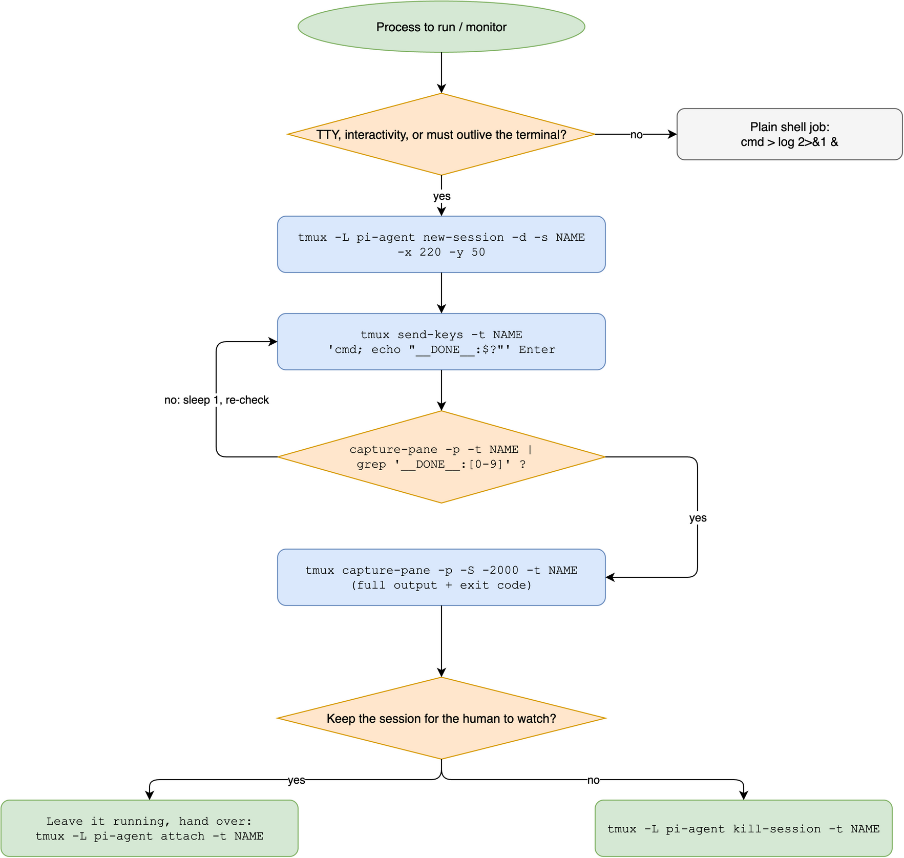

# tmux-skill: tmux for coding agents

[](LICENSE)
[](https://github.com/Agents365-ai/365-skills/stargazers)
[](https://github.com/Agents365-ai/365-skills/network/members)
[](https://github.com/Agents365-ai/365-skills/commits/main)

[](https://skillsmp.com)
[](https://github.com/Agents365-ai/365-skills)
[](https://agentskills.io)
[](https://github.com/badlogic/pi-mono)

**English** · [中文](README_CN.md)

A pure-instruction skill that teaches coding agents (pi, Claude Code, Codex, OpenClaw, any [Agent Skills](https://agentskills.io) host) to drive **tmux programmatically and correctly**: detached sessions with a fixed size, `send-keys` input injection, `capture-pane` output polling with a race-free sentinel, format-based inspection, four completion-detection strategies, and the pitfalls that break naive tmux scripts. Grounded in the official [tmux wiki](https://github.com/tmux/tmux/wiki) (Getting-Started, Formats, Control-Mode, Events, FAQ).

## Why

Agents constantly need to run things that outlive a single command: long builds, dev servers, REPL sessions, TUI apps, watches. Naive tmux usage fails in predictable ways (80x24 mangled captures, scrollback missed, `sleep`-based guessing, sentinel greps matching the echoed command line). This skill encodes the working patterns once so every run is correct.

## What it does

- **Decides** when tmux is the right tool (TTY, interactivity, outliving the turn) vs a plain shell background job
- **Canonical loop**: `new-session -d -x/-y` → `send-keys ... Enter` → sentinel poll → `capture-pane -S` → cleanup
- **Completion detection, four ways**: expanded-sentinel grep, `remain-on-exit` + `#{pane_dead}`, process check, `wait-for` (with its race caveat)
- **Cheat sheet** for `send-keys`, `capture-pane`, formats (`-F '#{pane_pid} #{pane_dead} ...'`), targets, and sockets (`tmux -L` isolation so agent sessions never disturb the user's tmux)
- **Recipes**: long job handed to the human with `attach`, multi-pane monitors, REPL driving, a self-contained `tmuxrun` helper
- **Pitfall checklist**: key names vs `\n`, quoting across two shells, 80x24 default size, auto-renamed windows, `tmux ls` exit 1 semantics, shared-socket safety
- **Control mode primer** (`-C`, `%begin`/`%end`/`%error`, `%output`) for streaming supervisors

## Workflow



## Installation

**pi**: copy the skill into the skills directory (or symlink):

```bash
git clone https://github.com/Agents365-ai/365-skills.git
ln -s "$(pwd)/365-skills/plugins/tmux/skills/tmux-skill" ~/.pi/agent/skills/tmux-skill
```

**Claude Code / other Agent Skills hosts**:

```bash
git clone https://github.com/Agents365-ai/365-skills.git
mkdir -p ~/.claude/skills
ln -s "$(pwd)/365-skills/plugins/tmux/skills/tmux-skill" ~/.claude/skills/tmux-skill
```

**OpenClaw**: install from the skill folder as usual (`SKILL.md` is at `plugins/tmux/skills/tmux-skill/`).

Requirements: `tmux` on PATH (`brew install tmux` / `apt install tmux`). No other dependencies, no env vars, no secrets.

## Native Claude Code comparison

| Capability | This skill | Native Claude Code |
| --- | --- | --- |
| Run command, keep output | tmux session + sentinel poll | `Bash` tool (kills at timeout) |
| Survive turn end | yes, detached session | background shells, no interactivity |
| Drive a REPL / TUI | `send-keys` + `capture-pane` | not supported |
| Human co-viewing | `tmux attach` in another terminal | not supported |

## Usage

Just mention tmux or a long-running/interactive process in your request: e.g. "run the dev server in tmux and watch the logs", "start a python REPL session and test this snippet". The skill triggers on: tmux, send-keys, capture-pane, detached session, 长任务后台运行, 终端复用.

## Support

If this project helps you, consider supporting the author:

<table>
  <tr>
    <td align="center">
      
      <br>
      <b>WeChat Pay</b>
    </td>
    <td align="center">
      
      <br>
      <b>Alipay</b>
    </td>
    <td align="center">
      
      <br>
      <b>Buy Me a Coffee</b>
    </td>
    <td align="center">
      
      <br>
      <b>Tip Author</b>
    </td>
  </tr>
</table>

## Author

**Agents365-ai**

- Bilibili: <https://space.bilibili.com/441831884>
- GitHub: <https://github.com/Agents365-ai>

## License

[CC BY-NC 4.0](LICENSE): free for non-commercial use. Commercial use requires permission.
