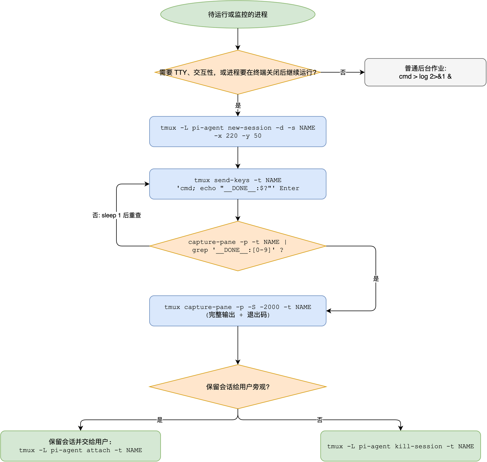

# tmux-skill: 面向编码智能体的 tmux 技能

[](LICENSE)
[](https://github.com/Agents365-ai/365-skills/stargazers)
[](https://github.com/Agents365-ai/365-skills/network/members)
[](https://github.com/Agents365-ai/365-skills/commits/main)

[](https://skillsmp.com)
[](https://github.com/Agents365-ai/365-skills)
[](https://agentskills.io)
[](https://github.com/badlogic/pi-mono)

中文 · [English](README.md)

这是一个纯指令型技能，教会编码智能体（pi、Claude Code、Codex、OpenClaw，以及任何 [Agent Skills](https://agentskills.io) 兼容宿主）**以编程方式正确驱动 tmux**：固定尺寸的 detached 会话、`send-keys` 注入输入、基于无竞态哨兵的 `capture-pane` 输出轮询、基于 format 的状态检查、四种完成检测策略，以及各种让朴素 tmux 脚本翻车的坑。内容基于 tmux 官方 wiki（Getting-Started、Formats、Control-Mode、Events、FAQ）。

## 为什么需要

智能体经常要运行超出单条命令生命周期的东西：长构建、dev server、REPL 会话、TUI 程序、watch。朴素的 tmux 用法会以可预测的方式失败（80x24 尺寸毁掉输出、漏掉回滚缓冲、靠 `sleep` 猜完成时间、哨兵 grep 匹配到回显的命令行本身）。这个技能把这些经过验证的模式固化下来，让每次运行都正确。

## 功能

- **判断** tmux 是否是正确工具（TTY、交互性、进程要在终端关闭后继续运行）vs 普通后台作业
- **标准循环**：`new-session -d -x/-y` → `send-keys ... Enter` → 哨兵轮询 → `capture-pane -S` → 清理
- **四种完成检测**：展开哨兵 grep、`remain-on-exit` + `#{pane_dead}`、进程检查、`wait-for`（含竞态告警）
- **速查表**：`send-keys`、`capture-pane`、format 变量（`-F '#{pane_pid} #{pane_dead} ...'`）、target 语法、`tmux -L` 独立 socket（智能体永不干扰用户自己的 tmux）
- **配方**：长任务交给用户 `attach` 旁观、多窗格监控、驱动 REPL、自包含的 `tmuxrun` 辅助函数
- **避坑清单**：按键名 vs `\n`、跨两层 shell 的引号、80x24 默认尺寸、窗口自动改名、`tmux ls` 退出码 1 的语义、共享 socket 安全
- **Control mode 入门**（`-C`、`%begin`/`%end`/`%error`、`%output`），用于流式监督进程

## 工作流



## 安装

**pi**: 把技能复制（或软链）到技能目录：

```bash
git clone https://github.com/Agents365-ai/365-skills.git
ln -s "$(pwd)/365-skills/plugins/tmux/skills/tmux-skill" ~/.pi/agent/skills/tmux-skill
```

**Claude Code / 其他 Agent Skills 宿主**：

```bash
git clone https://github.com/Agents365-ai/365-skills.git
mkdir -p ~/.claude/skills
ln -s "$(pwd)/365-skills/plugins/tmux/skills/tmux-skill" ~/.claude/skills/tmux-skill
```

**OpenClaw**：按常规从技能目录安装（`SKILL.md` 位于 `plugins/tmux/skills/tmux-skill/`）。

依赖：PATH 中有 `tmux`（`brew install tmux` / `apt install tmux`）。无其他依赖，无环境变量，无密钥。

## 与 Claude Code 原生能力对比

| 能力 | 本技能 | Claude Code 原生 |
| --- | --- | --- |
| 运行命令并保留输出 | tmux 会话 + 哨兵轮询 | `Bash` 工具（超时即终止） |
| 跨回合存活 | 是，detached 会话 | 后台 shell，无交互性 |
| 驱动 REPL / TUI | `send-keys` + `capture-pane` | 不支持 |
| 用户旁观 | 另一终端 `tmux attach` | 不支持 |

## 用法

在请求中提到 tmux 或长时/交互式进程即可触发，例如"用 tmux 起 dev server 并盯着日志"、"开个 python REPL 会话测试这段代码"。触发词：tmux、send-keys、capture-pane、detached session、长任务后台运行、终端复用。

## 支持

如果这个项目对你有帮助，欢迎支持作者：

<table>
  <tr>
    <td align="center">
      
      <br>
      <b>微信支付</b>
    </td>
    <td align="center">
      
      <br>
      <b>支付宝</b>
    </td>
    <td align="center">
      
      <br>
      <b>Buy Me a Coffee</b>
    </td>
    <td align="center">
      
      <br>
      <b>赞赏作者</b>
    </td>
  </tr>
</table>

## 作者

**Agents365-ai**

- Bilibili：<https://space.bilibili.com/441831884>
- GitHub：<https://github.com/Agents365-ai>

## 许可证

[CC BY-NC 4.0](LICENSE): 非商业用途免费，商业使用需授权。
